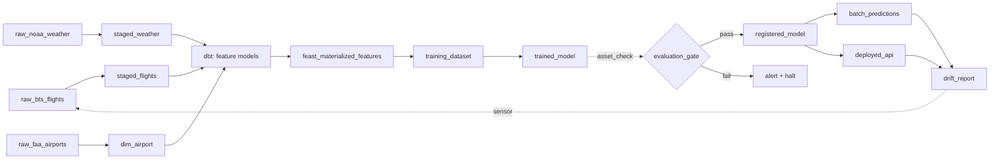

# Batch ML Training Orchestrator — Implementation Plan

A portfolio-scale build plan targeting senior data engineering roles. Optimized for near-$0 infrastructure cost while preserving the engineering signals that matter in interviews (point-in-time correctness, reproducibility, idempotency, schema discipline, operational maturity).

---

## 1. Use Case & Data Source Options

The right data source is the single biggest determinant of how believable your point-in-time correctness demo looks. A dataset without precise event timestamps turns the hardest DE problem in this project into a toy, so I've ranked each option primarily on timestamp quality and secondarily on scale, domain richness, and joinability with other sources.

### Option A — NYC TLC Trip Records + NOAA Weather

**What it is:** Every yellow/green taxi and for-hire vehicle trip in NYC, with precise pickup and dropoff timestamps, distances, fares, tips. Paired with daily weather observations from the NOAA Global Historical Climatology Network.

- **Source:** `d37ci6vzurychx.cloudfront.net/trip-data/` + `ncei.noaa.gov/data/global-historical-climatology-network-daily/`
- **Size:** 2–8 GB/month Parquet (trips); weather is KB-scale
- **Format:** Parquet natively (no conversion step)
- **Prediction targets:** `tip_amount` (regression), `trip_duration` (regression), `high_tipper` (binary classification)

**Pros**

- Second-level pickup timestamps make PIT correctness vivid and testable — you can plant a leak from a future trip aggregation and the test catches it immediately.
- Natively Parquet and monthly-partitioned, so it maps one-to-one to a `MonthlyPartitionsDefinition`.
- Rich join partners (weather, holidays, zone lookups) exercise multi-source feature engineering without forcing you to scrape anything.
- Scales smoothly from 3 months (~20 GB) to 5+ years (~500 GB) — you pick the demo scale.
- The prediction target is interpretable enough that you can talk about feature importance in an interview without caveats.
- No API keys, no rate limits, publicly hosted on CloudFront with high throughput.

**Cons**

- Widely used on Kaggle — reviewers have seen many versions. You differentiate on engineering rigor, not novelty.
- Tipping behavior changed after the 2020 pandemic; you need to be aware of the distribution shift (it's actually a pro for the drift-detection narrative, but a con if you ignore it).
- Little "business context" depth — you can't tell a rich product story around it.

**Senior DE signal: 9/10.** The best balance of timestamp quality, scale, and joinability.

### Option B — BTS Airline On-Time Performance + NOAA Weather

**What it is:** US DOT Bureau of Transportation Statistics publishes every domestic commercial flight's scheduled and actual departure/arrival times, delays, and cancellation reasons. Pair with weather at origin/destination airports.

- **Source:** `transtats.bts.gov` (monthly CSV downloads, ~500 MB/month)
- **Size:** ~500 MB–1 GB/month CSV; ~100 MB/month after Parquet conversion
- **Prediction targets:** `arrival_delay_minutes` (regression), `is_delayed_15min` (binary)

**Pros**

- Scheduled vs. actual timestamps are a natural PIT story: at training time, you know actual delays, but at serving time (predicting future flights) you only know scheduled times. Forces you to implement the "as-of" logic correctly.
- Multi-entity joins (flight, origin airport, destination airport, carrier) give you legitimate reasons to build multiple entity types in Feast.
- The cascading-delay story (upstream flight delays propagate) makes for a great windowed-feature demo.

**Cons**

- CSV-first, so you spend the first week writing conversion + schema enforcement code (arguably a pro for the DE signal, but slows you down).
- Less voluminous than TLC unless you pull many years.
- The BTS site is clunky; scripted downloads require some HTML scraping.

**Senior DE signal: 8.5/10.** Stronger PIT narrative than TLC, weaker scale and developer experience.

### Option C — GitHub Archive (GH Archive)

**What it is:** Every public GitHub event (push, PR, issue, comment, star) in hourly JSON.gz files since 2011. Billions of events.

- **Source:** `gharchive.org` (hourly files) or BigQuery public dataset
- **Size:** ~1–3 GB/hour compressed; multi-TB for full history
- **Prediction targets:** `pr_will_be_merged` (binary), `issue_time_to_close` (regression), `repo_will_gain_100_stars_in_30d` (binary)

**Pros**

- Event-stream data at scale — the most "real big data" feel of any option here.
- Timestamps are precise and the event model is temporally clean.
- Strong narrative for senior DE: "I built a feature pipeline over every public GitHub event in 2024."
- Natural multi-entity model (user, repo, PR, issue) for Feast.

**Cons**

- Nested JSON requires a real schema-extraction pass — adds a week of engineering up front.
- Scale is easy to underestimate; one careless PySpark job will OOM a free-tier VM.
- GitHub event schema has evolved over the years; you need to handle versioning carefully (senior signal if you do, footgun if you don't).
- Prediction targets require you to define labels yourself (e.g., join PR-opened events to PR-merged events), which is extra work.

**Senior DE signal: 9.5/10 if you nail it, 6/10 if you underestimate the effort.** High ceiling, high risk.

### Option D — Criteo Click Logs (1TB or Terabyte Click Logs)

**What it is:** Anonymized ad click-through logs released by Criteo. The classic CTR prediction benchmark.

- **Source:** `ailab.criteo.com/ressources/` (registration required, free)
- **Size:** 1 TB uncompressed (can sample to 10 GB)
- **Prediction target:** `click` (binary) — ad CTR prediction

**Pros**

- Real-scale data — demonstrates you can handle production-sized feature pipelines.
- Strong industry pedigree; "I worked with Criteo click logs" is a recognizable signal.
- Class-imbalanced (~3% CTR), which lets you showcase imbalance handling in the evaluation gate.

**Cons**

- Features are hashed and anonymized (`I1–I13` numerical, `C1–C26` categorical). You lose the "domain-aware feature engineering" narrative entirely — everything becomes "feature 7 aggregated over 1h."
- Timestamps are coarse (day-level), which weakens the PIT demo.
- Licensing requires registration; slightly awkward for public GitHub repos.
- The "tabular + categorical hashing" setup is a well-worn path in ML tutorials.

**Senior DE signal: 7/10.** Great scale story, weak domain story. Choose this only if you explicitly want a scale-focused narrative.

### Option E — Yelp Open Dataset

**What it is:** ~9 GB JSON of Yelp business, review, user, check-in, and tip data across ~10 metro areas.

- **Source:** `yelp.com/dataset`
- **Size:** ~9 GB JSON, ~2 GB Parquet after conversion
- **Prediction targets:** `review_will_be_useful` (binary), `business_will_close_in_12mo` (binary), `review_rating` (ordinal regression)

**Pros**

- Rich relational structure (businesses, reviews, users, check-ins) — lets you build a real star schema as part of the staging layer.
- Review timestamps support a PIT demo for user-level and business-level rolling features.
- Text column opens the door to feature engineering with embeddings if you want to show off.

**Cons**

- JSON-first; first-week cost to convert and enforce schemas.
- No natural "prediction at serving time" use case — nobody calls an API asking "will this review be useful?" Weakens the online-serving narrative.
- Dataset is static (one-time release), so you can't demo incremental ingestion of new partitions without faking it.
- License is non-commercial — fine for portfolio, not fine if you later want to open-source a product.

**Senior DE signal: 7.5/10.** Great relational modeling, weaker ML-in-production story.

### Option F — MovieLens + TMDB

**What it is:** MovieLens ratings (25M or 32M dataset) joined with TMDB metadata API.

- **Source:** `grouplens.org/datasets/movielens/` + `themoviedb.org` API
- **Size:** ~250 MB–1 GB
- **Prediction targets:** user rating prediction, watch-propensity

**Pros**

- Smallest ops overhead of any option — you can iterate fast.
- Rating timestamps enable a PIT story.
- Accessible prediction target everyone understands.

**Cons**

- Too small to credibly demonstrate DE-at-scale concerns; reviewers will see through it.
- Extremely well-trodden. Every bootcamp grad has a MovieLens project. You will compete on execution against many others.
- TMDB API rate limits add complexity without adding signal.

**Senior DE signal: 5/10.** Good for a first pipeline, not good for a senior portfolio headliner.

### Option G — ISO-NE or CAISO Electricity Load + NOAA Weather

**What it is:** 5-minute interval electricity demand from US ISO/RTO operators, paired with weather.

- **Source:** `iso-ne.com/isoexpress/web/reports` or `oasis.caiso.com`
- **Size:** ~100 MB/year (small but dense)
- **Prediction target:** `load_1h_ahead` (regression), `load_24h_ahead` (regression)

**Pros**

- High-frequency time series (5-min intervals) — a genuinely different PIT challenge than transactional data.
- The forecasting use case gives you a legitimate reason to build time-windowed features and demonstrate look-ahead bias prevention more carefully than other options.
- Weather-joining story is cleaner than TLC because weather directly drives demand.
- Niche enough that reviewers haven't seen it 100 times.

**Cons**

- Small scale; hard to demonstrate big-data DE chops without artificial augmentation.
- Single-entity (or few-entity) model — limits Feast/feature-store complexity demo.
- Time-series forecasting invites questions about sequence models (LSTM, Temporal Fusion Transformer) that are out of scope for a DE portfolio.

**Senior DE signal: 7.5/10.** Best "temporal correctness" story, weakest scale story.

### Comparison matrix

| Option                  | Scale      | Timestamp quality                | Domain richness   | Novelty  | Dev effort | Senior DE signal        |
| ----------------------- | ---------- | -------------------------------- | ----------------- | -------- | ---------- | ----------------------- |
| A — NYC TLC + NOAA      | High       | Excellent                        | Medium            | Medium   | Low        | 9/10                    |
| B — BTS Flights + NOAA  | Medium     | Excellent (scheduled vs. actual) | High              | High     | Medium     | 8.5/10                  |
| C — GH Archive          | Very high  | Excellent                        | High              | High     | High       | 9.5 if nailed, 6 if not |
| D — Criteo              | Very high  | Poor (day-level)                 | Low (anonymized)  | Low      | Medium     | 7/10                    |
| E — Yelp                | Low–Medium | Good                             | High (relational) | Medium   | Medium     | 7.5/10                  |
| F — MovieLens + TMDB    | Low        | Good                             | Medium            | Very low | Low        | 5/10                    |
| G — ISO-NE/CAISO + NOAA | Low        | Excellent (5-min)                | Medium            | High     | Low–Medium | 7.5/10                  |

### Selected primary: Option B — BTS Airline On-Time Performance + NOAA Weather

**Why Option B over Option A:**

- The scheduled-vs-actual timestamp split is the cleanest PIT story of any option. At training time you have both timestamps; at serving time you only have the scheduled time. The code must reflect that gap or it leaks — and you can write a unit test that makes the leak impossible to miss.
- Less common in portfolios than NYC TLC, so the execution signal is less diluted by "I've reviewed this dataset 50 times" fatigue.
- Multi-entity model (flight, origin airport, destination airport, carrier, tail number) is a legitimate reason to define multiple entity types in Feast — demonstrates Feast competence you can't fake with a single-entity dataset.
- Cascading-delay dynamics (a delayed inbound flight delays the next outbound on the same aircraft) give you a genuine reason to build recursive/temporal features and talk about them in interviews.

**Secondary fallback: Option A (NYC TLC + NOAA)** if the BTS CSV ingestion or schema-change handling is eating too much time. The plan transfers cleanly with a source swap.

**Ambitious alternative: Option C (GH Archive)** if you have 12+ weeks and want a real scale story.

**Avoid for this project:** Option F (MovieLens — too well-trodden) and Option D (Criteo — weak PIT + anonymized features gut the domain narrative).

**Selected data sources:**

| Source                                 | URL                                                                                                                 | Role                                                |
| -------------------------------------- | ------------------------------------------------------------------------------------------------------------------- | --------------------------------------------------- |
| BTS On-Time Performance                | `transtats.bts.gov` (Reporting Carrier On-Time Performance, monthly)                                                | Primary event stream                                |
| NOAA GHCN Daily / LCD                  | `ncei.noaa.gov/data/global-historical-climatology-network-daily/` + `ncei.noaa.gov/data/local-climatological-data/` | Weather features at airport stations                |
| FAA Airport Master (5010)              | `faa.gov/airports/airport_safety/airportdata_5010`                                                                  | Airport dimension (IATA ↔ location, runway count)   |
| OpenFlights routes                     | `openflights.org/data`                                                                                              | Route dimension + great-circle distance             |
| US Federal Holidays                    | `pandas.tseries.holiday` (built-in)                                                                                 | Calendar features                                   |
| NOAA Weather Station ↔ Airport mapping | Derived                                                                                                             | Spatial join key (nearest GHCN station per airport) |

---

## 2. Tech Stack Decisions

Each row lists the spec's original choice, alternatives, and my recommendation with rationale.

### 2.1 Orchestration

| Option                                       | Pros                                                                                                                                                                                      | Cons                                                                                     |
| -------------------------------------------- | ----------------------------------------------------------------------------------------------------------------------------------------------------------------------------------------- | ---------------------------------------------------------------------------------------- |
| **Dagster (self-hosted via docker-compose)** | Asset-oriented model is a shape-match for this pipeline; built-in lineage UI; native `dagster-dbt`, `dagster-mlflow`, `dagster-pyspark`; asset checks for DQ; first-class time partitions | Smaller community than Airflow; fewer legacy job-post mentions                           |
| **Airflow**                                  | Industry standard; massive ecosystem                                                                                                                                                      | Task-oriented model forces you to rebuild lineage by hand; heavy; clunky local dev       |
| **Prefect**                                  | Clean Python-native API; generous free cloud tier                                                                                                                                         | No asset primitive; less DE-platform focus; weaker fit for a versioned-artifact pipeline |

**Recommendation: Dagster, self-hosted via docker-compose.** Every stage of this project produces a versioned artifact (raw → staging → features → dataset → model → predictions). Dagster's Software-Defined Assets model exactly this, and the auto-generated lineage graph becomes the hero screenshot in your README. Use `dagster-dbt` to auto-load dbt models as assets so dbt + Python lineage merge into one graph. Asset checks become the natural home for schema contracts and evaluation gates. Native `MonthlyPartitionsDefinition` makes BTS monthly backfills a one-liner.

Include a short "Why not Airflow?" section in the README — senior reviewers reward the explicit trade-off more than the "correct" framework choice, and some roles still explicitly require Airflow. Alternative deployment: **Dagster+ Serverless free tier** (1 deployment, hosted UI) if self-hosting the daemon becomes a time sink.

### 2.2 Feature Engineering Compute

| Option                                       | Pros                                                                 | Cons                                                 |
| -------------------------------------------- | -------------------------------------------------------------------- | ---------------------------------------------------- |
| **Apache Spark (PySpark, local/standalone)** | Resume keyword; real at scale; required signal for senior DE         | Overkill for portfolio data sizes; slow dev loop     |
| **dbt-duckdb**                               | Fast, modern, SQL-first; excellent testing story; lightning dev loop | Single-node only; not a "big data" signal on its own |
| **Polars**                                   | Blazing fast; lazy API; growing adoption                             | Newer; less common in job postings                   |

**Recommendation: hybrid — dbt-duckdb for the transformation DAG + PySpark for one or two deliberately heavy jobs.** This is the strongest signal per line of code:

- Use dbt-duckdb to build 80% of features. You get free data tests, lineage, docs site — all senior-DE artifacts.
- Use PySpark for the heaviest aggregation (e.g. 2 years of flights window-aggregated by origin airport + carrier, plus the cascading-delay join that links each flight to its aircraft's previous flight by tail number). Run it locally in standalone mode. This demonstrates you can hand-roll a partitioning/shuffle-aware job.

Resist the urge to Spark everything — you'll burn weeks fighting JVM on a 2GB dataset.

### 2.3 Storage (Object Store)

| Option                  | Free tier                     | Notes                                       |
| ----------------------- | ----------------------------- | ------------------------------------------- |
| **MinIO (self-hosted)** | Unlimited (uses your disk)    | S3-compatible; runs in docker-compose       |
| **Cloudflare R2**       | 10 GB storage + **$0 egress** | Best real-cloud free tier for this use case |
| **Backblaze B2**        | 10 GB free                    | Cheap beyond that ($0.006/GB)               |
| **AWS S3**              | 5 GB/12 months                | Egress fees bite; avoid                     |

**Recommendation: MinIO locally for dev, Cloudflare R2 for the "cloud deployment" demo.** R2's zero-egress policy is the only reason you can keep online-serving costs at $0. Structure everything via the S3 SDK so migration is a config change.

### 2.4 Table Format

| Option             | Pros                                             | Cons                                                  |
| ------------------ | ------------------------------------------------ | ----------------------------------------------------- |
| **Parquet-only**   | Simple; universally supported                    | No ACID, no time-travel, no schema evolution          |
| **Apache Iceberg** | Industry-trending; time-travel; schema evolution | More setup; fewer single-node engines support it well |
| **Delta Lake**     | Mature; ACID; native Spark                       | Tighter to Spark/Databricks ecosystem                 |

**Recommendation: Iceberg.** Pairs well with DuckDB (read support) and PySpark (full support), and the time-travel feature is narratively useful for dataset versioning. Delta Lake is equally defensible if your local Spark setup prefers it. Plain Parquet is fine for v0 but you should graduate to a table format before calling the project done — it's a visible senior-DE signal in 2026.

### 2.5 Feature Store

| Option                          | Notes                                                    |
| ------------------------------- | -------------------------------------------------------- |
| **Feast**                       | Open source, self-hostable, the reference implementation |
| **Tecton**                      | SaaS, not free                                           |
| **Custom (Postgres + Parquet)** | Possible, but don't — you lose the Feast narrative       |

**Recommendation: Feast, stick with the spec.** Use the `file` provider for offline store (Parquet on MinIO/R2) and `redis` for online. Pin to a recent Feast version (0.40+) and be ready to talk about the materialization model — interviewers will ask.

### 2.6 Online Store

| Option                  | Free tier             | Notes                                   |
| ----------------------- | --------------------- | --------------------------------------- |
| **Redis (self-hosted)** | Free                  | Standard choice                         |
| **Upstash Redis**       | 10K commands/day free | Serverless; good for cloud demo         |
| **DragonflyDB**         | Free                  | Redis-compatible, faster; swap-in later |

**Recommendation: Upstash Redis for hosted demo, plain Redis (docker) for local dev.** Upstash's free tier is enough for a portfolio-scale inference API.

### 2.7 Experiment Tracking

**Recommendation: MLflow, self-hosted.** Stick with the spec. Run the tracking server in docker-compose with a SQLite backend and MinIO artifact store. Alternative: Weights & Biases has a generous personal free tier and looks nicer in screenshots, but MLflow is the DE interview default.

### 2.8 Model Training

**Recommendation: XGBoost as the primary model, PySpark MLlib for one benchmark run.** XGBoost gives you a strong baseline on tabular data in minutes; MLlib demonstrates distributed training competency. Skip PyTorch for this project unless you specifically need deep learning as a signal — tabular deep learning rarely beats XGBoost and the training infrastructure doesn't showcase DE skills.

### 2.9 Hyperparameter Tuning

**Recommendation: Optuna with SQLite storage.** Lightweight, integrates with MLflow via callbacks, and its pruning + TPE story is worth ~5 minutes of interview conversation. Ray Tune is overkill for single-node training.

### 2.10 Model Serving

| Option                         | Free tier                      | Notes                                      |
| ------------------------------ | ------------------------------ | ------------------------------------------ |
| **FastAPI + Docker on Fly.io** | 3 shared VMs free              | Best balance of "real cloud" and $0        |
| **Modal**                      | $30/month free credits         | Clean Python DX                            |
| **HuggingFace Spaces**         | Free                           | Easy deploy; less "production-y" narrative |
| **Oracle Cloud Always Free**   | 2 AMD + 4 ARM VMs, always free | Most generous free tier; clunkier DX       |

**Recommendation: Fly.io for the online API, Oracle Cloud Always Free for the Dagster + MLflow control plane.** Oracle's Ampere ARM instances (24 GB RAM, 4 OCPU across 4 VMs, free forever) are the unlock that makes this project $0. Fly.io gives you clean Docker deploys for the inference service.

### 2.11 Drift Detection

**Recommendation: Evidently AI, stick with the spec.** Open source, generates nice HTML reports (screenshot gold for the README), supports PSI and KL divergence out of the box.

### 2.12 Container Orchestration

**Recommendation: Skip Kubernetes. Use docker-compose for local + Oracle Cloud, and Fly.io's native deploys for the API.** Kubernetes on a portfolio project is a known anti-pattern in senior DE interviews ("why did you need that?") — unless K8s is explicitly required in the role you're targeting, it's all cost with no signal. If you must, use K3s on a single Oracle VM.

### 2.13 Infrastructure as Code

**Recommendation: Terraform for the cloud resources (Oracle + Cloudflare + Fly) + docker-compose for local.** Even if it's just 100 lines of Terraform, having it in the repo is a visible senior-DE artifact. Alternative: Pulumi if you prefer Python.

### 2.14 Python Package Manager

| Option              | Pros                                                                                                                                            | Cons                                                                |
| ------------------- | ----------------------------------------------------------------------------------------------------------------------------------------------- | ------------------------------------------------------------------- |
| **uv**              | 10–100x faster than pip; unified Python version + deps + venv management; native dependency groups (PEP 735); excellent lockfile; single binary | Newest tool in the space; some niche packages still have edge cases |
| **Poetry**          | Mature, widely adopted                                                                                                                          | Slower; has historically had lockfile drift issues                  |
| **pip + pip-tools** | Boring, universal                                                                                                                               | Slow; you manage Python versions separately                         |
| **pdm**             | Standards-compliant; PEP 582 support                                                                                                            | Smaller community                                                   |

**Recommendation: uv.** It's the modern default and the speed difference is visible in every CI run. Concretely:

- `uv` pins the Python version via `.python-version` — no separate pyenv needed.
- `uv sync` creates/updates the venv from `pyproject.toml` + `uv.lock` in seconds.
- `uv add dagster-dbt --group dagster` adds a dep to a specific dependency group (PEP 735), so you can build minimal Docker images per service (Dagster worker, FastAPI, Spark) without dragging in every dep.
- `uv run pytest` runs a command in the project venv with zero ceremony.
- `uv lock --upgrade-package xgboost` does targeted upgrades.

The dependency-groups feature is what makes this clean for a multi-service repo — the serving Docker image installs only `serving` group deps; the Dagster image installs `dagster + training + spark`; the dbt image installs `dbt`. Same codebase, three lean images. Concrete layout is in the next section.

---

## 3. Target Architecture

### 3.1 End-to-end flow

```
┌────────────────────────────────────────────────────────────────────┐
│                         CONTROL PLANE (Oracle Cloud Free)          │
│  ┌──────────┐   ┌──────────┐   ┌──────────┐   ┌──────────────┐    │
│  │ Dagster  │   │  MLflow  │   │  Feast   │   │  Evidently   │    │
│  │ webui +  │   │  Server  │   │ Registry │   │  Reports     │    │
│  │ daemon   │   │          │   │          │   │              │    │
│  └────┬─────┘   └────┬─────┘   └────┬─────┘   └──────┬───────┘    │
│       │              │              │                 │            │
│  ┌────┴──────────────┴──────────────┴─────────────────┴─────────┐ │
│  │            Postgres (metadata)    +    MinIO (artifacts)     │ │
│  └──────────────────────────────────────────────────────────────┘ │
└────────────────────────────────────────────────────────────────────┘
             │                                      │
             │ triggers                             │ reads/writes
             ▼                                      ▼
┌────────────────────────────────┐  ┌─────────────────────────────────┐
│   DATA PLANE (Oracle Cloud)    │  │   OBJECT STORE (Cloudflare R2)  │
│  ┌──────────┐   ┌───────────┐  │  │  ┌─────────────────────────┐    │
│  │ dbt-     │   │  PySpark  │  │  │  │ raw/     (Parquet)      │    │
│  │ duckdb   │   │ (heavy    │  │──┼─▶│ staging/ (Parquet)      │    │
│  │          │   │  jobs)    │  │  │  │ features/(Iceberg)      │    │
│  └──────────┘   └───────────┘  │  │  │ datasets/(versioned)    │    │
│  ┌──────────────────────────┐  │  │  │ models/  (MLflow)       │    │
│  │   Training (XGBoost +    │  │  │  └─────────────────────────┘    │
│  │   Optuna)                │  │  └─────────────────────────────────┘
│  └──────────────────────────┘  │
└────────────────────────────────┘
             │
             │ promote
             ▼
┌───────────────────────────────────────────────────────────────────┐
│                      SERVING (Fly.io + Upstash)                   │
│  ┌──────────────────┐       ┌─────────────────────────────────┐   │
│  │  FastAPI         │──────▶│  Upstash Redis (online store)   │   │
│  │  Inference       │       └─────────────────────────────────┘   │
│  └──────────────────┘                                             │
└───────────────────────────────────────────────────────────────────┘
```

### 3.2 Dagster asset graph

Every node below is a Software-Defined Asset. Dagster infers the dependency arrows from each asset's declared inputs, and the webui renders this graph automatically.



Key Dagster primitives used:

- `@asset` for every node above (dbt models auto-loaded via `dagster-dbt`).
- `@asset_check` for schema contracts, freshness, and the evaluation gate.
- `MonthlyPartitionsDefinition` on `raw_bts_flights` and downstream partitioned assets.
- `@sensor` watching the drift metrics table → triggers a run of the training asset group.
- `@schedule` for the nightly retrain cadence.

### 3.3 Point-in-time join model

This is the diagram reviewers care about most. Understanding it is the difference between "built an ML pipeline" and "built a data engineering ML pipeline."

```
Time →

Feature values over time (origin_airport=ORD):
  t=08:00  avg_dep_delay_1h=6.2
  t=09:00  avg_dep_delay_1h=9.8    ← available at 09:00
  t=10:00  avg_dep_delay_1h=14.1
  t=11:00  avg_dep_delay_1h=18.5

Label events (scheduled departures):
  flight_A  scheduled_dep=09:15  → correct feature: avg_dep_delay_1h=9.8  (from t=09:00)
  flight_B  scheduled_dep=10:45  → correct feature: avg_dep_delay_1h=14.1 (from t=10:00)

WRONG (causes leakage):
  flight_A  → avg_dep_delay_1h=18.5 (from t=11:00, value from THE FUTURE)

Extra subtlety for BTS: the feature must be keyed by SCHEDULED departure time,
never actual departure time, because actual is what you're predicting.

Feast PIT join rule:
  joined feature = latest feature where feature_ts <= event_ts - ttl
```

---

## 4. Project Codebase Structure

### 4.1 Top-level layout

The repo is a single Python project managed by uv, with dependency groups per service so each Docker image stays lean. Dbt and Feast live alongside as their own conventionally-structured subdirectories (they have their own tooling and shouldn't be folded into the Python package).

```
batch-ml-orchestrator/
├── .github/
│   └── workflows/
│       ├── ci.yml                    # lint, type-check, unit tests, leakage test
│       ├── dbt-docs.yml              # build + publish dbt docs to GH Pages
│       ├── evidently-reports.yml     # publish drift reports to GH Pages
│       └── build-images.yml          # build + push per-service Docker images
├── .python-version                   # uv pins Python version (e.g. 3.11.9)
├── pyproject.toml                    # project + dependency groups
├── uv.lock                           # committed; source of truth
├── Makefile                          # canonical commands
├── README.md
├── LICENSE
├── .env.example
├── .pre-commit-config.yaml
│
├── src/                              # single Python package, importable as `bmo`
│   └── bmo/                          # "batch ml orchestrator"
│       ├── __init__.py
│       ├── common/                   # shared config, logging, types, s3 helpers
│       │   ├── __init__.py
│       │   ├── config.py             # pydantic Settings (env-driven)
│       │   ├── logging.py            # structlog setup
│       │   ├── storage.py            # s3/r2/minio client factory
│       │   └── types.py              # shared Pydantic models, enums
│       │
│       ├── ingestion/                # raw → object store
│       │   ├── __init__.py
│       │   ├── bts.py                # BTS form-POST scraper + Parquet conversion
│       │   ├── noaa.py               # NOAA GHCN/LCD downloader
│       │   ├── faa.py                # FAA 5010 airport master
│       │   ├── openflights.py        # OpenFlights routes
│       │   └── manifest.py           # ingest run manifest writer
│       │
│       ├── staging/                  # raw → Iceberg + schema contracts
│       │   ├── __init__.py
│       │   ├── contracts.py          # Pydantic schemas per source
│       │   ├── timezone.py           # local-airport → UTC conversion
│       │   ├── spatial_join.py       # nearest NOAA station per airport
│       │   └── iceberg_writer.py
│       │
│       ├── pyspark_jobs/             # submitted as Spark apps
│       │   ├── __init__.py
│       │   ├── cascading_delay.py    # tail-number self-join
│       │   └── rolling_aggregates.py
│       │
│       ├── training_dataset_builder/ # THE critical module
│       │   ├── __init__.py
│       │   ├── builder.py            # public API: build_dataset(...)
│       │   ├── pit_join.py           # point-in-time join logic
│       │   ├── dataset_handle.py     # content-addressed handle
│       │   └── leakage_guards.py     # explicit leakage checks
│       │
│       ├── training/
│       │   ├── __init__.py
│       │   ├── train.py              # single training run entry point
│       │   ├── hpo.py                # Optuna orchestration
│       │   ├── reproduce.py          # reproduce_run(run_id)
│       │   └── models/
│       │       ├── __init__.py
│       │       ├── xgboost_model.py
│       │       └── mllib_baseline.py
│       │
│       ├── evaluation_gate/
│       │   ├── __init__.py
│       │   ├── base.py               # Check protocol/ABC
│       │   ├── checks.py             # AUC, calibration, slice parity, leakage sentinels
│       │   └── reports.py            # Evidently report wrapping
│       │
│       ├── batch_scoring/
│       │   ├── __init__.py
│       │   └── score.py
│       │
│       ├── serving/                  # FastAPI inference service
│       │   ├── __init__.py
│       │   ├── api.py                # FastAPI app, routes
│       │   ├── feature_client.py     # Feast online retrieval + fail-closed
│       │   ├── model_loader.py       # MLflow registry → in-memory model
│       │   └── schemas.py            # request/response Pydantic models
│       │
│       └── monitoring/
│           ├── __init__.py
│           ├── drift.py              # PSI, KL divergence
│           └── retrain_trigger.py    # threshold evaluation
│
├── dagster_project/                  # orchestration layer
│   ├── __init__.py
│   ├── definitions.py                # top-level Definitions(...)
│   ├── partitions.py                 # MonthlyPartitionsDefinition, DailyPartitionsDefinition
│   ├── resources/
│   │   ├── __init__.py
│   │   ├── s3_resource.py
│   │   ├── mlflow_resource.py
│   │   ├── feast_resource.py
│   │   ├── duckdb_resource.py
│   │   └── spark_resource.py
│   ├── io_managers/
│   │   ├── __init__.py
│   │   └── iceberg_io_manager.py
│   ├── assets/
│   │   ├── __init__.py
│   │   ├── raw.py                    # wraps bmo.ingestion as @assets
│   │   ├── staging.py                # wraps bmo.staging as @assets
│   │   ├── features_dbt.py           # @dbt_assets auto-loader
│   │   ├── features_python.py        # cascading_delay, etc.
│   │   ├── feast_materialization.py
│   │   ├── training.py               # training_dataset, trained_model, registered_model
│   │   ├── serving.py                # batch_predictions, deployed_api
│   │   └── monitoring.py             # drift_report
│   ├── asset_checks/
│   │   ├── __init__.py
│   │   ├── schema_checks.py
│   │   ├── freshness_checks.py
│   │   └── evaluation_gate.py        # thin Dagster wrapper over bmo.evaluation_gate
│   ├── sensors/
│   │   ├── __init__.py
│   │   ├── bts_release_sensor.py     # polls BTS for new monthly drops
│   │   ├── drift_retrain_sensor.py   # drift table → training run trigger
│   │   └── run_failure_sensor.py     # Discord/Slack webhook
│   └── schedules/
│       ├── __init__.py
│       └── nightly_retrain.py
│
├── dbt_project/
│   ├── dbt_project.yml
│   ├── profiles.yml                  # DuckDB profile; reads from env
│   ├── packages.yml                  # dbt_utils, etc.
│   ├── models/
│   │   ├── staging/                  # thin 1:1 casts from Iceberg
│   │   │   ├── stg_flights.sql
│   │   │   ├── stg_weather.sql
│   │   │   └── _stg_schema.yml
│   │   ├── intermediate/             # joins, denormalizations
│   │   │   ├── int_flights_enriched.sql
│   │   │   └── _int_schema.yml
│   │   ├── features/                 # one model per feature view
│   │   │   ├── feat_origin_airport_windowed.sql
│   │   │   ├── feat_destination_airport_windowed.sql
│   │   │   ├── feat_carrier_rolling.sql
│   │   │   ├── feat_route_rolling.sql
│   │   │   ├── feat_airport_static.sql
│   │   │   ├── feat_calendar.sql
│   │   │   └── _features_schema.yml
│   │   └── marts/
│   │       ├── mart_predictions.sql  # joined predictions + actuals for monitoring
│   │       └── mart_drift_metrics.sql
│   ├── macros/
│   │   └── test_no_future_leakage.sql
│   └── tests/
│       └── assert_pit_correct.sql
│
├── feature_repo/                     # Feast config
│   ├── feature_store.yaml            # offline=file(parquet@r2), online=redis
│   ├── entities.py                   # flight, origin_airport, carrier, aircraft_tail
│   ├── data_sources.py               # references to Iceberg/Parquet
│   ├── feature_views.py              # one per feature group
│   └── feature_services.py           # feature bundles used at serve time
│
├── infra/
│   ├── docker/
│   │   ├── dagster.Dockerfile        # uv sync --only-group dagster --group training --group spark
│   │   ├── serving.Dockerfile        # uv sync --only-group serving
│   │   ├── spark.Dockerfile          # uv sync --only-group spark
│   │   └── dbt.Dockerfile            # uv sync --only-group dbt
│   ├── compose/
│   │   └── docker-compose.yml        # postgres, minio, redis, dagster, mlflow
│   └── terraform/
│       ├── main.tf
│       ├── variables.tf
│       ├── outputs.tf
│       ├── oracle/                   # ARM VM, networking
│       ├── cloudflare_r2/            # buckets, API token
│       └── flyio/                    # serving app + secrets
│
├── docs/
│   ├── architecture.md               # diagrams + rationale
│   ├── pit-correctness.md            # the hero doc
│   ├── skew-prevention.md
│   ├── dataset-versioning.md
│   ├── reproducibility.md
│   ├── postmortem.md                 # real bug you hit and fixed
│   ├── why-dagster.md
│   ├── lineage.png                   # Dagster graph screenshot
│   └── evidently-reports/            # published to GH Pages
│
├── tests/
│   ├── conftest.py
│   ├── fixtures/
│   │   ├── tiny_bts_sample.parquet   # <1 MB fixture for unit tests
│   │   └── expected_pit_joins.json
│   ├── unit/
│   │   ├── test_ingestion_bts.py
│   │   ├── test_staging_timezone.py
│   │   ├── test_pit_join.py
│   │   ├── test_dataset_handle.py
│   │   ├── test_evaluation_gate.py
│   │   └── test_serving_feature_client.py
│   ├── integration/
│   │   ├── test_end_to_end_training.py
│   │   ├── test_feast_roundtrip.py
│   │   └── test_leakage_planted_value.py   # plants future value, asserts rejection
│   └── determinism/
│       └── test_reproduce_run.py     # byte-equality of model artifact
│
├── scripts/
│   ├── bootstrap_dev.sh              # docker compose up + uv sync + dbt seed + feast apply
│   ├── tear_down.sh
│   ├── reproduce_run.sh              # wraps bmo.training.reproduce
│   └── publish_evidently.sh
│
├── fly.toml                          # Fly.io serving deployment
└── .dockerignore
```

### 4.2 `pyproject.toml` with dependency groups

Keeping one project with dependency groups (PEP 735) means one `uv.lock`, one source of truth, and tight per-service Docker images.

```toml
[project]
name = "bmo"
version = "0.1.0"
description = "Batch ML training orchestrator — BTS flight delay prediction"
requires-python = ">=3.11,<3.13"
dependencies = [
  # used by every service
  "pydantic>=2.7",
  "pydantic-settings>=2.3",
  "pyarrow>=16",
  "pandas>=2.2",
  "boto3>=1.34",
  "structlog>=24",
  "tenacity>=8",
]

[project.optional-dependencies]
# kept empty on purpose — we use dependency-groups below

[dependency-groups]
dev = [
  "pytest>=8",
  "pytest-cov",
  "pytest-mock",
  "ruff>=0.5",
  "mypy>=1.10",
  "pre-commit",
  "moto[s3]",  # S3 mocking
]

dagster = [
  "dagster>=1.8",
  "dagster-webserver",
  "dagster-dbt>=0.24",
  "dagster-mlflow",
  "dagster-pyspark",
  "dagster-duckdb",
]

dbt = [
  "dbt-core>=1.8",
  "dbt-duckdb>=1.8",
  "dbt-utils",  # via packages.yml in practice
]

training = [
  "xgboost>=2.1",
  "scikit-learn>=1.5",
  "optuna>=3.6",
  "mlflow>=2.14",
  "numpy>=1.26",
]

spark = [
  "pyspark>=3.5",
  "delta-spark>=3.2",  # or pyiceberg
]

feast = [
  "feast[redis]>=0.40",
]

serving = [
  "fastapi>=0.111",
  "uvicorn[standard]>=0.30",
  "feast[redis]>=0.40",
  "mlflow-skinny>=2.14",  # pulls model without full MLflow stack
  "prometheus-client",
]

monitoring = [
  "evidently>=0.4",
]

iceberg = [
  "pyiceberg[s3fs,duckdb]>=0.7",
]

[tool.uv]
# reproducible resolution
resolution = "highest"

[tool.ruff]
line-length = 100
target-version = "py311"

[tool.mypy]
strict = true

[tool.pytest.ini_options]
testpaths = ["tests"]
markers = [
  "integration: slower tests requiring docker-compose stack",
  "determinism: model byte-equality tests",
]

[tool.hatch.build.targets.wheel]
packages = ["src/bmo"]
```

### 4.3 Per-service sync commands

Each Docker image runs exactly one `uv sync` command with the groups it needs. This is the payoff of the single-project + dependency-groups design.

| Service          | Command in Dockerfile                                                                                                       |
| ---------------- | --------------------------------------------------------------------------------------------------------------------------- |
| Dagster worker   | `uv sync --frozen --no-dev --group dagster --group training --group spark --group feast --group iceberg --group monitoring` |
| FastAPI serving  | `uv sync --frozen --no-dev --group serving --group iceberg`                                                                 |
| Spark job runner | `uv sync --frozen --no-dev --group spark --group iceberg`                                                                   |
| dbt runner       | `uv sync --frozen --no-dev --group dbt --group iceberg`                                                                     |
| Local dev        | `uv sync --all-groups`                                                                                                      |

`--frozen` forbids any lockfile update inside the image, which is what you want for reproducible builds. `--no-dev` skips the `dev` group.

### 4.4 `Makefile` canonical commands

```makefile
.PHONY: setup lint type test test-int test-det leakage dagster-dev serving-dev dbt dbt-docs feast-apply reproduce

setup:
	uv sync --all-groups
	uv run pre-commit install

lint:
	uv run ruff check .
	uv run ruff format --check .

type:
	uv run mypy src dagster_project

test:
	uv run pytest tests/unit -q

test-int:
	uv run pytest tests/integration -q -m integration

test-det:
	uv run pytest tests/determinism -q -m determinism

leakage:  # must pass; runs the planted-future-value test
	uv run pytest tests/integration/test_leakage_planted_value.py -q

dagster-dev:
	uv run dagster dev -m dagster_project.definitions

serving-dev:
	uv run uvicorn bmo.serving.api:app --reload --port 8080

dbt:
	cd dbt_project && uv run dbt build --profiles-dir .

dbt-docs:
	cd dbt_project && uv run dbt docs generate --profiles-dir . && uv run dbt docs serve --profiles-dir .

feast-apply:
	cd feature_repo && uv run feast apply

reproduce:
	uv run python -m bmo.training.reproduce $(RUN_ID)
```

### 4.5 Why this layout

- **Single Python package, importable as `bmo.*`.** Dagster assets, Spark jobs, training code, and the serving API all share the same feature computation code — this is how you prevent training/serving skew at the codebase level, not at runtime.
- **Dagster lives outside `src/bmo/`.** Dagster's `@asset` decorators are orchestration concerns. The business logic (compute a feature, train a model, run an eval check) lives in `bmo` and is unit-testable without Dagster. Dagster assets are thin wrappers. This separation is a senior-DE signal — many portfolio projects entangle orchestration and business logic, which makes them hard to test and hard to swap frameworks.
- **dbt and Feast as siblings, not submodules.** Both have their own config files, CLIs, and conventions. Trying to force them under `src/` fights the tools.
- **Dependency groups over a uv workspace.** Workspace is the right move once you have 3+ deployable packages with divergent versioning; for this scope, groups give 80% of the benefit with far less ceremony. You can migrate later without losing git history.
- **Tests mirror the source tree.** One directory per concern, plus explicit `integration/` and `determinism/` splits so CI can run `unit` fast on every push and `integration + determinism` on a nightly schedule.

### 4.6 Initial bootstrap sequence

```bash
# one-time: install uv itself
curl -LsSf https://astral.sh/uv/install.sh | sh

# pin Python + install everything
uv python install 3.11
echo "3.11.9" > .python-version
uv sync --all-groups

# start the local stack
docker compose -f infra/compose/docker-compose.yml up -d

# bootstrap data layer
make feast-apply
make dbt
uv run python -m bmo.ingestion.bts --year 2024 --month 01

# start Dagster
make dagster-dev
# → open http://localhost:3000 and materialize the `raw_bts_flights` asset
```

---

## 5. Implementation Phases

Each phase ends with a verifiable deliverable. Build in order — later phases assume earlier ones work.

### Phase 0 — Project setup (Week 0, ~1 day)

**Deliverables**

- Git repo with `README.md`, `.github/workflows/ci.yml` (lint + tests), `pyproject.toml`, pre-commit hooks.
- `docker-compose.yml` with placeholders for: postgres, minio, redis, dagster (webui + daemon + user-code gRPC server), mlflow.
- `.env.example` documenting every secret.
- Diagram of final architecture in the README (even if services aren't built yet).

**Senior signal:** a clean repo structure on day 0 is the cheapest possible signal that you know what you're doing.

### Phase 1 — Raw ingestion + storage layer (Week 1)

**Goals**

- Ingest 3 months of BTS On-Time Performance CSVs, convert to Parquet, land in MinIO under `s3://raw/bts/year=YYYY/month=MM/`.
- Ingest NOAA GHCN (or LCD for hourly) weather for the same period, scoped to the ~400 airport weather stations you care about.
- Ingest FAA Airport Master (dimension) + OpenFlights routes (dimension).

**Deliverables**

- `ingestion/` Python package with idempotent download scripts.
- BTS scraper that programmatically POSTs the download form on `transtats.bts.gov` (the site has no clean API — document the workaround).
- CSV → Parquet conversion step with explicit schema + type coercion; bad rows routed to `s3://rejected/bts/`.
- Scripts are _checksum-verified_: if the upstream file hash matches the local manifest, skip.
- Dagster assets `raw_bts_flights`, `raw_noaa_weather`, `raw_faa_airports`, `raw_openflights_routes` with a `MonthlyPartitionsDefinition` on the time-varying sources; a `@sensor` polls the BTS site for new monthly releases (BTS typically publishes with ~2 month lag).
- Unit tests mocking the HTTP layer.

**Key engineering moves**

- Idempotency: every materialization is safe to rerun. Use the partition key in object paths (`year=YYYY/month=MM/`).
- Partitioned layout from day one — mirrors the Dagster partition definition exactly.
- Manifest file per materialization: `s3://raw/_manifests/{run_id}.json` with source URL, SHA, row count, schema fingerprint. Surface as asset metadata via `MaterializeResult(metadata=...)`.

### Phase 2 — Staging + schema contracts (Week 1–2)

**Goals**

- Convert raw Parquet → curated Iceberg tables with enforced schemas.
- Reject rows that violate contracts; route them to a `rejected/` prefix with reason codes.

**Deliverables**

- Great Expectations or custom Pydantic-based validator wired as `@asset_check` functions attached to the staging assets.
- `staged_flights`, `staged_weather`, `dim_airport`, `dim_route` assets backed by Iceberg tables.
- Explicit dual timestamps on `staged_flights`: `scheduled_departure_utc` and `actual_departure_utc` (and same for arrival). Everything downstream keys off scheduled — document why.
- Timezone normalization: BTS timestamps are local to each airport. Convert to UTC using the airport dimension and assert round-trip correctness.
- Spatial join to assign nearest NOAA GHCN station to each airport; stored as part of `dim_airport`.
- Schema-evolution demo: BTS has actually changed columns over years (e.g. CANCELLATION_CODE additions). Use a real historical change in the demo — asset check flags the change, not a hard failure.

**Senior signal:** rejection routing + schema evolution. Most portfolio projects silently drop bad rows; you should not.

### Phase 3 — Feature engineering with dbt-duckdb + PySpark (Week 2–3)

**Goals**

- 20+ features across 4 entity types: `flight`, `origin_airport`, `carrier`, `aircraft_tail`.
- Mix of point-in-time features, windowed aggregates, static lookups, and one recursive temporal feature (cascading delay).

**Example feature set**

- Origin airport (windowed): `origin_avg_dep_delay_1h`, `origin_avg_dep_delay_24h`, `origin_pct_cancelled_24h`, `origin_flight_count_1h`, `origin_congestion_score_1h`
- Destination airport (windowed): `dest_avg_arr_delay_1h`, `dest_pct_cancelled_24h`
- Carrier (windowed): `carrier_on_time_pct_7d`, `carrier_cancellation_rate_7d`
- Route (windowed): `route_avg_delay_7d` — OD pair over last 7 days
- Aircraft tail (recursive): `prev_flight_arrival_delay` — the delay of the same aircraft's previous flight, joined via tail number + time. This is the cascading-delay feature and the star of the pipeline.
- Weather (joined): `origin_temp_f`, `origin_precip_in`, `origin_wind_kts`, `origin_is_thunderstorm`, same for destination
- Static: `origin_runway_count`, `route_distance_miles`, `carrier_is_legacy` (vs. low-cost)
- Calendar: `scheduled_hour`, `scheduled_day_of_week`, `is_holiday`, `is_rush_hour`, `days_to_holiday`

**Deliverables**

- dbt project with 15+ models, 30+ generic and singular tests. Loaded into Dagster via `@dbt_assets` so every dbt model appears as a native asset in the lineage graph.
- One PySpark job wrapped as a Dagster asset (`aircraft_cascading_delay` — a self-join of the flights table by tail number with a time window). Demonstrate partitioning strategy (partition by tail number + date), broadcast joins for `dim_airport`, and salting if a single tail dominates.
- dbt docs site hosted via GitHub Pages.

**Key engineering moves**

- Every feature has explicit timestamp semantics: `event_ts` (when it became true) vs `computed_ts` (when the pipeline wrote it).
- Feature tests: nulls, ranges, cardinality, freshness.

### Phase 4 — Feature store with Feast (Week 3–4)

**Goals**

- Define entity + feature view definitions in `feature_repo/`.
- Materialize features from Iceberg → offline Parquet + online Redis.
- Expose consistent retrieval for both training and serving.

**Deliverables**

- `feast apply` working idempotently in CI.
- `feast_materialized_features` Dagster asset depending on the dbt feature assets; a `@schedule` runs hourly materialization.
- End-to-end smoke test: write a feature value, retrieve it via `get_online_features`, retrieve it via `get_historical_features`, assert equality.

**Interview gold:** be able to explain why `get_historical_features` is not just a `SELECT` — draw the PIT join on a whiteboard.

### Phase 5 — Training dataset builder with PIT correctness (Week 4)

**Goals**

- Given a label CSV (entity + event_ts + target), produce a training-ready Parquet file with no leakage.
- Every produced dataset is immutable and addressable by a content hash.

**Deliverables**

- `training_dataset_builder/` package.
- `build_dataset(label_df, feature_refs, as_of) → DatasetHandle` API.
- Handle includes: dataset version (content hash), feature set version, feature TTLs, row count, label distribution, schema fingerprint.
- Leakage test suite: deliberately inject a future value, assert the builder refuses.

**This is the most important phase. Do not cut corners.** If reviewers only read one piece of your code, it will be this.

### Phase 6 — Training + experiment tracking (Week 5)

**Goals**

- XGBoost training wrapped in MLflow run context.
- Optuna HPO with 50+ trials, pruning enabled, TPE sampler.
- One PySpark MLlib baseline logged for comparison.
- Every run logs: git SHA, dataset handle, feature set version, hyperparameters, metrics, feature importance, confusion matrix image.

**Deliverables**

- `training/` package.
- Reproducibility test: `uv run python -m bmo.training.reproduce <run_id>` regenerates the exact model byte-for-byte (pinned seeds, data versions, library versions in `uv.lock`, Python version in `.python-version`).

### Phase 7 — Evaluation gate + model registry (Week 5–6)

**Goals**

- Automated gate that blocks promotion of bad models.

**Gate checks**

1. Test AUC ≥ threshold AND ≥ current prod AUC − 0.01.
2. No single feature importance > 0.7 (leakage sentinel).
3. Performance no worse than current prod across slices: time-of-day, carrier, origin airport hub-size bucket, weather condition.
4. Calibration error within bound.

**Deliverables**

- `evaluation_gate/` package with pluggable check interface.
- Each check exposed as a Dagster `@asset_check` attached to the `trained_model` asset, with severity levels (`WARN` vs `ERROR`). Failures block downstream `registered_model` materialization and surface the Evidently report as asset metadata.
- MLflow Model Registry transitions: `None → Staging → Production` gated by checks.

### Phase 8 — Orchestration wiring (Week 6)

**Goals**

- Single Dagster `Definitions` object, end-to-end, runnable via `dagster asset materialize --select +registered_model` or from the webui.
- Asset dependencies are declared, not hand-wired — the lineage graph falls out for free.

**Deliverables**

- `dagster_project/definitions.py` registering all assets, asset checks, schedules, sensors, and resources (MLflow client, Feast store, S3/R2 client, DuckDB connection).
- Asset groups organized by stage: `raw`, `staging`, `features`, `training`, `serving`, `monitoring`.
- `@schedule` for nightly retrain; `@sensor` for drift-triggered retrain.
- Freshness policies (`FreshnessPolicy`) on key assets so the UI shows stale-data warnings.
- `run_failure_sensor` that posts to a free Discord/Slack webhook.
- Screenshot of the full asset lineage graph committed to `docs/lineage.png` and embedded in the README.

### Phase 9 — Deployment: batch + online (Week 7)

**Batch scoring**

- `batch_predictions` Dagster asset with a `DailyPartitionsDefinition`; loads latest `Production` model + features, writes predictions to an Iceberg table partitioned by date.
- Idempotent on `(model_version, score_date)` — rerunning a partition overwrites cleanly.

**Online serving**

- FastAPI app with `/predict`, `/health`, `/model-info` endpoints.
- Loads model from MLflow registry on startup; hot-swap via `/admin/reload`.
- Fetches features from Feast online store; fails closed if features missing or stale.
- Deployed to Fly.io via `fly.toml` in the repo.
- Prometheus metrics exposed on `/metrics`.

**Shadow deploy (simplified blue/green)**

- Env var `SHADOW_MODEL_VERSION` — if set, serve primary but log predictions from shadow too. Compare offline.
- This is cheaper and shows the same engineering judgment as full blue/green.

### Phase 10 — Monitoring + drift + auto-retrain (Week 8)

**Goals**

- Daily Evidently report on feature + prediction drift.
- PSI > 0.2 on any top-10 feature triggers the retrain DAG.
- Ground-truth backfill DAG joins eventual labels back to predictions for live accuracy tracking.

**Deliverables**

- Evidently reports published to GitHub Pages (free hosting, great for screenshots in the README).
- `drift_report` Dagster asset; drift metrics written to a Postgres table.
- `@sensor` that polls the drift metrics and triggers a run of the training asset group when PSI exceeds threshold.

### Phase 11 — Polish for portfolio (Week 8–9)

**Deliverables**

- README with: architecture diagram, problem statement, key engineering decisions, what you'd do differently with a budget.
- 3-minute Loom video walking through the system.
- One "postmortem" markdown file: document a real bug you hit and fixed (data leakage caught by the gate, a silent schema drift, etc.). This is the single highest-signal artifact in the whole repo.
- Write-up blog post on the PIT correctness implementation.

---

## 6. $0 Deployment Recipe

### What runs where

| Component                            | Host                            | Cost | Free tier limit                           |
| ------------------------------------ | ------------------------------- | ---- | ----------------------------------------- |
| Dagster (webui + daemon + user-code) | Oracle Cloud Always Free ARM VM | $0   | 24 GB RAM, 4 OCPU across VMs              |
| MLflow server + Postgres             | Same Oracle VM                  | $0   | —                                         |
| MinIO (dev) / Cloudflare R2 (cloud)  | Local / R2                      | $0   | 10 GB R2 storage, no egress               |
| Feast offline store                  | Cloudflare R2                   | $0   | —                                         |
| Feast online store                   | Upstash Redis                   | $0   | 10K commands/day                          |
| dbt-duckdb + PySpark workers         | Oracle Cloud ARM VM             | $0   | —                                         |
| FastAPI inference                    | Fly.io                          | $0   | 3 shared-CPU VMs, 256 MB each             |
| Evidently reports                    | GitHub Pages                    | $0   | —                                         |
| CI/CD                                | GitHub Actions                  | $0   | 2,000 min/month private, unlimited public |
| Monitoring (Prometheus + Grafana)    | Grafana Cloud free tier         | $0   | 10K series, 14-day retention              |
| Discord/Slack webhooks               | Personal server                 | $0   | —                                         |

### Setup order

1. Claim Oracle Cloud Always Free. Do this _first_ — approvals can take days and capacity varies by region.
2. Claim Cloudflare R2 (no approval needed).
3. Claim Fly.io, Upstash, Grafana Cloud accounts.
4. Provision the Oracle VM with Terraform.
5. Everything else via docker-compose on that VM.

### Cost guardrails

- R2 bills on egress-to-internet; in-region reads are free. Keep your training VMs in a region that can read R2 cheaply (all egress to R2 itself is free).
- Oracle has been known to reclaim idle Always Free VMs. Keep a small cron job pinging the VM every hour to prevent this.
- Fly.io auto-stops VMs after idle — good for cost, but cold-start your first `/predict` call will be slow. Document this.

---

## 7. Key Engineering Challenges — How to Demonstrate Each

These are the four challenges called out in the original spec. Make each one visible in the repo.

### 6.1 Point-in-time correctness

- Dedicated `docs/pit-correctness.md` with the time-axis diagram and a worked example.
- Unit test that plants a future-value feature and asserts the dataset builder excludes it.
- Code comment in `training_dataset_builder.py` referencing the doc.

### 6.2 Feature/training skew

- Same Python module computes the feature for both offline materialization and online request-time (if any on-demand features).
- Integration test: materialize feature offline → retrieve online → assert equality.
- `docs/skew-prevention.md` explaining the single-source-of-truth pattern.

### 6.3 Dataset versioning

- Content-addressed dataset handles (SHA-256 of sorted feature refs + as_of + label hash + code version).
- Iceberg snapshot IDs used for feature table versions.
- A "dataset card" JSON per training run.

### 6.4 Reproducibility

- `uv.lock` pinning every Python dep.
- Seeds pinned in training code; assert determinism in CI.
- `reproduce.py` CLI that takes a run ID and recreates the model.

---

## 8. Portfolio Presentation Tips

### README structure that works for senior DE reviewers

1. **One-paragraph summary** — what it does and the hardest problem it solves.
2. **Hero image: Dagster lineage graph screenshot** — the auto-generated asset graph is the single most impressive visual this project produces. Put it above the fold.
3. **Architecture diagram** — the control-plane/data-plane/serving diagram.
4. **Key engineering decisions** — 5–8 bullets with the trade-off, the alternative, and why you chose this path. Include a "Why Dagster over Airflow?" bullet.
5. **Running it** — docker-compose command that works on a laptop.
6. **Failure modes I designed for** — this section is disproportionately valuable.
7. **What I'd do with a real budget** — shows mature judgment.

### Anti-patterns to avoid

- Marketing prose ("leverages cutting-edge ML..."). Reviewers bounce immediately.
- Screenshots of the happy path only. Include a screenshot of the evaluation gate failing.
- "Built with Kubernetes" if you don't need it. You don't.
- Unused tech listed in the stack. Every dependency should have a visible purpose.

### Interview talking points this project unlocks

- "Walk me through how your pipeline prevents data leakage." → PIT correctness.
- "How do you version a 100 GB training dataset?" → Iceberg snapshots + content-hash handles.
- "What happens when a schema changes upstream?" → rejection routing + evolution test + Dagster asset check.
- "Describe a time a model regressed silently." → drift detection + evaluation gate asset check.
- "How do you balance consistency between training and serving?" → shared feature code + Feast + skew test.
- "Why Dagster over Airflow?" → asset-oriented vs. task-oriented; lineage as a first-class artifact; native dbt and partition integration.

---

## 9. Timeline Summary

| Week | Focus                                    | Risk                                         |
| ---- | ---------------------------------------- | -------------------------------------------- |
| 0    | Setup, repo, architecture diagram        | Low                                          |
| 1    | Ingestion, storage, manifests            | Low                                          |
| 1–2  | Staging, schema contracts                | Low                                          |
| 2–3  | Feature engineering (dbt + Spark)        | Medium — scope creep                         |
| 3–4  | Feast setup, materialization             | Medium — Feast config is finicky             |
| 4    | **PIT training dataset builder**         | **High — do not cut corners**                |
| 5    | Training + Optuna + MLflow               | Low                                          |
| 5–6  | Evaluation gate, registry                | Low                                          |
| 6    | Dagster wiring (assets, checks, sensors) | Low–Medium — framework does most of the glue |
| 7    | Batch scoring + online API               | Medium                                       |
| 8    | Drift, monitoring, auto-retrain          | Low                                          |
| 8–9  | Polish, writeup, video, postmortem       | Low                                          |

**Realistic total: 9–10 weeks at 10–15 hrs/week.** The spec's 9 milestones look cleanly sequenced; in practice, Phases 3–5 will consume 40% of the effort. Plan around that.

---

## 10. What to Cut if You're Behind Schedule

Prioritized from "cut first" to "never cut."

1. PySpark MLlib baseline — XGBoost is enough.
2. Shadow deploy — ship single-version and document the plan.
3. Hyperparameter tuning — one well-tuned model beats 50 random ones.
4. Online serving — batch scoring alone is enough for a DE portfolio if time is tight.
5. Drift detection — can be a "future work" item in the README.

**Never cut:** PIT correctness, evaluation gate, reproducibility, dataset versioning, schema contracts. These are the signals the project exists to send.
