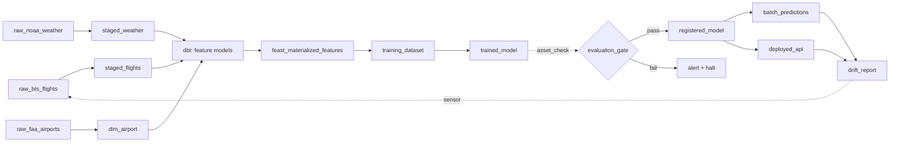

# ml-training-orchestrator


### Architecture

```
┌────────────────────────────────────────────────────────────────────┐
│                         CONTROL PLANE (Oracle Cloud Free)          │
│  ┌──────────┐   ┌──────────┐   ┌──────────┐   ┌──────────────┐    │
│  │ Dagster  │   │  MLflow  │   │  Feast   │   │  Evidently   │    │
│  │ webui +  │   │  Server  │   │ Registry │   │  Reports     │    │
│  │ daemon   │   │          │   │          │   │              │    │
│  └────┬─────┘   └────┬─────┘   └────┬─────┘   └──────┬───────┘    │
│       │              │              │                 │            │
│  ┌────┴──────────────┴──────────────┴─────────────────┴─────────┐ │
│  │            Postgres (metadata)    +    MinIO (artifacts)     │ │
│  └──────────────────────────────────────────────────────────────┘ │
└────────────────────────────────────────────────────────────────────┘
             │                                      │
             │ triggers                             │ reads/writes
             ▼                                      ▼
┌────────────────────────────────┐  ┌─────────────────────────────────┐
│   DATA PLANE (Oracle Cloud)    │  │   OBJECT STORE (Cloudflare R2)  │
│  ┌──────────┐   ┌───────────┐  │  │  ┌─────────────────────────┐    │
│  │ dbt-     │   │  PySpark  │  │  │  │ raw/     (Parquet)      │    │
│  │ duckdb   │   │ (heavy    │  │──┼─▶│ staging/ (Parquet)      │    │
│  │          │   │  jobs)    │  │  │  │ features/(Iceberg)      │    │
│  └──────────┘   └───────────┘  │  │  │ datasets/(versioned)    │    │
│  ┌──────────────────────────┐  │  │  │ models/  (MLflow)       │    │
│  │   Training (XGBoost +    │  │  │  └─────────────────────────┘    │
│  │   Optuna)                │  │  └─────────────────────────────────┘
│  └──────────────────────────┘  │
└────────────────────────────────┘
             │
             │ promote
             ▼
┌───────────────────────────────────────────────────────────────────┐
│                      SERVING (Fly.io + Upstash)                   │
│  ┌──────────────────┐       ┌─────────────────────────────────┐   │
│  │  FastAPI         │──────▶│  Upstash Redis (online store)   │   │
│  │  Inference       │       └─────────────────────────────────┘   │
│  └──────────────────┘                                             │
└───────────────────────────────────────────────────────────────────┘
```

### Dagster Asset Graph

Every node below is a Software-Defined Asset. Dagster infers the dependency arrows from each asset's declared inputs, and the webui renders this graph automatically.



Key Dagster primitives used:

- `@asset` for every node above (dbt models auto-loaded via `dagster-dbt`).
- `@asset_check` for schema contracts, freshness, and the evaluation gate.
- `MonthlyPartitionsDefinition` on `raw_bts_flights` and downstream partitioned assets.
- `@sensor` watching the drift metrics table → triggers a run of the training asset group.
- `@schedule` for the nightly retrain cadence.

```
Time →

Feature values over time (origin_airport=ORD):
  t=08:00  avg_dep_delay_1h=6.2
  t=09:00  avg_dep_delay_1h=9.8    ← available at 09:00
  t=10:00  avg_dep_delay_1h=14.1
  t=11:00  avg_dep_delay_1h=18.5

Label events (scheduled departures):
  flight_A  scheduled_dep=09:15  → correct feature: avg_dep_delay_1h=9.8  (from t=09:00)
  flight_B  scheduled_dep=10:45  → correct feature: avg_dep_delay_1h=14.1 (from t=10:00)

WRONG (causes leakage):
  flight_A  → avg_dep_delay_1h=18.5 (from t=11:00, value from THE FUTURE)

Extra subtlety for BTS: the feature must be keyed by SCHEDULED departure time,
never actual departure time, because actual is what you're predicting.

Feast PIT join rule:
  joined feature = latest feature where feature_ts <= event_ts - ttl
```

### Storage

Rough estimates per monthly partition:

#### Flights (raw + staged)

- BTS reports ~600–700K domestic flights/month
- Raw CSV is ~100–200 MB uncompressed; as Parquet + zstd it compresses to ~15–30 MB
- Staged adds UTC timestamps but drops no rows (validated rows only) — similar size, ~15–25 MB
- Rejected rows: a small fraction, likely <1 MB

#### Weather (raw + staged)

- ~350–450 NOAA stations × 720 FM-15 obs/station (hourly × 30 days) = ~300K rows
- 13 narrow columns (mostly float32) — ~3–8 MB as Parquet + zstd

#### Dimension tables (written once, not partitioned)

- dim_airport: ~500 rows — negligible
- dim_route: ~10K–50K rows — <5 MB

#### Full backfill (2018–2024, 84 months)

- Flights: ~84 × 20 MB = ~1.7 GB raw + ~1.5 GB staged
- Weather: ~84 × 5 MB = ~420 MB raw + ~350 MB staged
- Total: ~4 GB, comfortable for a local MinIO instance

One caveat: the raw NOAA layer stores all data that came out of LCD parsing (already filtered to FM-15 + target month), not the full annual CSVs, so it won't balloon. The heavy I/O cost is network (downloading those annual files), not storage.

## Development

fresh checkout or after switching branches, run:

```bash
# 1. Python dependencies
uv sync --all-groups

# 2. dbt setup — must run before dagster dev
make dbt-bootstrap

# 3. Start infrastructure
docker compose up -d

# 4. Create S3 buckets and Postgres databases
./scripts/bootstrap_dev.sh # already run by minio-init in compose.yml

# 5. Launch Dagster (requires target/manifest.json to exist - make dbt-bootstrap)
make dagster-dev

# 6. Ingest raw data (run via Dagster UI or CLI)
#    — raw_faa_airports, raw_openflights_routes, station_map
#    — raw_noaa_weather (monthly)
#    — raw_bts_flights (monthly)

# 7. Materialize staging layer
#    — dim_airport, dim_route
#    — staged_flights, staged_weather (all partitions)

# 8. PySpark cascading delay
#    — feat_cascading_delay (or materialize via Dagster)

# 9. In Dagster UI: materialize bmo_dbt_assets
#    Or from CLI:
cd dbt_project && uv run dbt build --profiles-dir .
```

### Ingestion from Dagster UI

1. Run make dagster-dev → open http://localhost:3000
2. Go to Assets tab → you'll see the full asset graph
3. To run ingestion in the right order, use the Asset Jobs approach or materialize assets manually:

#### Dimensions (no partition):

- Click `raw_faa_airports` → Materialize → confirm
- Click `station_map` → Materialize
- Click `raw_openflights_routes` → Materialize
- Click `dim_airport` → Materialize ← depends on `raw_faa_airports` + `station_map`
- Click `dim_route` → Materialize ← depends on `raw_openflights_routes` + `dim_airport`

#### Monthly partitioned assets (flights + weather):

- Click `raw_bts_flights` → Materialize selected partitions → pick the months you want (e.g. `2024-01-01`)
- Click `staged_flights` → Materialize selected partitions → same month(s)
- Repeat for `raw_noaa_weather` → `staged_weather`

#### Feature layer (run after all staging is complete):

- Click `feat_cascading_delay` → Materialize
- Click any `bmo_dbt_assets` model → Materialize all (or the whole group)

#### Backfill all partitions at once

##### Dagster UI

For bulk historical ingestion, use Backfills rather than materializing one partition at a time:

1. Go to Assets → select `staged_flights` → **Backfill**
2. Select partition range: `2018-01` through `2024-12`
3. Dagster queues a run per partition and executes them concurrently (up to your `max_concurrent_runs` setting)

##### CLI

```bash
uv run dg launch --assets staged_flights --all-partitions
```

### From the CLI using `dg launch`

```bash
# Dimensions
uv run dg launch --assets raw_faa_airports
uv run dg launch --assets station_map
uv run dg launch --assets raw_openflights_routes
uv run dg launch --assets dim_airport
uv run dg launch --assets dim_route

# Monthly partitioned — specify partition key (format: YYYY-MM-DD)
uv run dg launch --assets raw_bts_flights --partition 2024-01-01
uv run dg launch --assets staged_flights --partition 2024-01-01
uv run dg launch --assets raw_noaa_weather --partition 2024-01-01
uv run dg launch --assets staged_weather --partition 2024-01-01

# Run a range of months (no native range flag — loop in bash)
for month in 2018-01-01 2018-02-01 2018-03-01; do
  uv run dg launch --assets raw_bts_flights --partition $month
  uv run dg launch --assets staged_flights --partition $month
done

# Features
uv run dg launch --assets feat_cascading_delay

# All dbt assets at once
uv run dg launch --assets 'group:dbt'   # if dbt_assets are in a group
# or by asset key pattern
uv run dg launch --assets 'bmo_dbt_assets*'

```

#### Verify PIT correctness:

runs test_no_future_leakage on origin_obs_time_utc and the singular assert_pit_correct.sql. Both should report 0 failures.

```bash
cd dbt_project && uv run dbt test --select int_flights_enriched --profiles-dir .
```

## Deployment

TODO

---

## ML Training Orchestrator — Technology Overview

### What is this system?

A **batch ML pipeline** for predicting flight delays (BTS airline on-time performance data). It's structured as a classic data engineering stack: raw ingestion → staging → feature engineering → model training → serving.

---

## Core Technologies

### 1. Dagster — Orchestration Layer

**Purpose:** The central "brain" of the system. Dagster models every data artifact (raw files, Iceberg tables, trained models) as an _asset_ in a dependency graph. It decides what runs, when, and in what order.

**Key concepts used here:**

- `@asset` decorators define each data artifact and its dependencies
- `@sensor` watches external systems (BTS website) and triggers runs when new data appears
- `@asset_check` runs post-materialization validation (null rates, schema drift)
- Partition support tracks which months have been processed
- Metadata store (backed by **PostgreSQL**) persists run history, logs, and schedules

**Integrations:** Dagster orchestrates _all other tools_ — it calls Python code, launches dbt builds, and submits PySpark jobs. The Dagster UI provides visibility into the full asset lineage.

---

### 2. dbt — SQL Transformation Layer

**Purpose:** Transforms validated staging data into ML features using SQL. Runs inside Dagster via `dagster-dbt`.

**How it integrates:**

- dbt models reference Iceberg tables as `{{ source(...) }}`
- A custom `BmoDbtTranslator` maps dbt source names → Dagster asset keys, so Dagster can draw the correct dependency edges (e.g., `staged_flights` → `int_flights_enriched`)
- The dbt adapter is `dbt-duckdb`, so queries run via DuckDB (no separate SQL server needed)
- The PyIceberg plugin for dbt-duckdb resolves the Iceberg table location at query time

**Models:**

```
staging/      → views on Iceberg tables (no storage cost)
intermediate/ → int_flights_enriched (PIT-correct weather join)
features/     → 6 windowed/rolling aggregation tables
marts/        → mart_training_dataset (final ML input)
```

---

### 3. Apache Iceberg — Table Format (Storage Layer)

**Purpose:** ACID-compliant table format sitting on top of S3/MinIO. This is the primary "database" for staging and feature data — not a query engine, just a format.

**Why Iceberg over plain Parquet?**

- **Partition overwrite:** Re-running a month safely overwrites exactly that partition, no corruption
- **Schema evolution:** Iceberg tracks schema history; asset checks detect unexpected changes
- **Time-travel:** Can query historical snapshots for reproducibility
- **Multi-engine reads:** Both DuckDB and PySpark can read the same Iceberg tables

**Two catalog implementations in this project:**

- **PyIceberg** (`SqlCatalog` backed by SQLite) — used by Python staging code and dbt
- **HadoopCatalog** — used by PySpark jobs, pointing to the same physical S3 location

---

### 4. DuckDB — Analytical Query Engine

**Purpose:** Runs SQL queries against Iceberg tables (via the `iceberg_scan` function + `httpfs` extension for S3). Used exclusively by dbt.

**Key property:** Ephemeral — no server process, just a library. DuckDB reads directly from S3/MinIO, computes features in memory, and writes results back as Iceberg tables. This means zero persistent compute cost.

---

### 5. PySpark — Distributed Computation

**Purpose:** Computes the `feat_cascading_delay` feature — a window function that looks up each aircraft's previous flight's arrival delay (`LAG` per `tail_number`, ordered by `scheduled_departure_utc`).

**Why PySpark and not DuckDB for this?**

- PySpark's shuffle-based window functions handle the cross-month data correctly (aircraft may have flown in a previous partition)
- Configured with `HadoopCatalog` to read/write Iceberg directly

**Integration:** The `feat_cascading_delay` Dagster asset submits the PySpark job via `dagster-pyspark` and waits for it to complete before downstream dbt models run.

---

### 6. MinIO — Object Storage (Dev) / Cloudflare R2 (Prod)

**Purpose:** S3-compatible blob storage for all data: raw Parquet files, Iceberg table data, and MLflow model artifacts.

**Bucket layout:**

```
s3://raw/               → downloaded Parquet (BTS flights, NOAA weather, FAA airports)
s3://staging/           → Iceberg table data (validated, timestamped)
s3://rejected/          → rows that failed Pydantic validation
s3://mlflow-artifacts/  → trained model files
```

The `src/bmo/common/storage.py` boto3 wrapper is endpoint-agnostic — swap the `S3_ENDPOINT_URL` env var to switch between MinIO (local), R2 (cloud), or AWS S3.

---

### 7. MLflow — Experiment Tracking & Model Registry

**Purpose:** Tracks every training run (hyperparameters, metrics, artifacts) and maintains a model registry for promoting models to production.

**Infrastructure:** Runs as a Docker service; uses PostgreSQL as its backend store and MinIO as its artifact store. The serving API loads the registered "champion" model on startup.

---

### 8. Feast — Feature Store

**Purpose:** Bridges the gap between offline feature computation (Iceberg) and online serving (Redis). Ensures the inference API gets the same features the model was trained on, at the correct point-in-time.

**Offline store:** Iceberg tables (already computed by dbt/PySpark)  
**Online store:** Redis — features are _materialized_ into Redis so the FastAPI service can fetch them in sub-millisecond latency at inference time.

---

### 9. FastAPI — Serving Layer

**Purpose:** REST API for inference. Loads the XGBoost model from MLflow registry, fetches features from Redis (via Feast), and returns a delay prediction.

---

## How They All Connect

```
┌─────────────────────────────────────────────────────────────────┐
│                         DAGSTER                                  │
│  Asset Graph: raw → staged → features → training → serving      │
│  Sensor: polls BTS website → triggers partition runs            │
│  Metadata DB: PostgreSQL                                         │
└───────┬────────────┬───────────────┬────────────────────────────┘
        │            │               │
        ▼            ▼               ▼
  Python assets   dbt assets    PySpark asset
  (src/bmo/)     (dbt_project/) (cascading_delay)
        │            │               │
        │     DuckDB (ephemeral)     │
        │     reads/writes Iceberg   │
        └────────────┴───────────────┘
                     │
                     ▼
        ┌────────────────────────┐
        │   Apache Iceberg       │  ← Table format (ACID, partitioned)
        │   on MinIO / R2        │  ← Physical storage
        └────────────────────────┘
                     │
          ┌──────────┴──────────┐
          ▼                     ▼
    MLflow (training)      Feast offline store
    PostgreSQL backend     → materialize →
    MinIO artifacts        Redis (online)
          │                     │
          ▼                     ▼
    ┌─────────────────────────────┐
    │   FastAPI (Fly.io)          │
    │   XGBoost model + features  │
    └─────────────────────────────┘
```

---

## Data Flow Summary

```
External HTTP              Python (bmo/ingestion)
BTS / NOAA / FAA  ──────►  raw Parquet on S3
                                   │
                           Python (bmo/staging)
                           + Pydantic validation
                                   │
                           Iceberg tables (staged_flights,
                           staged_weather, dim_airport)
                                   │
                    ┌──────────────┴──────────────┐
                    ▼                             ▼
             dbt + DuckDB                      PySpark
             SQL feature models             cascading_delay
             (windowed averages,            (window LAG per
              weather joins, etc.)           aircraft tail #)
                    └──────────────┬──────────────┘
                                   ▼
                         mart_training_dataset
                         (Iceberg, all features)
                                   │
                         XGBoost + Optuna (TODO)
                         MLflow tracking
                                   │
                         Feast materialization
                         Iceberg → Redis
                                   │
                         FastAPI inference API
```

---

## Key Architectural Pattern: Point-in-Time Correctness

The trickiest part of any ML pipeline. Every feature is keyed to `scheduled_departure_utc` — never actual departure — so that at inference time, you only use information that was knowable _before_ the flight departed. The `int_flights_enriched` dbt model enforces this with a `QUALIFY row_number() = 1` window to pick only weather observations that occurred before the scheduled departure.

---

**Why `get_historical_features` is not just a SELECT — the interview explanation:**

When you call `get_historical_features(entity_df, features)`, Feast does:

Takes your `entity_df` — one row per training example, each with an entity key and an `event_timestamp`.
For each row, finds all feature rows matching the entity key.
Filters to rows where `feature.event_ts <= entity.event_timestamp`.
Within that filtered set, picks the latest row (maximum `event_ts`).
Returns that value as the feature for that training example.
This is the "as-of join" or "point-in-time join." On a whiteboard, draw two timelines: one for feature snapshots (computed each hour) and one for flight events (one per scheduled departure). The PIT join connects each flight to the most recent feature snapshot that existed before that flight departed.

A plain SQL `SELECT latest_value FROM features WHERE entity = X` would give every flight the same "latest" feature value regardless of when the flight happened — which leaks future information into the training set.

**"Walk me through your feature store design."**

Feast with a file-based offline store (Parquet on MinIO/R2) and Redis for online serving. Five feature views organized by entity type: origin airport, destination airport, carrier, route, and aircraft tail. Calendar features are excluded from the feature store deliberately — they're deterministic functions of the timestamp and cheaper to compute on-the-fly than to store and retrieve.

**"Why is get_historical_features not just a SELECT?"**

It's an as-of join. For each row in your entity dataframe — which has an entity key and a timestamp — Feast finds the latest feature snapshot where the feature's event_ts is less than or equal to the entity's timestamp. A plain SELECT of the latest value would give every training example the same feature value regardless of when the event happened, leaking future information into the training set. I have a test that plants two different values at T=10:00 and T=14:00, then requests features for events at T=11:30 and T=15:00, and asserts each gets its correct historical value.

**"How do you keep training and serving features consistent?"**

One feature view definition → one Parquet source → materialized to both the offline store (for get_historical_features during training) and the online store (Redis, for inference). The same field names, same TTLs, same types. There's no separate "training features" codebase — the Feast schema is the contract.
