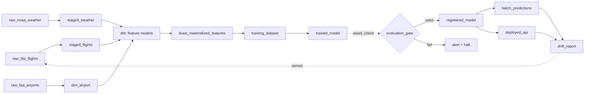

# ml-training-orchestrator


### Architecture

```
┌────────────────────────────────────────────────────────────────────┐
│                         CONTROL PLANE (Oracle Cloud Free)          │
│  ┌──────────┐   ┌──────────┐   ┌──────────┐   ┌──────────────┐    │
│  │ Dagster  │   │  MLflow  │   │  Feast   │   │  Evidently   │    │
│  │ webui +  │   │  Server  │   │ Registry │   │  Reports     │    │
│  │ daemon   │   │          │   │          │   │              │    │
│  └────┬─────┘   └────┬─────┘   └────┬─────┘   └──────┬───────┘    │
│       │              │              │                 │            │
│  ┌────┴──────────────┴──────────────┴─────────────────┴─────────┐ │
│  │            Postgres (metadata)    +    MinIO (artifacts)     │ │
│  └──────────────────────────────────────────────────────────────┘ │
└────────────────────────────────────────────────────────────────────┘
             │                                      │
             │ triggers                             │ reads/writes
             ▼                                      ▼
┌────────────────────────────────┐  ┌─────────────────────────────────┐
│   DATA PLANE (Oracle Cloud)    │  │   OBJECT STORE (Cloudflare R2)  │
│  ┌──────────┐   ┌───────────┐  │  │  ┌─────────────────────────┐    │
│  │ dbt-     │   │  PySpark  │  │  │  │ raw/     (Parquet)      │    │
│  │ duckdb   │   │ (heavy    │  │──┼─▶│ staging/ (Parquet)      │    │
│  │          │   │  jobs)    │  │  │  │ features/(Iceberg)      │    │
│  └──────────┘   └───────────┘  │  │  │ datasets/(versioned)    │    │
│  ┌──────────────────────────┐  │  │  │ models/  (MLflow)       │    │
│  │   Training (XGBoost +    │  │  │  └─────────────────────────┘    │
│  │   Optuna)                │  │  └─────────────────────────────────┘
│  └──────────────────────────┘  │
└────────────────────────────────┘
             │
             │ promote
             ▼
┌───────────────────────────────────────────────────────────────────┐
│                      SERVING (Fly.io + Upstash)                   │
│  ┌──────────────────┐       ┌─────────────────────────────────┐   │
│  │  FastAPI         │──────▶│  Upstash Redis (online store)   │   │
│  │  Inference       │       └─────────────────────────────────┘   │
│  └──────────────────┘                                             │
└───────────────────────────────────────────────────────────────────┘
```

### Dagster Asset Graph

Every node below is a Software-Defined Asset. Dagster infers the dependency arrows from each asset's declared inputs, and the webui renders this graph automatically.



Key Dagster primitives used:

- `@asset` for every node above (dbt models auto-loaded via `dagster-dbt`).
- `@asset_check` for schema contracts, freshness, and the evaluation gate.
- `MonthlyPartitionsDefinition` on `raw_bts_flights` and downstream partitioned assets.
- `@sensor` watching the drift metrics table → triggers a run of the training asset group.
- `@schedule` for the nightly retrain cadence.

```
Time →

Feature values over time (origin_airport=ORD):
  t=08:00  avg_dep_delay_1h=6.2
  t=09:00  avg_dep_delay_1h=9.8    ← available at 09:00
  t=10:00  avg_dep_delay_1h=14.1
  t=11:00  avg_dep_delay_1h=18.5

Label events (scheduled departures):
  flight_A  scheduled_dep=09:15  → correct feature: avg_dep_delay_1h=9.8  (from t=09:00)
  flight_B  scheduled_dep=10:45  → correct feature: avg_dep_delay_1h=14.1 (from t=10:00)

WRONG (causes leakage):
  flight_A  → avg_dep_delay_1h=18.5 (from t=11:00, value from THE FUTURE)

Extra subtlety for BTS: the feature must be keyed by SCHEDULED departure time,
never actual departure time, because actual is what you're predicting.

Feast PIT join rule:
  joined feature = latest feature where feature_ts <= event_ts - ttl
```

### Storage

Rough estimates per monthly partition:

#### Flights (raw + staged)

- BTS reports ~600–700K domestic flights/month
- Raw CSV is ~100–200 MB uncompressed; as Parquet + zstd it compresses to ~15–30 MB
- Staged adds UTC timestamps but drops no rows (validated rows only) — similar size, ~15–25 MB
- Rejected rows: a small fraction, likely <1 MB

#### Weather (raw + staged)

- ~350–450 NOAA stations × 720 FM-15 obs/station (hourly × 30 days) = ~300K rows
- 13 narrow columns (mostly float32) — ~3–8 MB as Parquet + zstd

#### Dimension tables (written once, not partitioned)

- dim_airport: ~500 rows — negligible
- dim_route: ~10K–50K rows — <5 MB

#### Full backfill (2018–2024, 84 months)

- Flights: ~84 × 20 MB = ~1.7 GB raw + ~1.5 GB staged
- Weather: ~84 × 5 MB = ~420 MB raw + ~350 MB staged
- Total: ~4 GB, comfortable for a local MinIO instance

One caveat: the raw NOAA layer stores all data that came out of LCD parsing (already filtered to FM-15 + target month), not the full annual CSVs, so it won't balloon. The heavy I/O cost is network (downloading those annual files), not storage.

## Development

fresh checkout or after switching branches, run:

```bash
# 1. Python dependencies
uv sync --all-groups

# 2. dbt setup — must run before dagster dev
make dbt-bootstrap

# 3. Start infrastructure
docker compose up -d

# 4. Create S3 buckets and Postgres databases
./scripts/bootstrap_dev.sh # already run by minio-init in compose.yml

# 5. Launch Dagster (requires target/manifest.json to exist - make dbt-bootstrap)
make dagster-dev

# 6. Ingest raw data (run via Dagster UI or CLI)
#    — raw_faa_airports, raw_openflights_routes, station_map
#    — raw_noaa_weather (monthly)
#    — raw_bts_flights (monthly)

# 7. Materialize staging layer
#    — dim_airport, dim_route
#    — staged_flights, staged_weather (all partitions)

# 8. PySpark cascading delay
#    — feat_cascading_delay (or materialize via Dagster)

# 9. In Dagster UI: materialize bmo_dbt_assets
#    Or from CLI:
cd dbt_project && uv run dbt build --profiles-dir .
```

### Ingestion from Dagster UI

1. Run make dagster-dev → open http://localhost:3000
2. Go to Assets tab → you'll see the full asset graph
3. To run ingestion in the right order, use the Asset Jobs approach or materialize assets manually:

#### Dimensions (no partition):

- Click `raw_faa_airports` → Materialize → confirm
- Click `station_map` → Materialize
- Click `raw_openflights_routes` → Materialize
- Click `dim_airport` → Materialize ← depends on `raw_faa_airports` + `station_map`
- Click `dim_route` → Materialize ← depends on `raw_openflights_routes` + `dim_airport`

#### Monthly partitioned assets (flights + weather):

- Click `raw_bts_flights` → Materialize selected partitions → pick the months you want (e.g. `2024-01-01`)
- Click `staged_flights` → Materialize selected partitions → same month(s)
- Repeat for `raw_noaa_weather` → `staged_weather`

#### Feature layer (run after all staging is complete):

- Click `feat_cascading_delay` → Materialize
- Click any `bmo_dbt_assets` model → Materialize all (or the whole group)

#### Backfill all partitions at once

##### Dagster UI

For bulk historical ingestion, use Backfills rather than materializing one partition at a time:

1. Go to Assets → select `staged_flights` → **Backfill**
2. Select partition range: `2018-01` through `2024-12`
3. Dagster queues a run per partition and executes them concurrently (up to your `max_concurrent_runs` setting)

##### CLI

```bash
uv run dg launch --assets staged_flights --all-partitions
```

### From the CLI using `dg launch`

```bash
# Dimensions
uv run dg launch --assets raw_faa_airports
uv run dg launch --assets station_map
uv run dg launch --assets raw_openflights_routes
uv run dg launch --assets dim_airport
uv run dg launch --assets dim_route

# Monthly partitioned — specify partition key (format: YYYY-MM-DD)
uv run dg launch --assets raw_bts_flights --partition 2024-01-01
uv run dg launch --assets staged_flights --partition 2024-01-01
uv run dg launch --assets raw_noaa_weather --partition 2024-01-01
uv run dg launch --assets staged_weather --partition 2024-01-01

# Run a range of months (no native range flag — loop in bash)
for month in 2018-01-01 2018-02-01 2018-03-01; do
  uv run dg launch --assets raw_bts_flights --partition $month
  uv run dg launch --assets staged_flights --partition $month
done

# Features
uv run dg launch --assets feat_cascading_delay

# All dbt assets at once
uv run dg launch --assets 'group:dbt'   # if dbt_assets are in a group
# or by asset key pattern
uv run dg launch --assets 'bmo_dbt_assets*'

```

#### Verify PIT correctness:

runs test_no_future_leakage on origin_obs_time_utc and the singular assert_pit_correct.sql. Both should report 0 failures.

```bash
cd dbt_project && uv run dbt test --select int_flights_enriched --profiles-dir .
```

## Deployment

TODO
