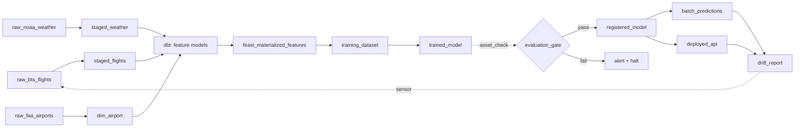

# ml-training-orchestrator


### Architecture

```
┌────────────────────────────────────────────────────────────────────┐
│                         CONTROL PLANE (Oracle Cloud Free)          │
│  ┌──────────┐   ┌──────────┐   ┌──────────┐   ┌──────────────┐    │
│  │ Dagster  │   │  MLflow  │   │  Feast   │   │  Evidently   │    │
│  │ webui +  │   │  Server  │   │ Registry │   │  Reports     │    │
│  │ daemon   │   │          │   │          │   │              │    │
│  └────┬─────┘   └────┬─────┘   └────┬─────┘   └──────┬───────┘    │
│       │              │              │                 │            │
│  ┌────┴──────────────┴──────────────┴─────────────────┴─────────┐ │
│  │            Postgres (metadata)    +    MinIO (artifacts)     │ │
│  └──────────────────────────────────────────────────────────────┘ │
└────────────────────────────────────────────────────────────────────┘
             │                                      │
             │ triggers                             │ reads/writes
             ▼                                      ▼
┌────────────────────────────────┐  ┌─────────────────────────────────┐
│   DATA PLANE (Oracle Cloud)    │  │   OBJECT STORE (Cloudflare R2)  │
│  ┌──────────┐   ┌───────────┐  │  │  ┌─────────────────────────┐    │
│  │ dbt-     │   │  PySpark  │  │  │  │ raw/     (Parquet)      │    │
│  │ duckdb   │   │ (heavy    │  │──┼─▶│ staging/ (Parquet)      │    │
│  │          │   │  jobs)    │  │  │  │ features/(Iceberg)      │    │
│  └──────────┘   └───────────┘  │  │  │ datasets/(versioned)    │    │
│  ┌──────────────────────────┐  │  │  │ models/  (MLflow)       │    │
│  │   Training (XGBoost +    │  │  │  └─────────────────────────┘    │
│  │   Optuna)                │  │  └─────────────────────────────────┘
│  └──────────────────────────┘  │
└────────────────────────────────┘
             │
             │ promote
             ▼
┌───────────────────────────────────────────────────────────────────┐
│                      SERVING (Fly.io + Upstash)                   │
│  ┌──────────────────┐       ┌─────────────────────────────────┐   │
│  │  FastAPI         │──────▶│  Upstash Redis (online store)   │   │
│  │  Inference       │       └─────────────────────────────────┘   │
│  └──────────────────┘                                             │
└───────────────────────────────────────────────────────────────────┘
```

### Dagster Asset Graph

Every node below is a Software-Defined Asset. Dagster infers the dependency arrows from each asset's declared inputs, and the webui renders this graph automatically.



Key Dagster primitives used:

- `@asset` for every node above (dbt models auto-loaded via `dagster-dbt`).
- `@asset_check` for schema contracts, freshness, and the evaluation gate.
- `MonthlyPartitionsDefinition` on `raw_bts_flights` and downstream partitioned assets.
- `@sensor` watching the drift metrics table → triggers a run of the training asset group.
- `@schedule` for the nightly retrain cadence.

```
Time →

Feature values over time (origin_airport=ORD):
  t=08:00  avg_dep_delay_1h=6.2
  t=09:00  avg_dep_delay_1h=9.8    ← available at 09:00
  t=10:00  avg_dep_delay_1h=14.1
  t=11:00  avg_dep_delay_1h=18.5

Label events (scheduled departures):
  flight_A  scheduled_dep=09:15  → correct feature: avg_dep_delay_1h=9.8  (from t=09:00)
  flight_B  scheduled_dep=10:45  → correct feature: avg_dep_delay_1h=14.1 (from t=10:00)

WRONG (causes leakage):
  flight_A  → avg_dep_delay_1h=18.5 (from t=11:00, value from THE FUTURE)

Extra subtlety for BTS: the feature must be keyed by SCHEDULED departure time,
never actual departure time, because actual is what you're predicting.

Feast PIT join rule:
  joined feature = latest feature where feature_ts <= event_ts - ttl
```
