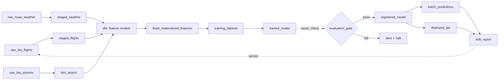
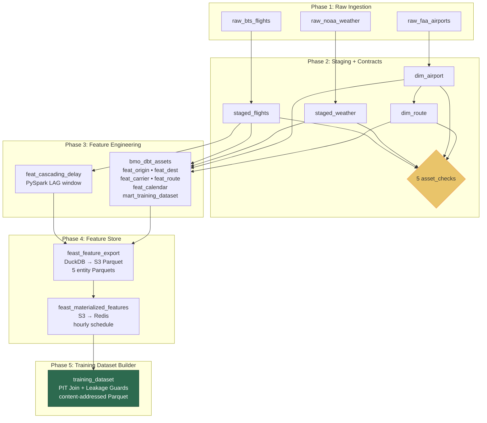
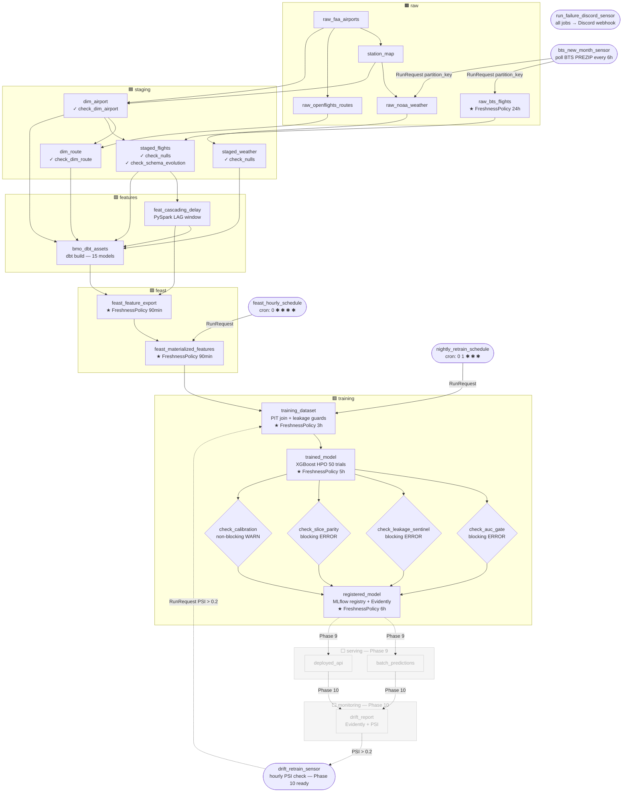

# ml-training-orchestrator


### Architecture

```
┌────────────────────────────────────────────────────────────────────┐
│                         CONTROL PLANE (Oracle Cloud Free)          │
│  ┌──────────┐   ┌──────────┐   ┌──────────┐   ┌──────────────┐    │
│  │ Dagster  │   │  MLflow  │   │  Feast   │   │  Evidently   │    │
│  │ webui +  │   │  Server  │   │ Registry │   │  Reports     │    │
│  │ daemon   │   │          │   │          │   │              │    │
│  └────┬─────┘   └────┬─────┘   └────┬─────┘   └──────┬───────┘    │
│       │              │              │                 │            │
│  ┌────┴──────────────┴──────────────┴─────────────────┴─────────┐ │
│  │            Postgres (metadata)    +    MinIO (artifacts)     │ │
│  └──────────────────────────────────────────────────────────────┘ │
└────────────────────────────────────────────────────────────────────┘
             │                                      │
             │ triggers                             │ reads/writes
             ▼                                      ▼
┌────────────────────────────────┐  ┌─────────────────────────────────┐
│   DATA PLANE (Oracle Cloud)    │  │   OBJECT STORE (Cloudflare R2)  │
│  ┌──────────┐   ┌───────────┐  │  │  ┌─────────────────────────┐    │
│  │ dbt-     │   │  PySpark  │  │  │  │ raw/     (Parquet)      │    │
│  │ duckdb   │   │ (heavy    │  │──┼─▶│ staging/ (Parquet)      │    │
│  │          │   │  jobs)    │  │  │  │ features/(Iceberg)      │    │
│  └──────────┘   └───────────┘  │  │  │ datasets/(versioned)    │    │
│  ┌──────────────────────────┐  │  │  │ models/  (MLflow)       │    │
│  │   Training (XGBoost +    │  │  │  └─────────────────────────┘    │
│  │   Optuna)                │  │  └─────────────────────────────────┘
│  └──────────────────────────┘  │
└────────────────────────────────┘
             │
             │ promote
             ▼
┌───────────────────────────────────────────────────────────────────┐
│                      SERVING (Fly.io + Upstash)                   │
│  ┌──────────────────┐       ┌─────────────────────────────────┐   │
│  │  FastAPI         │──────▶│  Upstash Redis (online store)   │   │
│  │  Inference       │       └─────────────────────────────────┘   │
│  └──────────────────┘                                             │
└───────────────────────────────────────────────────────────────────┘
```

### Dagster Asset Graph

Every node below is a Software-Defined Asset. Dagster infers the dependency arrows from each asset's declared inputs, and the webui renders this graph automatically.




Key Dagster primitives used:

- `@asset` for every node above (dbt models auto-loaded via `dagster-dbt`).
- `@asset_check` for schema contracts, freshness, and the evaluation gate.
- `MonthlyPartitionsDefinition` on `raw_bts_flights` and downstream partitioned assets.
- `@sensor` watching the drift metrics table → triggers a run of the training asset group.
- `@schedule` for the nightly retrain cadence.

```
Time →

Feature values over time (origin_airport=ORD):
  t=08:00  avg_dep_delay_1h=6.2
  t=09:00  avg_dep_delay_1h=9.8    ← available at 09:00
  t=10:00  avg_dep_delay_1h=14.1
  t=11:00  avg_dep_delay_1h=18.5

Label events (scheduled departures):
  flight_A  scheduled_dep=09:15  → correct feature: avg_dep_delay_1h=9.8  (from t=09:00)
  flight_B  scheduled_dep=10:45  → correct feature: avg_dep_delay_1h=14.1 (from t=10:00)

WRONG (causes leakage):
  flight_A  → avg_dep_delay_1h=18.5 (from t=11:00, value from THE FUTURE)

Extra subtlety for BTS: the feature must be keyed by SCHEDULED departure time,
never actual departure time, because actual is what you're predicting.

Feast PIT join rule:
  joined feature = latest feature where feature_ts <= event_ts - ttl
```

# References

[XGBoost python examples](https://github.com/dmlc/xgboost/tree/master/demo/guide-python)

### Storage

Rough estimates per monthly partition:

#### Flights (raw + staged)

- BTS reports ~600–700K domestic flights/month
- Raw CSV is ~100–200 MB uncompressed; as Parquet + zstd it compresses to ~15–30 MB
- Staged adds UTC timestamps but drops no rows (validated rows only) — similar size, ~15–25 MB
- Rejected rows: a small fraction, likely <1 MB

#### Weather (raw + staged)

- ~350–450 NOAA stations × 720 FM-15 obs/station (hourly × 30 days) = ~300K rows
- 13 narrow columns (mostly float32) — ~3–8 MB as Parquet + zstd

#### Dimension tables (written once, not partitioned)

- dim_airport: ~500 rows — negligible
- dim_route: ~10K–50K rows — <5 MB

#### Full backfill (2018–2024, 84 months)

- Flights: ~84 × 20 MB = ~1.7 GB raw + ~1.5 GB staged
- Weather: ~84 × 5 MB = ~420 MB raw + ~350 MB staged
- Total: ~4 GB, comfortable for a local MinIO instance

One caveat: the raw NOAA layer stores all data that came out of LCD parsing (already filtered to FM-15 + target month), not the full annual CSVs, so it won't balloon. The heavy I/O cost is network (downloading those annual files), not storage.

## Development

fresh checkout or after switching branches, run:

```bash
# 1. Python dependencies
uv sync --all-groups

# 2. dbt setup — must run before dagster dev
make dbt-bootstrap

# 3. Start infrastructure
docker compose up -d

# 4. Create S3 buckets and Postgres databases
./scripts/bootstrap_dev.sh # already run by minio-init in compose.yml

# 5. Launch Dagster (requires target/manifest.json to exist - make dbt-bootstrap)
make dagster-dev

# 6. Ingest raw data (run via Dagster UI or CLI)
#    — raw_faa_airports, raw_openflights_routes, station_map
#    — raw_noaa_weather (monthly)
#    — raw_bts_flights (monthly)

# 7. Materialize staging layer
#    — dim_airport, dim_route
#    — staged_flights, staged_weather (all partitions)

# 8. PySpark cascading delay
#    — feat_cascading_delay (or materialize via Dagster)

# 9. In Dagster UI: materialize bmo_dbt_assets
#    Or from CLI:
cd dbt_project && uv run dbt build --profiles-dir .
```

### Ingestion from Dagster UI

1. Run make dagster-dev → open http://localhost:3000
2. Go to Assets tab → you'll see the full asset graph
3. To run ingestion in the right order, use the Asset Jobs approach or materialize assets manually:

#### Dimensions (no partition):

- Click `raw_faa_airports` → Materialize → confirm
- Click `station_map` → Materialize
- Click `raw_openflights_routes` → Materialize
- Click `dim_airport` → Materialize ← depends on `raw_faa_airports` + `station_map`
- Click `dim_route` → Materialize ← depends on `raw_openflights_routes` + `dim_airport`

#### Monthly partitioned assets (flights + weather):

- Click `raw_bts_flights` → Materialize selected partitions → pick the months you want (e.g. `2024-01-01`)
- Click `staged_flights` → Materialize selected partitions → same month(s)
- Repeat for `raw_noaa_weather` → `staged_weather`

#### Feature layer (run after all staging is complete):

- Click `feat_cascading_delay` → Materialize
- Click any `bmo_dbt_assets` model → Materialize all (or the whole group)

#### Backfill all partitions at once

##### Dagster UI

For bulk historical ingestion, use Backfills rather than materializing one partition at a time:

1. Go to Assets → select `staged_flights` → **Backfill**
2. Select partition range: `2018-01` through `2024-12`
3. Dagster queues a run per partition and executes them concurrently (up to your `max_concurrent_runs` setting)

##### CLI

```bash
uv run dg launch --assets staged_flights --all-partitions
```

### From the CLI using `dg launch`

```bash
# Dimensions
uv run dg launch --assets raw_faa_airports
uv run dg launch --assets station_map
uv run dg launch --assets raw_openflights_routes
uv run dg launch --assets dim_airport
uv run dg launch --assets dim_route

# Monthly partitioned — specify partition key (format: YYYY-MM-DD)
uv run dg launch --assets raw_bts_flights --partition 2024-01-01
uv run dg launch --assets staged_flights --partition 2024-01-01
uv run dg launch --assets raw_noaa_weather --partition 2024-01-01
uv run dg launch --assets staged_weather --partition 2024-01-01

# Run a range of months (no native range flag — loop in bash)
for month in 2018-01-01 2018-02-01 2018-03-01; do
  uv run dg launch --assets raw_bts_flights --partition $month
  uv run dg launch --assets staged_flights --partition $month
done

# Features
uv run dg launch --assets feat_cascading_delay

# All dbt assets at once
uv run dg launch --assets 'group:dbt'   # if dbt_assets are in a group
# or by asset key pattern
uv run dg launch --assets 'bmo_dbt_assets*'

```

#### Verify PIT correctness

runs test_no_future_leakage on origin_obs_time_utc and the singular assert_pit_correct.sql. Both should report 0 failures.

```bash
cd dbt_project && uv run dbt test --select int_flights_enriched --profiles-dir .
```

#### Run instructions after stage 5

1. One-time setup

```bash
make setup
make feast-apply
make dbt-bootstrap # runs dbt deps --profiles-dir . & dbt parse --profiles-dir .
```

- `dbt deps --profiles-dir .` - installs dependencies (like `pnpm install`); checks version compatibility
- `dbt parse --profiles-dir .` - builds dbt's DAG (dependency graph) & ensures no syntax errors

2. Start Dagster

```bash
make dagster-dev
```

Open [http://localhost:3000](http://localhost:3000)

3. In the Dagster UI — materialize in order:

- `raw_faa_airports` → Materialize
- `raw_openflights_routes` → Materialize
- `raw_bts_flights` → Materialize (pick a partition, e.g. 2024-01-01)
- `raw_noaa_weather` → Materialize (same partition)
- `dim_airport`, `dim_route` → Materialize
- `staged_flights`, `staged_weather` → Materialize (same partition)
- `feat_cascading_delay` → Materialize

4. Run dbt (in a separate terminal)

```bash
make dbt-build
```

> Note: dbt should materialize automatically now:
>
> ```python
> bmo_dbt_assets = bmo_dbt_assets.with_attributes(
>   automation_condition=AutomationCondition.eager()
> )
> ```

The [dbt build](https://docs.getdbt.com/reference/commands/build?version=1.12) command consolidates four primary dbt actions — `run`, `test`, `snapshot`, and `seed—into` a single operation. It executes these resources in the correct order based on your project's dependency graph (DAG).

- Seeds: Loads static CSV files into the database.
- Models: Materializes SQL transformations into tables or views.
- Snapshots: Captures historical state changes (SCD Type 2).
- Tests: Runs both unit tests (before models) and data tests (after models)
- generates manifests.json

5. Back in Dagster UI:

- `feast_feature_export` → Materialize
- `feast_materialized_features` → Materialize
- `training_dataset` → Materialize
- `trained` → Materialize

The BTS sensor will automatically trigger raw_bts_flights for new months going forward — you only need to manually kick off step 3 for backfills.

### Note on Postgres, Iceberg, S3, DuckDB

#### S3 (MinIO) — the actual storage

All data lives here as Parquet files. Iceberg just adds a metadata layer on top:

```
s3://staging/iceberg/dim_airport/
  metadata/
    v1.metadata.json      ← table schema, partition spec, snapshot history
    snap-123.avro         ← manifest list (which files belong to this snapshot)
  data/
    00000.parquet         ← actual rows
```

Without Iceberg, you'd just have raw Parquet files with no schema tracking, no ACID writes, and no way to do partial overwrites.

#### Iceberg

Iceberg is a table format, not a database. It's a spec for how to organize Parquet files on S3 into something that behaves like a database table — with ACID writes, schema evolution, and time travel.

It uses Postgres (or sqlite) to store metadata. (e.g. `staging.dim_airport → s3://staging/iceberg/dim_airport/`)

#### DuckDB - query engine

DuckDB doesn't store anything. It reads Iceberg tables at query time via two paths in this project:

- **PyIceberg plugin** (for dbt) — the plugin asks the Postgres catalog for the table location, then hands DuckDB the S3 path to read
- **PySpark** — uses its own JdbcCatalog to do the same thing independently

#### Data flow summary

Python staging code
→ writes Parquet files to S3 via PyIceberg
→ registers snapshot in Postgres catalog

dbt (DuckDB)
→ asks Postgres catalog (via Iceberg): "where is staging.staged_flights?"
→ gets back S3 path
→ DuckDB reads Parquet directly from S3
→ computes feature tables in memory
→ (optionally) writes results back to S3

#### Why not just use Parquet files directly?

The old code (the commented-out lines in dimensions.py) did exactly that — wrote to dim_airport/dim_airport.parquet and read it back with boto3. The migration to Iceberg adds:

- Atomic overwrites — a failed write doesn't corrupt the table
- Schema enforcement — Iceberg rejects data that doesn't match the schema
- Partition pruning — DuckDB only reads the months it needs for a query
- A single source of truth — both Python and DuckDB query the same table via the catalog, instead of hardcoded S3 paths scattered across the code

## Deployment

TODO

---

## ML Training Orchestrator — Technology Overview

### What is this system?

A **batch ML pipeline** for predicting flight delays (BTS airline on-time performance data). It's structured as a classic data engineering stack: raw ingestion → staging → feature engineering → model training → serving.

---

## Core Technologies

### 1. Dagster — Orchestration Layer

**Purpose:** The central "brain" of the system. Dagster models every data artifact (raw files, Iceberg tables, trained models) as an _asset_ in a dependency graph. It decides what runs, when, and in what order.

**Key concepts used here:**

- `@asset` decorators define each data artifact and its dependencies
- `@sensor` watches external systems (BTS website) and triggers runs when new data appears
- `@asset_check` runs post-materialization validation (null rates, schema drift)
- Partition support tracks which months have been processed
- Metadata store (backed by **PostgreSQL**) persists run history, logs, and schedules

**Integrations:** Dagster orchestrates _all other tools_ — it calls Python code, launches dbt builds, and submits PySpark jobs. The Dagster UI provides visibility into the full asset lineage.

---

### 2. dbt — SQL Transformation Layer

**Purpose:** Transforms validated staging data into ML features using SQL. Runs inside Dagster via `dagster-dbt`.

**How it integrates:**

- dbt models reference Iceberg tables as `{{ source(...) }}`
- A custom `BmoDbtTranslator` maps dbt source names → Dagster asset keys, so Dagster can draw the correct dependency edges (e.g., `staged_flights` → `int_flights_enriched`)
- The dbt adapter is `dbt-duckdb`, so queries run via DuckDB (no separate SQL server needed)
- The PyIceberg plugin for dbt-duckdb resolves the Iceberg table location at query time

**Models:**

```
staging/      → views on Iceberg tables (no storage cost)
intermediate/ → int_flights_enriched (PIT-correct weather join)
features/     → 6 windowed/rolling aggregation tables
marts/        → mart_training_dataset (final ML input)
```

---

### 3. Apache Iceberg — Table Format (Storage Layer)

**Purpose:** ACID-compliant table format sitting on top of S3/MinIO. This is the primary "database" for staging and feature data — not a query engine, just a format.

**Why Iceberg over plain Parquet?**

- **Partition overwrite:** Re-running a month safely overwrites exactly that partition, no corruption
- **Schema evolution:** Iceberg tracks schema history; asset checks detect unexpected changes
- **Time-travel:** Can query historical snapshots for reproducibility
- **Multi-engine reads:** Both DuckDB and PySpark can read the same Iceberg tables

**Two catalog implementations in this project:**

- **PyIceberg** (`SqlCatalog` backed by SQLite) — used by Python staging code and dbt
- **HadoopCatalog** — used by PySpark jobs, pointing to the same physical S3 location

---

### 4. DuckDB — Analytical Query Engine

**Purpose:** Runs SQL queries against Iceberg tables (via the `iceberg_scan` function + `httpfs` extension for S3). Used exclusively by dbt.

**Key property:** Ephemeral — no server process, just a library. DuckDB reads directly from S3/MinIO, computes features in memory, and writes results back as Iceberg tables. This means zero persistent compute cost.

---

### 5. PySpark — Distributed Computation

**Purpose:** Computes the `feat_cascading_delay` feature — a window function that looks up each aircraft's previous flight's arrival delay (`LAG` per `tail_number`, ordered by `scheduled_departure_utc`).

**Why PySpark and not DuckDB for this?**

- PySpark's shuffle-based window functions handle the cross-month data correctly (aircraft may have flown in a previous partition)
- Configured with `HadoopCatalog` to read/write Iceberg directly

**Integration:** The `feat_cascading_delay` Dagster asset submits the PySpark job via `dagster-pyspark` and waits for it to complete before downstream dbt models run.

---

### 6. MinIO — Object Storage (Dev) / Cloudflare R2 (Prod)

**Purpose:** S3-compatible blob storage for all data: raw Parquet files, Iceberg table data, and MLflow model artifacts.

**Bucket layout:**

```
s3://raw/               → downloaded Parquet (BTS flights, NOAA weather, FAA airports)
s3://staging/           → Iceberg table data (validated, timestamped)
s3://rejected/          → rows that failed Pydantic validation
s3://mlflow-artifacts/  → trained model files
```

The `src/bmo/common/storage.py` boto3 wrapper is endpoint-agnostic — swap the `S3_ENDPOINT_URL` env var to switch between MinIO (local), R2 (cloud), or AWS S3.

---

### 7. MLflow — Experiment Tracking & Model Registry

**Purpose:** Tracks every training run (hyperparameters, metrics, artifacts) and maintains a model registry for promoting models to production.

**Infrastructure:** Runs as a Docker service; uses PostgreSQL as its backend store and MinIO as its artifact store. The serving API loads the registered "champion" model on startup.

---

### 8. Feast — Feature Store

**Purpose:** Bridges the gap between offline feature computation (Iceberg) and online serving (Redis). Ensures the inference API gets the same features the model was trained on, at the correct point-in-time.

**Offline store:** Iceberg tables (already computed by dbt/PySpark)  
**Online store:** Redis — features are _materialized_ into Redis so the FastAPI service can fetch them in sub-millisecond latency at inference time.

---

### 9. FastAPI — Serving Layer

**Purpose:** REST API for inference. Loads the XGBoost model from MLflow registry, fetches features from Redis (via Feast), and returns a delay prediction.

---

## How They All Connect

```
┌─────────────────────────────────────────────────────────────────┐
│                         DAGSTER                                  │
│  Asset Graph: raw → staged → features → training → serving      │
│  Sensor: polls BTS website → triggers partition runs            │
│  Metadata DB: PostgreSQL                                         │
└───────┬────────────┬───────────────┬────────────────────────────┘
        │            │               │
        ▼            ▼               ▼
  Python assets   dbt assets    PySpark asset
  (src/bmo/)     (dbt_project/) (cascading_delay)
        │            │               │
        │     DuckDB (ephemeral)     │
        │     reads/writes Iceberg   │
        └────────────┴───────────────┘
                     │
                     ▼
        ┌────────────────────────┐
        │   Apache Iceberg       │  ← Table format (ACID, partitioned)
        │   on MinIO / R2        │  ← Physical storage
        └────────────────────────┘
                     │
          ┌──────────┴──────────┐
          ▼                     ▼
    MLflow (training)      Feast offline store
    PostgreSQL backend     → materialize →
    MinIO artifacts        Redis (online)
          │                     │
          ▼                     ▼
    ┌─────────────────────────────┐
    │   FastAPI (Fly.io)          │
    │   XGBoost model + features  │
    └─────────────────────────────┘
```

---

## Data Flow Summary

```
External HTTP              Python (bmo/ingestion)
BTS / NOAA / FAA  ──────►  raw Parquet on S3
                                   │
                           Python (bmo/staging)
                           + Pydantic validation
                                   │
                           Iceberg tables (staged_flights,
                           staged_weather, dim_airport)
                                   │
                    ┌──────────────┴──────────────┐
                    ▼                             ▼
             dbt + DuckDB                      PySpark
             SQL feature models             cascading_delay
             (windowed averages,            (window LAG per
              weather joins, etc.)           aircraft tail #)
                    └──────────────┬──────────────┘
                                   ▼
                         mart_training_dataset
                         (Iceberg, all features)
                                   │
                         XGBoost + Optuna (TODO)
                         MLflow tracking
                                   │
                         Feast materialization
                         Iceberg → Redis
                                   │
                         FastAPI inference API
```

Through stage 5:

<!-- prettier-ignore-start -->
╔══════════════════════════════════════════════════════════════════════════════════════╗
║                         DATA SOURCES                                                 ║
║  BTS transtats.bts.gov    NOAA ncei.noaa.gov    FAA/OurAirports    OpenFlights       ║
╚══════════════╤══════════════════════╤════════════════════╤═══════════╤═══════════════╝
               │                      │                    │           │
               ▼                      ▼                    ▼           ▼
╔══════════════════════════════════════════════════════════════════════════════════════╗
║  PHASE 1 — RAW INGESTION                         [group: raw]                        ║
║                                                                                      ║
║  raw_bts_flights          raw_noaa_weather        raw_faa_airports   station_map     ║
║  (monthly partitioned)    (monthly partitioned)   (dimension)        (JSON on S3)    ║
║                                                                                      ║
║  MinIO: raw/bts/year=YYYY/month=MM/data.parquet                                      ║
║         raw/noaa/year=YYYY/month=MM/data.parquet                                     ║
║         raw/faa/airports.parquet                                                     ║
║         raw/openflights/routes.parquet                                               ║
╚══════════════╤══════════════════════╤════════════════════╤═══════════╤═══════════════╝
               │                      │                    │           │
               ▼                      ▼                    ▼           ▼
╔══════════════════════════════════════════════════════════════════════════════════════╗
║  PHASE 2 — STAGING + SCHEMA CONTRACTS            [group: staging]                    ║
║                                                                                      ║
║  staged_flights           staged_weather           dim_airport        dim_route      ║
║  (monthly partitioned)                             (UTC tz map,       (haversine     ║
║  UTC timestamps added                              station join)       distances)    ║
║  4 invalid-row guards                                                                ║
║                                                                                      ║
║  Iceberg: staging.staged_flights (month-partitioned)                                 ║
║           staging.staged_weather                                                     ║
║           staging.dim_airport                                                        ║
║           staging.dim_route                                                          ║
║                                                                                      ║
║  ┌──── ASSET CHECKS (5) ────────────────────────────────────────────────────┐        ║
║  │ check_staged_flights_nulls       check_staged_flights_schema_evolution   │        ║
║  │ check_staged_weather_nulls       check_dim_airport    check_dim_route    │        ║
║  └──────────────────────────────────────────────────────────────────────────┘        ║
║                                                                                      ║
║  MinIO: rejected/bts/...  rejected/noaa/...  (invalid rows with reason codes)        ║
╚══════════════╤═══════════════════════════════════════════════════════════════════════╝
               │
       ┌───────┴───────────────────────────────────────┐
       │                                               │
       ▼                                               ▼
╔══════════════════════════════════╗   ╔═══════════════════════════════════════════════╗
║  PHASE 3a — PYSPARK              ║   ║  PHASE 3b — dbt-DuckDB                        ║
║  [group: features_python]        ║   ║  [group: features_dbt via @dbt_assets]        ║
║                                  ║   ║                                               ║
║  feat_cascading_delay            ║   ║  STAGING VIEWS (DuckDB views over Iceberg):   ║
║  ─────────────────               ║   ║    stg_flights  stg_weather                   ║
║  Spark LAG window per            ║   ║    stg_dim_airport  stg_dim_route             ║
║  tail_number:                    ║   ║    stg_feat_cascading_delay                   ║
║    prev_arr_delay_min            ║   ║                                               ║
║    turnaround_min                ║   ║  INTERMEDIATE (PIT weather join):             ║
║                                  ║   ║    int_flights_enriched                       ║
║  Iceberg:                        ║   ║      ↳ ASOF weather for origin (≤3h)          ║
║    staging.feat_cascading_delay  ║   ║      ↳ ASOF weather for dest (≤6h)            ║
╚════════════╤═════════════════════╝   ║                                               ║
             │                         ║  FEATURE TABLES (materialized):               ║
             │                         ║    feat_origin_airport_windowed               ║
             │                         ║      (1h/24h/7d rolling windows per origin)   ║
             │                         ║    feat_dest_airport_windowed                 ║
             │                         ║      (1h/24h rolling per dest)                ║
             │                         ║    feat_carrier_rolling  (7d per carrier)     ║
             │                         ║    feat_route_rolling    (7d per OD pair)     ║
             │                         ║    feat_calendar         (hour/dow/holiday)   ║
             │                         ║                                               ║
             │                         ║  MART (wide training table):                  ║
             │                         ║    mart_training_dataset                      ║
             │                         ║      ↳ all features + labels per flight       ║
             └───────────────────┬─────╚═══════════════════════════════════════════════╝
                                 │
                                 ▼
╔══════════════════════════════════════════════════════════════════════════════════════╗
║  PHASE 4 — FEATURE STORE                         [group: feast]                      ║
║                                                                                      ║
║  feast_feature_export                                                                ║
║  ──────────────────────────────────────────────────────────────────────              ║
║  DuckDB (feat_* tables) ──► S3 Parquet (per entity type, with event_ts)              ║
║                                                                                      ║
║  MinIO staging/feast/                                                                ║
║    origin_airport/data.parquet  [entity: origin,      event_ts, 8 features]          ║
║    dest_airport/data.parquet    [entity: dest,         event_ts, 4 features]         ║
║    carrier/data.parquet         [entity: carrier,      event_ts, 4 features]         ║
║    route/data.parquet           [entity: route_key,    event_ts, 6 features]         ║
║    aircraft/data.parquet        [entity: tail_number,  event_ts, 2 features]         ║
║                                         ↑                                            ║
║                               (from Iceberg feat_cascading_delay via PyArrow)        ║
║                                                                                      ║
║  feast_materialized_features                                                         ║
║  ──────────────────────────────────────────────────────────────────────              ║
║  S3 Parquet ──► Redis online store  (hourly, materialize_incremental)                ║
║                                                                                      ║
║  TTLs enforced at online serving time:                                               ║
║    origin/dest airport: 26h  │  carrier/route: 8d  │  aircraft: 12h                  ║
╚══════════════════════════════════════╤═══════════════════════════════════════════════╝
                                       │
                 ┌─────────────────────┘
                 │   (labels from mart_training_dataset)
                 │   (features from staging/feast/ S3 Parquet)
                 ▼
╔══════════════════════════════════════════════════════════════════════════════════════╗
║  PHASE 5 — TRAINING DATASET BUILDER (NEW)        [group: training]                   ║
║                                                                                      ║
║  training_dataset asset                                                              ║
║  ──────────────────────────────────────────────────────────────────────              ║
║                                                                                      ║
║  INPUT A: label_df (from mart_training_dataset, label columns only)                  ║
║    flight_id, event_timestamp (=scheduled_departure_utc), origin, dest,              ║
║    carrier, tail_number, route_key, dep_delay_min, is_dep_delayed, ...               ║
║                                                                                      ║
║  INPUT B: feature Parquets (from staging/feast/ S3)                                  ║
║    5 entity types × their feature columns                                            ║
║                                                                                      ║
║  STEP 1: compute version_hash (SHA-256 of feature_refs + as_of + label_hash)         ║
║          └─► check S3 cache; return immediately if hash already exists               ║
║                                                                                      ║
║  STEP 2: PITJoiner — DuckDB ASOF JOIN (5 feature views × 1 ASOF JOIN each)           ║
║                                                                                      ║
║    For each flight at event_timestamp T:                                             ║
║      origin features  = latest snapshot WHERE event_ts ≤ T, age ≤ 26h                ║
║      dest features    = latest snapshot WHERE event_ts ≤ T, age ≤ 26h                ║
║      carrier features = latest snapshot WHERE event_ts ≤ T, age ≤ 8d                 ║
║      route features   = latest snapshot WHERE event_ts ≤ T, age ≤ 8d                 ║
║      aircraft features= latest snapshot WHERE event_ts ≤ T, age ≤ 12h                ║
║                                                                                      ║
║  STEP 3: Leakage Guards (4 checks)                                                   ║
║    ✓ guard_event_timestamps_bounded   — no label events after as_of                  ║
║    ✓ guard_no_future_features         — no feature_ts > event_timestamp              ║
║    ✓ guard_ttl_compliance             — warn if age > TTL (already nulled)           ║
║    ✓ guard_no_target_leakage          — no label columns in feature_refs             ║
║    └─► LeakageError raised if any ERROR-severity violation found                     ║
║                                                                                      ║
║  STEP 4: Write content-addressed output                                              ║
║    staging/datasets/{version_hash}/data.parquet   (24 feature cols + labels)         ║
║    staging/datasets/{version_hash}/card.json      (DatasetHandle metadata card)      ║
║                                                                                      ║
║  OUTPUT: DatasetHandle                                                               ║
║    version_hash      (SHA-256, 64 hex chars)                                         ║
║    feature_set_version  (git tree hash of feature_repo/)                             ║
║    feature_ttls      (per feature view, in seconds)                                  ║
║    row_count         (number of training examples)                                   ║
║    label_distribution   (mean, std, positive_rate per target column)                 ║
║    schema_fingerprint   (SHA-256 of column names + dtypes)                           ║
║    storage_path      (s3://staging/datasets/{hash}/data.parquet)                     ║
╚══════════════════════════════════════════════════════════════════════════════════════╝
<!-- prettier-ignore-end -->



#### Stage 7:

<!-- prettier-ignore-start -->
┌─────────────────────────────────────────────────────────────────────────────────┐
│  RAW (MinIO/S3 Parquet)                                                         │
│  raw_bts_flights [MonthlyPartition]  raw_noaa_weather  raw_faa_airports         │
│  raw_openflights_routes  station_map                                            │
└───────────────────────────┬─────────────────────────────────────────────────────┘
                            │  @asset_check: schema_evolution, null checks
                            ▼
┌─────────────────────────────────────────────────────────────────────────────────┐
│  STAGING (Iceberg via PyIceberg + JdbcCatalog)                                  │
│  staged_flights  staged_weather  dim_airport  dim_route                         │
└───────────────────────────┬─────────────────────────────────────────────────────┘
                            │
                  ┌─────────┴──────────┐
                  ▼                    ▼
          bmo_dbt_assets          feat_cascading_delay
          (dbt-duckdb)            (PySpark self-join
          ├─ stg_flights           on tail_number + time)
          ├─ stg_weather
          ├─ int_flights_enriched
          ├─ feat_origin_airport_windowed
          ├─ feat_dest_airport_windowed
          ├─ feat_carrier_rolling
          ├─ feat_route_rolling
          ├─ feat_calendar
          └─ mart_training_dataset
                  │                    │
                  └─────────┬──────────┘
                            ▼
                    feast_feature_export
                    (DuckDB → Parquet on S3)
                            │
                            ▼
                  feast_materialized_features
                  (hourly @schedule → Redis online store)
                            │
                            ▼
                    training_dataset
                    PIT-correct via ASOF JOIN
                    content-addressed (version_hash)
                    LeakageError if future value detected
                            │
                            ▼
                      trained_model
                      XGBoost + Optuna (50 trials)
                      champion run logged to MLflow
                      ┌────┴──────────────────────────────┐
                      │  @asset_check (blocking=True)      │
                      │  ┌─────────────────────────────┐  │
                      │  │ check_auc_gate               │  │
                      │  │   AUC ≥ 0.70 floor           │  │
                      │  │   AUC ≥ prod_AUC − 0.01      │  │
                      │  ├─────────────────────────────┤  │
                      │  │ check_leakage_sentinel       │  │
                      │  │   max feature importance     │  │
                      │  │   ≤ 0.70                     │  │
                      │  ├─────────────────────────────┤  │
                      │  │ check_slice_parity           │  │
                      │  │   per-carrier/hub/hour/      │  │
                      │  │   weather AUC ≥ 0.60         │  │
                      │  │   drop vs overall ≤ 0.10     │  │
                      │  ├─────────────────────────────┤  │
                      │  │ check_calibration (WARN)     │  │
                      │  │   brier_score ≤ 0.25         │  │
                      │  └─────────────────────────────┘  │
                      └────────────────┬──────────────────┘
                                       │  all blocking checks pass
                                       ▼
                               registered_model
                               MLflow Model Registry
                               ┌─────────────────────┐
                               │ version N            │
                               │  alias: challenger   │
                               │  alias: champion ←── │── if AUC ≥ current champion
                               │                      │   (old champion → archived)
                               └─────────────────────┘
                               + Evidently HTML report
                                 logged as MLflow artifact
<!-- prettier-ignore-end -->

#### Stage 8



<!-- prettier-ignore-start -->
┌──────────────────────────────────────────────────────────────────────────────────────┐
│ ORCHESTRATION LAYER (Dagster)                                                        │
│                                                                                      │
│  SENSORS                          SCHEDULES                                          │
│  ┌──────────────────────┐         ┌───────────────────────┐                          │
│  │ bts_new_month_sensor │         │ feast_hourly_schedule  │                          │
│  │ polls BTS every 6h   │         │ cron: 0 * * * *        │──────────────────────┐  │
│  └──────────┬───────────┘         └───────────────────────┘                       │  │
│             │                                                                      │  │
│             ▼                     ┌───────────────────────┐  ┌──────────────────┐ │  │
│  ┌──────────────────────┐         │ nightly_retrain_sched  │  │ drift_retrain_   │ │  │
│  │ ingest_bts_month job │         │ cron: 0 1 * * *        │  │ sensor           │ │  │
│  └──────────────────────┘         └────────────┬──────────┘  │ polls Postgres   │ │  │
│                                                │              │ drift_metrics    │ │  │
│  ┌──────────────────────┐                      │              │ PSI > 0.2?       │ │  │
│  │ run_failure_sensor   │◄── any run failure   │              └────────┬─────────┘ │  │
│  │ posts Discord embed  │                      ▼                       │           │  │
│  └──────────────────────┘         ┌──────────────────────────────────┐ │           │  │
│                                   │        retrain_job               │◄┘           │  │
│                                   │  training_dataset → trained_model│             │  │
│                                   │  → [eval gate checks]            │             │  │
│                                   │  → registered_model              │             │  │
│                                   └──────────────────────────────────┘             │  │
└──────────────────────────────────────────────────────────────────────────────────────┘
                                                                                     │
                                                                                     │ feast_materialize_job
                                                                                     ▼
┌──────────────────────────────────────────────────────────────────────────────────────┐
│ ASSET DAG                                                                            │
│                                                                                      │
│  [raw]                  [staging]              [features]        [feast]             │
│                                                                                      │
│  raw_faa_airports ──►  dim_airport ─┐                                               │
│  station_map      ──►              ─┤                                               │
│  raw_openflights  ──►  dim_route    │                                               │
│                                     │                                               │
│  raw_bts_flights  ──►  staged_flights ─────────────────────────────────────────┐   │
│   (partitioned)         (partitioned) ─► bmo_dbt_assets ◄──── dim_airport      │   │
│                                          (15 dbt models:  ◄──── dim_route       │   │
│  raw_noaa_weather ──►  staged_weather ──► stg_, int_,     ◄──── staged_weather  │   │
│   (partitioned)         (partitioned)     feat_* models)                        │   │
│                                                   │                             │   │
│                         staged_flights ──► feat_cascading_delay (PySpark)       │   │
│                                                   │                             │   │
│                                                   ▼                             │   │
│                                          feast_feature_export ◄─────────────────┘   │
│                                          (DuckDB → S3 Parquet)                       │
│                                                   │                                  │
│                                                   ▼                                  │
│                                          feast_materialized_features                 │
│                                          (S3 Parquet → Redis online store)           │
│                                                   │                                  │
│  [training]                                       │                                  │
│                                                   ▼                                  │
│                                          training_dataset (PIT join, content-hashed) │
│                                                   │                                  │
│                                                   ▼                                  │
│                                          trained_model (XGBoost + Optuna HPO)        │
│                                                   │                                  │
│                                          ┌────────┴─────────────────────────┐        │
│                                          │  @asset_checks (blocking):       │        │
│                                          │  check_auc_gate                  │        │
│                                          │  check_leakage_sentinel          │        │
│                                          │  check_slice_parity              │        │
│                                          │  check_calibration (warn only)   │        │
│                                          └────────┬─────────────────────────┘        │
│                                                   │ pass                             │
│                                                   ▼                                  │
│                                          registered_model                            │
│                                          (MLflow: challenger → champion)             │
│                                                   │                                  │
│                                        ┌──────────┴──────────┐                       │
│  [serving — Phase 9]      batch_predictions           deployed_api (FastAPI)          │
│  [monitoring — Phase 10]            drift_report ──► drift_retrain_sensor            │
└──────────────────────────────────────────────────────────────────────────────────────┘

RESOURCES (wired in Phase 8, available to all assets)
  ┌─────────────────┐  ┌───────────────┐  ┌──────────────┐  ┌────────────────┐
  │ MLflowResource  │  │  S3Resource   │  │ FeastResource│  │ DuckDBResource │
  │ mlflow_tracking │  │ MinIO / R2    │  │ feature_repo/│  │ bmo_features   │
  │ _uri            │  │ S3-compatible │  │ feast_store  │  │ .duckdb        │
  └─────────────────┘  └───────────────┘  └──────────────┘  └────────────────┘


#### phase 9

                         ┌──────────────────────────────────────────────────┐
                         │             CONTROL PLANE (Oracle/Local)          │
                         │  Dagster  ·  MLflow Registry  ·  Feast Registry   │
                         └────────────────────┬─────────────────────────────┘
                                              │ triggers
             ┌────────────────────────────────▼────────────────────────────┐
             │                    DAGSTER ASSET GRAPH                       │
             │                                                              │
 raw_bts_flights                                                            │
      │                                                                     │
 staged_flights ──► bmo_dbt_assets ──► feast_feature_export                │
      │                                        │                           │
 staged_weather ──────────────────────────────►│                           │
                                               ▼                           │
                                  feast_materialized_features               │
                                               │                           │
                                         training_dataset                  │
                                               │                           │
                                         trained_model ──► [eval checks]   │
                                               │                           │
                                         registered_model                  │
                                          /          \                     │
                                         /            \                    │
                         batch_predictions         deployed_api            │
                    (DailyPartitionsDefinition)   (model_config.json→S3)  │
             └────────────────────────────────────────────────────────────┘
                          │                              │
                          ▼                              ▼
          ┌───────────────────────────┐    ┌────────────────────────────────┐
          │  s3://staging/            │    │    Fly.io / FastAPI             │
          │  predictions/             │    │                                │
          │  date=YYYY-MM-DD/         │    │  POST /predict                 │
          │  data.parquet             │    │   └── FeatureClient            │
          │  (+ model_version,        │    │        └── Feast Redis online  │
          │    scored_at, etc.)       │    │   └── ModelLoader              │
          └───────────────────────────┘    │        └── MLflow champion     │
                          │                │  GET  /health                  │
                          │                │  GET  /model-info              │
                          │                │  POST /admin/reload (hot-swap) │
                          │                │  GET  /metrics (Prometheus)    │
                          │                └────────────────────────────────┘
                          │
                          ▼
             Phase 10 (drift_report asset reads
             mart_predictions dbt model which
             queries predictions/ Parquet)


stage 10

┌──────────────────────────────────────────────────────────────────────────────┐
│                       CONTROL PLANE (Oracle Cloud Free)                      │
│  ┌──────────┐  ┌──────────┐  ┌──────────┐  ┌─────────────────────────────┐  │
│  │ Dagster  │  │  MLflow  │  │  Feast   │  │  Postgres                   │  │
│  │ webui +  │  │  Server  │  │ Registry │  │  ┌─────────────────────┐    │  │
│  │ daemon   │  │          │  │          │  │  │ drift_metrics       │◄───┼──┼─ drift_report writes
│  └──────────┘  └──────────┘  └──────────┘  │  │ live_accuracy       │    │  │
│                                            │  │ (dagster metadata)  │    │  │
│                                            │  └─────────────────────┘    │  │
│                                            └─────────────────────────────┘  │
└──────────────────────────────────────────────────────────────────────────────┘
                │
                │ triggers / reads
                ▼
┌──────────────────────────────────────────────────────────────────────────────┐
│                          DAGSTER ASSET GRAPH                                 │
│                                                                              │
│  [raw_bts_flights] ──► [staged_flights] ──► [bmo_dbt_assets]                │
│  [raw_noaa_weather] ──► [staged_weather] ──┘    │                            │
│  [raw_faa_airports] ──► [dim_airport] ──────────┘                            │
│       │                                         │                            │
│       │                                         ▼                            │
│       │               [feast_feature_export] ──► [feast_materialized_features]│
│       │                                              │                       │
│       │                                              ▼                       │
│       │                              [training_dataset] ──► [trained_model]  │
│       │                                                          │            │
│       │                                          [eval checks] ──┤            │
│       │                                                          ▼            │
│       │                                             [registered_model]        │
│       │                                                    │                  │
│       │                              ┌─────────────────────┴──────────┐      │
│       │                              │                                │      │
│       │                              ▼                                ▼      │
│       │                    [batch_predictions]              [deployed_api]    │
│       │                (DailyPartition, 6am UTC)                     │      │
│       │                          │                              S3 config    │
│       │                          │                                   │      │
│       │                          ▼ ← NEW (Phase 10)                  │      │
│       │                    [drift_report] ──────────────────────────►┘      │
│       │                (DailyPartition, 8am UTC)                            │
│       │                     │        │                                       │
│       │             HTML to S3   PSI to Postgres                            │
│       │                     │        │                                       │
│       │                     │        └──► drift_retrain_sensor (polls 1h)   │
│       │                     │                        │                       │
│       │                     ▼                        │ PSI > 0.2             │
│       │             GitHub Pages                     ▼                       │
│       │             (CI workflow)             retrain_job triggers           │
│       │                                              │                       │
│       │              (mart_predictions)              │ (nightly OR triggered)│
│       └──► [bmo_dbt_assets] ──► [ground_truth_backfill] ← NEW (Phase 10)   │
│                                            │                                 │
│                                   live_accuracy (Postgres)                   │
└──────────────────────────────────────────────────────────────────────────────┘
                │
                ▼
┌──────────────────────────────────────────────────────────────────────────────┐
│                         SERVING (Fly.io + Upstash)                           │
│  ┌──────────────────┐       ┌──────────────────────────────────────────┐    │
│  │  FastAPI         │──────►│  Upstash Redis (Feast online store)      │    │
│  │  /predict        │       └──────────────────────────────────────────┘    │
│  │  /health         │                                                        │
│  │  /metrics        │                                                        │
│  │  /admin/reload   │◄── model_config.json from deployed_api                 │
│  └──────────────────┘                                                        │
└──────────────────────────────────────────────────────────────────────────────┘

Auto-retrain loop (Phase 10 closes this):
  batch_predictions → drift_report → drift_metrics (Postgres)
                                          ↑
                                  drift_retrain_sensor polls hourly
                                          │ PSI > 0.2 on any top-10 feature
                                          ▼
                                    retrain_job
                                    (training_dataset → trained_model
                                     → evaluation_gate checks
                                     → registered_model → deployed_api)

<!-- prettier-ignore-end -->

---

## Key Architectural Pattern: Point-in-Time Correctness

The trickiest part of any ML pipeline. Every feature is keyed to `scheduled_departure_utc` — never actual departure — so that at inference time, you only use information that was knowable _before_ the flight departed. The `int_flights_enriched` dbt model enforces this with a `QUALIFY row_number() = 1` window to pick only weather observations that occurred before the scheduled departure.

---

**Why `get_historical_features` is not just a SELECT — the interview explanation:**

When you call `get_historical_features(entity_df, features)`, Feast does:

Takes your `entity_df` — one row per training example, each with an entity key and an `event_timestamp`.
For each row, finds all feature rows matching the entity key.
Filters to rows where `feature.event_ts <= entity.event_timestamp`.
Within that filtered set, picks the latest row (maximum `event_ts`).
Returns that value as the feature for that training example.
This is the "as-of join" or "point-in-time join." On a whiteboard, draw two timelines: one for feature snapshots (computed each hour) and one for flight events (one per scheduled departure). The PIT join connects each flight to the most recent feature snapshot that existed before that flight departed.

A plain SQL `SELECT latest_value FROM features WHERE entity = X` would give every flight the same "latest" feature value regardless of when the flight happened — which leaks future information into the training set.

**"Walk me through your feature store design."**

Feast with a file-based offline store (Parquet on MinIO/R2) and Redis for online serving. Five feature views organized by entity type: origin airport, destination airport, carrier, route, and aircraft tail. Calendar features are excluded from the feature store deliberately — they're deterministic functions of the timestamp and cheaper to compute on-the-fly than to store and retrieve.

**"Why is get_historical_features not just a SELECT?"**

It's an as-of join. For each row in your entity dataframe — which has an entity key and a timestamp — Feast finds the latest feature snapshot where the feature's event_ts is less than or equal to the entity's timestamp. A plain SELECT of the latest value would give every training example the same feature value regardless of when the event happened, leaking future information into the training set. I have a test that plants two different values at T=10:00 and T=14:00, then requests features for events at T=11:30 and T=15:00, and asserts each gets its correct historical value.

**"How do you keep training and serving features consistent?"**

One feature view definition → one Parquet source → materialized to both the offline store (for get_historical_features during training) and the online store (Redis, for inference). The same field names, same TTLs, same types. There's no separate "training features" codebase — the Feast schema is the contract.

**"How do you prevent training/serving skew?"**

There are two separate code paths — bmo.batch_scoring.score (Feast offline, PIT join) and bmo.serving.feature_client (Feast online, latest value) — but both use exactly the same FEATURE_REFS list and the same FEATURE_COLUMNS ordering. The constants are defined once in each module and documented as "must match ALL_FEATURE_REFS in training.py." The integration test test_feast_roundtrip.py from Phase 4 verifies write-then-read equality. The only difference between batch and online is the join strategy, which is intentional.

**"What happens if Redis goes down?"**

FeatureClient.get_features() wraps the Feast call in a try/except and returns None. The FastAPI /predict endpoint checks for None and returns a 503 Service Unavailable with an explanatory message. The \_fail_closed_count Prometheus counter increments, making the degradation visible in Grafana. The /health endpoint returns status: 'degraded' (not unhealthy) so Fly.io doesn't replace the machine — it's still able to serve if Redis recovers.

**"How do you do a zero-downtime model swap?"**

deployed_api Dagster asset writes model_config.json to S3. The FastAPI /admin/reload endpoint calls ModelLoader.reload(), which downloads the new model in an asyncio.Lock block so in-flight requests finish on the old model before the swap. The lock is released as soon as the new model is loaded — subsequent requests use the new model. No container restart required.

**"How does batch scoring prevent data leakage?"**

event_timestamp = min(scheduled_departure_utc, run_time) per entity row. For a flight scheduled at 10am that we're scoring at 6am, event_timestamp = 6am. Feast's offline get_historical_features returns only features where feature_ts <= 6am. For a historical backfill of a flight that departed at 10am last week, event_timestamp = 10am last week — Feast returns features as they existed at 10am, not any data from after the flight.

### Training Dataset

- inputs
  - label_df: who + when + what happened
    - entity keys, event ts, target values
  - feature_refs: which features to include
    - ("origin_airport_features:origin_avg_dep_delay_1h", ...)
- outputs
  - parquet file where every row = 1 flight
  - every column = 1 feature or label
  - every feature = the value that was _KNOWN_ at that flight's scheduled departure time (PIT correctness - do not want to train on information that was not available at prediction time)

Feast's `get_historical_features` handles PIT for features it manages. Training dataset builder adds safeguards:

- **event timestamp validation**: ensures no training label uses a `scheduled_departure_utc` in the future relative to `as_of`
- **TTL guard**: verifies retrieved feature values aren't older than TTL allows (Feast's TTL only applies to online serving; offline can return old values)
- **target leakage guard**: checks none of the feature column names match known target/label column names
- **immutable handle**: produces hash of dataset config to prove the same features and labels for a given training run were used

#### Content addressing and immutability

A **content-addressed dataset** is like a Git commit hash for your training data. The SHA-256 hash is computed from:

- The sorted list of feature references
- The `as_of` timestamp
- A hash of the label data (the actual flight IDs and targets)
- The feature registry version
- The code version (git SHA)

Two training runs with identical inputs produce the same hash. This means:

- You can reproduce any historical training run byte-for-byte (given the same data in the offline store).
- MLflow stores the `version_hash` as a run parameter — you can always trace back from a model to exactly what data built it.
- A "dataset card" JSON file lives next to the Parquet — any downstream consumer can inspect it without running anything.

Docs: [DVC's content-addressed storage](https://dvc.org/doc/user-guide/data-management/data-versioning) is the reference design. Ours is simpler but identical in principle.

#### DuckDB ASOF JOIN

Feast implements PIT join internally (it's documented but opaque). We also implement it explicitly in DuckDB so the algorithm is auditable and testable:

DuckDB ASOF JOIN semantics:

For every row in LEFT table (label event at time T),
find the LATEST row in RIGHT table (feature snapshot at time F)
where F.entity_key = L.entity_key AND F.event_ts <= L.event_timestamp.

This is exactly PIT join:

- The join respects time ordering.
- It always uses the most recent known value.
- It never reaches forward in time.

[DuckDB ASOF JOIN docs](https://duckdb.org/docs/sql/query_syntax/from.html#as-of-joins)

### PyIceberg: HadoopCatalog vs JdbcCatalog

> Note: PyIceberg uses SqlCatalog (stores metadata in Postgres). Spark (used in `feat_cascading_delay`) was using HadoopCatalog, which uses S3 files to track metadata. PyIceberg was switched from HadoopCatalog to JdbcCatalog to align with PyIceberg's SqlCatalog (use same Postgres `iceberg_tables`)

#### How Each Works

**HadoopCatalog** is a filesystem-based catalog. Table state is tracked by two file conventions on the object store:

- `metadata/version-hint.text` — an integer pointing to the current version
- `metadata/v{n}.metadata.json` — sequentially-named snapshots

To commit a new snapshot, the writer increments `version-hint.text`. "Locking" is done via optimistic filesystem overwrites.

**JdbcCatalog** tracks `metadata_location` (a UUID-named path) in an `iceberg_tables` row in PostgreSQL. Commits are database transactions — a `SELECT ... FOR UPDATE` followed by an `UPDATE` atomically swaps the pointer to the new metadata file.

---

#### Concurrency Safety (the critical difference)

|                          | HadoopCatalog                                                           | JdbcCatalog                              |
| ------------------------ | ----------------------------------------------------------------------- | ---------------------------------------- |
| Commit mechanism         | Overwrite `version-hint.text` on object store                           | PostgreSQL `UPDATE` inside a transaction |
| Atomic compare-and-swap  | **No** — S3/MinIO don't support atomic file rename                      | **Yes** — DB transactions                |
| Concurrent writer safety | **Unsafe** — two writers can overwrite each other's `version-hint.text` | **Safe** — database serializes commits   |
| Lost update risk         | Real, not theoretical                                                   | None                                     |

S3 doesn't support atomic rename. MinIO has partial support but it's not reliable enough to trust for production writes. This is a well-documented Iceberg limitation, not a hypothetical — it's why the Iceberg spec warns against using HadoopCatalog with S3-compatible stores in multi-writer scenarios.

Dagster runs assets concurrently. HadoopCatalog on MinIO is a data corruption risk.

---

#### Other Dimensions

|                                     | HadoopCatalog                       | JdbcCatalog                                       |
| ----------------------------------- | ----------------------------------- | ------------------------------------------------- |
| External dependency                 | None (catalog is the filesystem)    | PostgreSQL                                        |
| Infrastructure cost in this project | Zero                                | **Also zero** — Postgres already runs for Dagster |
| Failure mode if DB is down          | N/A                                 | Catalog operations fail; **data files are safe**  |
| Catalog portability                 | Moves with the bucket               | Requires migrating PostgreSQL too                 |
| Namespace/schema management         | Directory-based                     | Full SQL, supports properties/tags                |
| Catalog discoverability             | `ls s3://staging/iceberg/`          | Query `iceberg_tables` in psql                    |
| PyIceberg compatibility             | Uses `HadoopCatalog` class          | Uses `SqlCatalog` — same schema as `JdbcCatalog`  |
| Debugging                           | Read JSON files directly from MinIO | Query PostgreSQL                                  |

---

#### Recommendation: JdbcCatalog

HadoopCatalog would win only if you had no external services available and single-writer access patterns. Neither is true here.

JdbcCatalog wins on the only dimension that actually matters for correctness: **it's safe for concurrent writes**. The fact that this project already runs PostgreSQL for Dagster makes the infrastructure argument for HadoopCatalog moot. You get ACID catalog commits at zero additional operational cost.

The one legitimate concern with JdbcCatalog is that PostgreSQL is a second thing that has to be up for Iceberg to function — but Dagster already has this requirement, so it's not a new dependency.

If you ever wanted to upgrade further, the modern production choice is an **Iceberg REST catalog** (stateless service, any backend), but that's meaningfully more infrastructure. JdbcCatalog is the right level of robustness for this project's scale.

### TODO

- figure out how to parallelize `raw_noaa_weather` data ingestion to run multiple months at a time. Only downloads full year and filters to specific month. CDO API key allows specific month (rate limited)? Cache annual files in S3 ?? What's file size?

- document xgboost params

Param | What it controls | Overfitting risk
max_depth | Tree depth; deeper = more expressive | High depth → overfit
learning_rate | Shrinkage per tree; lower = more trees needed | Lower = better generalization
n_estimators | Number of trees (mitigated by early stopping) | More = overfit without ES
subsample | Fraction of rows per tree (bagging) | Introduces randomness = regularizes
colsample_bytree | Fraction of features per tree | Regularizes, like Random Forest
scale_pos_weight | Upweights positive class | Critical for imbalanced data

- Tag all feature columns with owner, description, expected range, and update frequency in a metadata YAML

- Resource constraints - memory, storage per partition/month,

- Fix triggers - "materialize all" doesn't wait for partition to finish when data from other partitions exist. options:
  - Separate the jobs (cleanest): keep raw ingestion and training as separate jobs. Run training only after ingestion is fully complete. The ingest_bts_month_job already exists for this pattern — add a train_job that starts from bmo_dbt_assets downward, triggered by a sensor that fires when all needed staged_weather partitions are materialized.
  - Drop eager() from bmo_dbt_assets: removes the daemon-triggered cascade, though the step-ordering gap within a mixed run remains.
