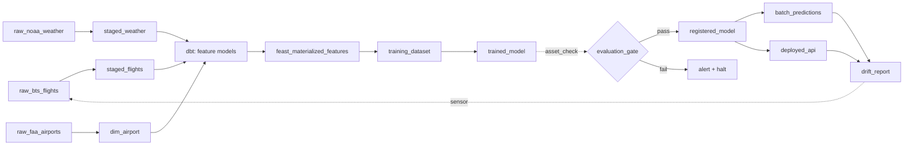
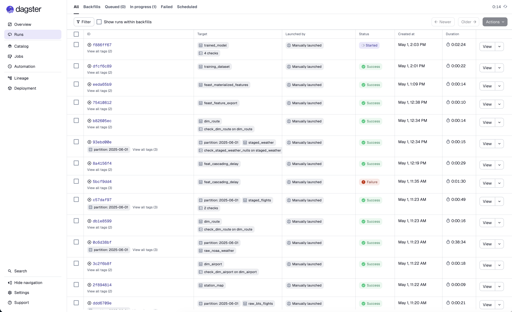
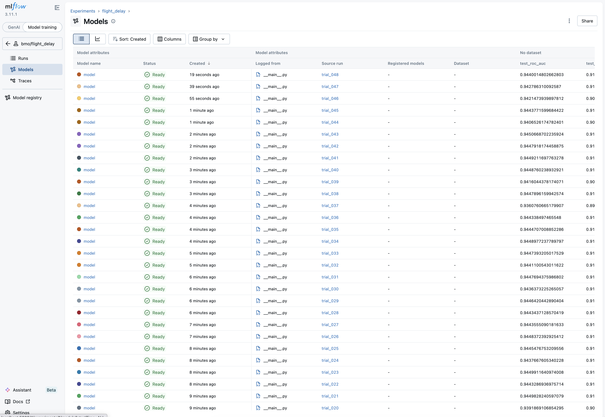
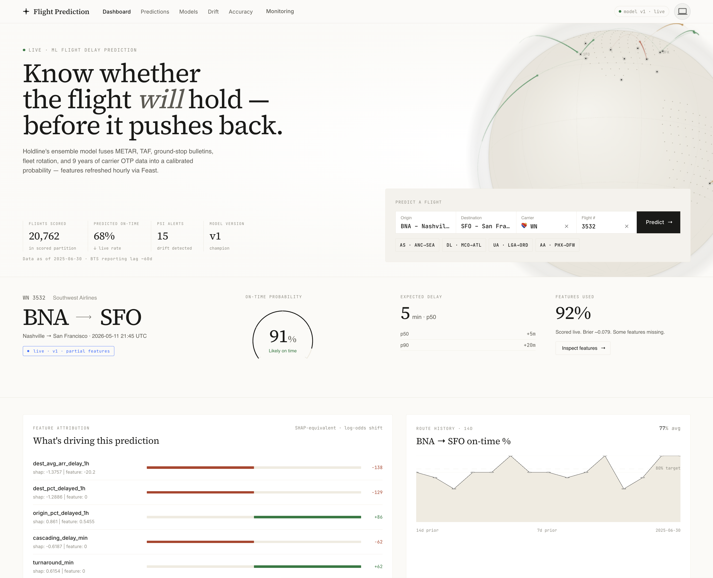
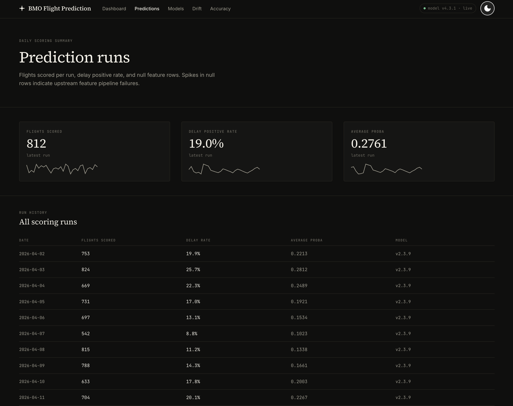
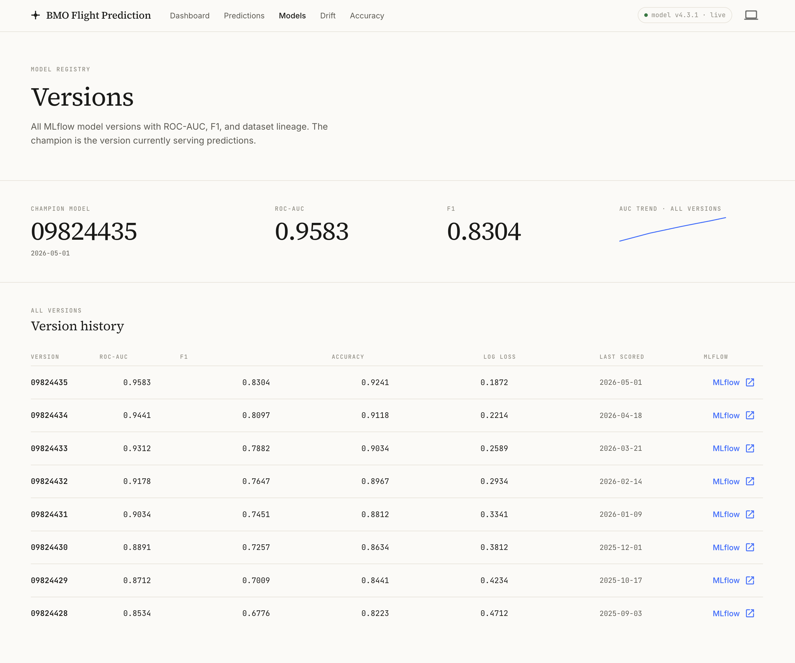
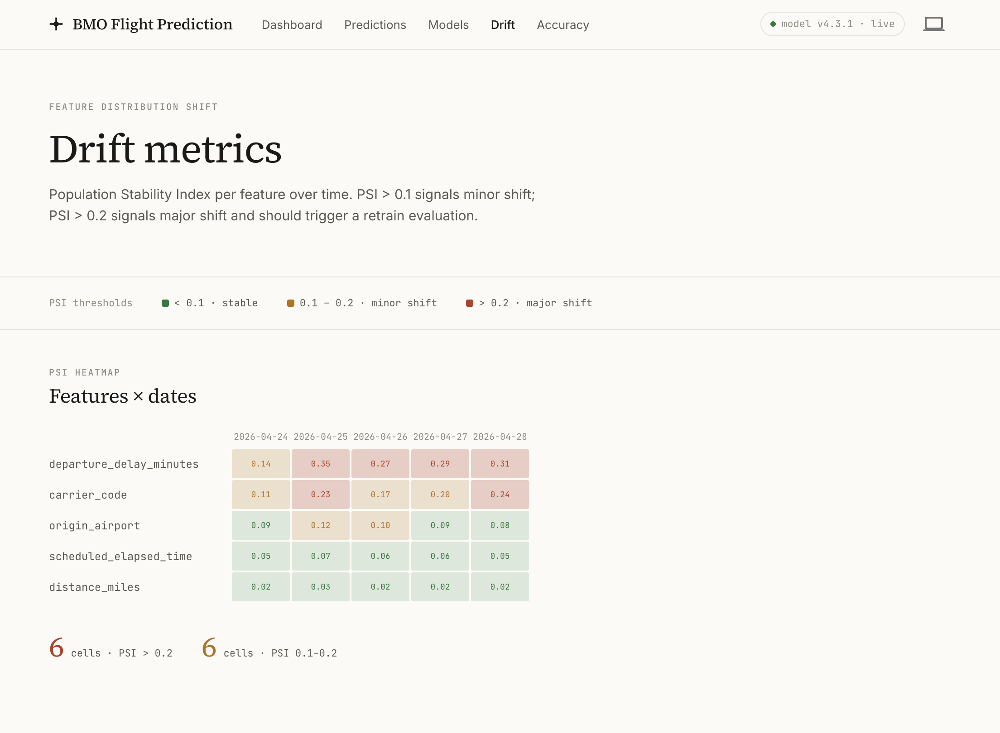
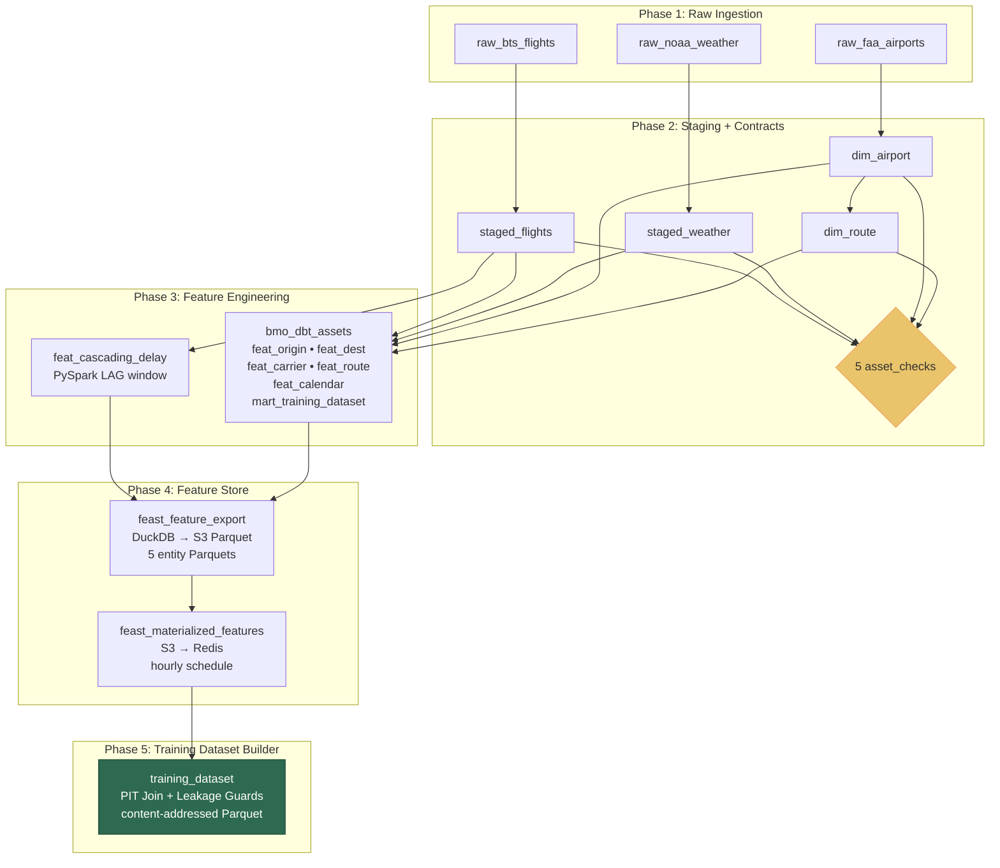
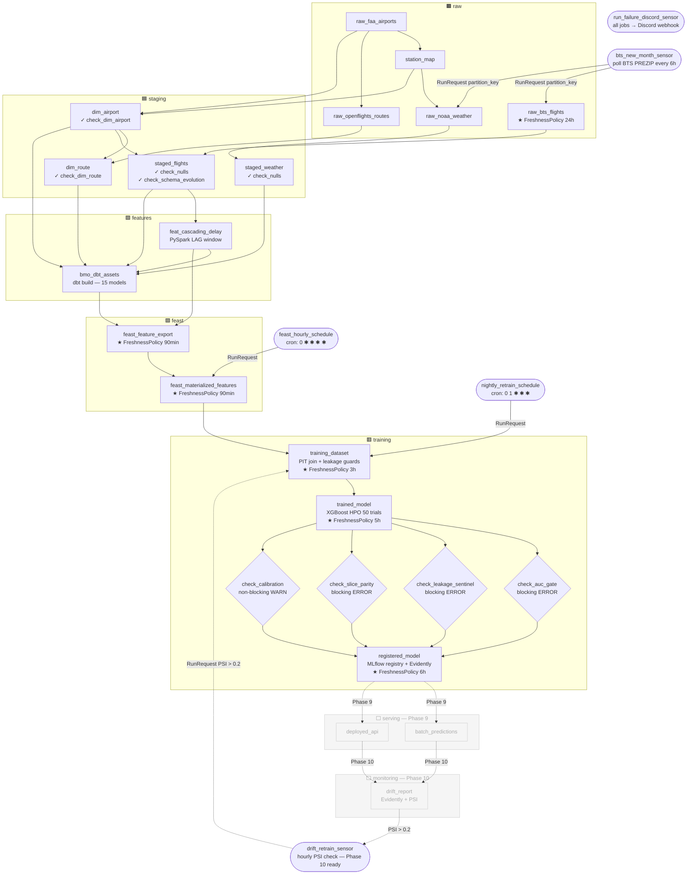

# ml-training-orchestrator


### Problem Statement

It might be nice to know whether a flight is likely to be delayed. This project ingests flight data from the Bureau of Transportation Statistics and NOAA, transforms the data, and trains a model to predict the likelihood a flight will be delayed.

### Architecture

```
┌────────────────────────────────────────────────────────────────────┐
│                         CONTROL PLANE (Oracle Cloud VM)            │
│  ┌──────────┐   ┌──────────┐   ┌──────────┐   ┌──────────────┐     │
│  │ Dagster  │   │  MLflow  │   │  Feast   │   │  Evidently   │     │
│  │ webui +  │   │  Server  │   │ Registry │   │  Reports     │     │
│  │ daemon   │   │          │   │          │   │              │     │
│  └────┬─────┘   └────┬─────┘   └────┬─────┘   └──────┬───────┘     │
│       │              │              │                 │            │
│  ┌────┴──────────────┴──────────────┴─────────────────┴─────────┐  │
│  │            Postgres (metadata)    +    MinIO (artifacts)     │  │
│  └──────────────────────────────────────────────────────────────┘  │
└────────────────────────────────────────────────────────────────────┘
             │                                      │
             │ triggers                             │ reads/writes
             ▼                                      ▼
┌────────────────────────────────┐  ┌─────────────────────────────────┐
│   DATA PLANE (Oracle Cloud)    │  │   OBJECT STORE (Cloudflare R2)  │
│  ┌──────────┐   ┌───────────┐  │  │  ┌─────────────────────────┐    │
│  │ dbt-     │   │  PySpark  │  │  │  │ raw/     (Parquet)      │    │
│  │ duckdb   │   │ (heavy    │  │──┼─▶│ staging/ (Parquet)      │    │
│  │          │   │  jobs)    │  │  │  │ features/(Iceberg)      │    │
│  └──────────┘   └───────────┘  │  │  │ datasets/(versioned)    │    │
│  ┌──────────────────────────┐  │  │  │ models/  (MLflow)       │    │
│  │   Training (XGBoost +    │  │  │  └─────────────────────────┘    │
│  │   Optuna)                │  │  └─────────────────────────────────┘
│  └──────────────────────────┘  │
└────────────────────────────────┘
             │
             │ promote
             ▼
┌───────────────────────────────────────────────────────────────────┐
│                      SERVING (FastAPI + Upstash)                  │
│  ┌──────────────────┐       ┌─────────────────────────────────┐   │
│  │  FastAPI         │──────▶│  Upstash Redis (online store)   │   │
│  │  Inference       │       └─────────────────────────────────┘   │
│  └──────────────────┘                                             │
└───────────────────────────────────────────────────────────────────┘
```

### Dagster Asset Graph

Every node below is a Software-Defined Asset. Dagster infers the dependency arrows from each asset's declared inputs, and the webui renders this graph automatically.


```mermaid
graph LR
    A[raw_bts_flights] --> B[staged_flights]
    C[raw_noaa_weather] --> D[staged_weather]
    AA[raw_faa_airports] --> DA[dim_airport]
    B --> E[dbt: feature models]
    D --> E
    DA --> E
    E --> F[feast_materialized_features]
    F --> G[training_dataset]
    G --> H[trained_model]
    H -.asset_check.-> I{evaluation_gate}
    I -->|pass| J[registered_model]
    I -->|fail| K[alert + halt]
    J --> L[batch_predictions]
    J --> M[deployed_api]
    L --> N[drift_report]
    M --> N
    N -.sensor.-> A
```

Key Dagster primitives used:

- `@asset` for every node above (dbt models auto-loaded via `dagster-dbt`).
- `@asset_check` for schema contracts, freshness, and the evaluation gate.
- `MonthlyPartitionsDefinition` on `raw_bts_flights` and downstream partitioned assets.
- `@sensor` watching the drift metrics table → triggers a run of the training asset group.
- `@schedule` for the nightly retrain cadence.

## Documentation

- [getting-started.md](/docs/getting-started.md)

- [architecture.md](/docs/architecture.md)
- [infrastructure.md](/docs/infrastructure.md)
- [data-structure-and-query-guidance.md](/docs/data-structure-and-query-guidance.md)
- [deployment.md](/docs/deployment.md)
- [configuration.md](/docs/configuration.md)
- [ci-cd.md](/docs/ci-cd.md)

- [data-ingestion.md](/docs/data-ingestion.md)
- [staging-validation.md](/docs//staging-validation.md)
- [feature-engineering.md](/docs/feature-engineering.md)
- [feature-store.md](/docs/feature-store.md)
- [pit-correctness.md](/docs/pit-correctness.md)
- [training.md](/docs/training.md)
- [batch-scoring.md](/docs/batch-scoring.md)
- [runbooks.md](/docs/runbooks.md)
- [evaluation-gate.md](/docs/evaluation-gate.md)
- [serving.md](/docs/serving.md)
- [batch-scoring.md](/docs/batch-scoring.md)
- [monitoring.md](/docs/monitoring.md)
- [testing.md](/docs/testing.md)

#### Dashboards

- React: [https://ml-training-orchestrator.vercel.app](https://ml-training-orchestrator.vercel.app)
- Dagster UI: [https://dagster.207.211.176.98.sslip.io](https://dagster.207.211.176.98.sslip.io) (not public)
- MLflow UI: [https://mlflow.207.211.176.98.sslip.io](https://mlflow.207.211.176.98.sslip.io)
  - username: demo
  - password: password1234

## Screenshots





### React






---

## ML Training Orchestrator — Technology Overview

### What is this system?

A **batch ML pipeline** for predicting flight delays (BTS airline on-time performance data). It's structured as a classic data engineering stack: raw ingestion → staging → feature engineering → model training → serving.

---

## Core Technologies

### 1. Dagster — Orchestration Layer

**Purpose:** The central "brain" of the system. Dagster models every data artifact (raw files, Iceberg tables, trained models) as an _asset_ in a dependency graph. It decides what runs, when, and in what order.

**Key concepts used here:**

- `@asset` decorators define each data artifact and its dependencies
- `@sensor` watches external systems (BTS website) and triggers runs when new data appears
- `@asset_check` runs post-materialization validation (null rates, schema drift)
- Partition support tracks which months have been processed
- Metadata store (backed by **PostgreSQL**) persists run history, logs, and schedules

**Integrations:** Dagster orchestrates _all other tools_ — it calls Python code, launches dbt builds, and submits PySpark jobs. The Dagster UI provides visibility into the full asset lineage.

---

### 2. dbt — SQL Transformation Layer

**Purpose:** Transforms validated staging data into ML features using SQL. Runs inside Dagster via `dagster-dbt`.

**How it integrates:**

- dbt models reference Iceberg tables as `{{ source(...) }}`
- A custom `BmoDbtTranslator` maps dbt source names → Dagster asset keys, so Dagster can draw the correct dependency edges (e.g., `staged_flights` → `int_flights_enriched`)
- The dbt adapter is `dbt-duckdb`, so queries run via DuckDB (no separate SQL server needed)
- The PyIceberg plugin for dbt-duckdb resolves the Iceberg table location at query time

**Models:**

```
staging/      → views on Iceberg tables (no storage cost)
intermediate/ → int_flights_enriched (PIT-correct weather join)
features/     → 6 windowed/rolling aggregation tables
marts/        → mart_training_dataset (final ML input)
```

---

### 3. Apache Iceberg — Table Format (Storage Layer)

**Purpose:** ACID-compliant table format sitting on top of S3/MinIO. This is the primary "database" for staging and feature data — not a query engine, just a format.

**Why Iceberg over plain Parquet?**

- **Partition overwrite:** Re-running a month safely overwrites exactly that partition, no corruption
- **Schema evolution:** Iceberg tracks schema history; asset checks detect unexpected changes
- **Time-travel:** Can query historical snapshots for reproducibility
- **Multi-engine reads:** Both DuckDB and PySpark can read the same Iceberg tables

**Two catalog implementations in this project:**

- **PyIceberg** (`SqlCatalog` backed by SQLite) — used by Python staging code and dbt
- **HadoopCatalog** — used by PySpark jobs, pointing to the same physical S3 location

---

### 4. DuckDB — Analytical Query Engine

**Purpose:** Runs SQL queries against Iceberg tables (via the `iceberg_scan` function + `httpfs` extension for S3). Used exclusively by dbt.

**Key property:** Ephemeral — no server process, just a library. DuckDB reads directly from S3/MinIO, computes features in memory, and writes results back as Iceberg tables. This means zero persistent compute cost.

---

### 5. PySpark — Distributed Computation

**Purpose:** Computes the `feat_cascading_delay` feature — a window function that looks up each aircraft's previous flight's arrival delay (`LAG` per `tail_number`, ordered by `scheduled_departure_utc`).

**Why PySpark and not DuckDB for this?**

- PySpark's shuffle-based window functions handle the cross-month data correctly (aircraft may have flown in a previous partition)
- Configured with `HadoopCatalog` to read/write Iceberg directly

**Integration:** The `feat_cascading_delay` Dagster asset submits the PySpark job via `dagster-pyspark` and waits for it to complete before downstream dbt models run.

---

### 6. MinIO — Object Storage (Dev) / Cloudflare R2 (Prod)

**Purpose:** S3-compatible blob storage for all data: raw Parquet files, Iceberg table data, and MLflow model artifacts.

**Bucket layout:**

```
s3://raw/               → downloaded Parquet (BTS flights, NOAA weather, FAA airports)
s3://staging/           → Iceberg table data (validated, timestamped)
s3://rejected/          → rows that failed Pydantic validation
s3://mlflow-artifacts/  → trained model files
```

The `src/bmo/common/storage.py` boto3 wrapper is endpoint-agnostic — swap the `S3_ENDPOINT_URL` env var to switch between MinIO (local), R2 (cloud), or AWS S3.

---

### 7. MLflow — Experiment Tracking & Model Registry

**Purpose:** Tracks every training run (hyperparameters, metrics, artifacts) and maintains a model registry for promoting models to production.

**Infrastructure:** Runs as a Docker service; uses PostgreSQL as its backend store and MinIO as its artifact store. The serving API loads the registered "champion" model on startup.

---

### 8. Feast — Feature Store

**Purpose:** Bridges the gap between offline feature computation (Iceberg) and online serving (Redis). Ensures the inference API gets the same features the model was trained on, at the correct point-in-time.

**Offline store:** Iceberg tables (already computed by dbt/PySpark)  
**Online store:** Redis — features are _materialized_ into Redis so the FastAPI service can fetch them in sub-millisecond latency at inference time.

---

### 9. FastAPI — Serving Layer

**Purpose:** REST API for inference. Loads the XGBoost model from MLflow registry, fetches features from Redis (via Feast), and returns a delay prediction.

---

## How They All Connect

```
┌─────────────────────────────────────────────────────────────────┐
│                         DAGSTER                                 │
│  Asset Graph: raw → staged → features → training → serving      │
│  Sensor: polls BTS website → triggers partition runs            │
│  Metadata DB: PostgreSQL                                        │
└───────┬────────────┬───────────────┬────────────────────────────┘
        │            │               │
        ▼            ▼               ▼
  Python assets   dbt assets    PySpark asset
  (src/bmo/)     (dbt_project/) (cascading_delay)
        │            │               │
        │     DuckDB (ephemeral)     │
        │     reads/writes Iceberg   │
        └────────────┴───────────────┘
                     │
                     ▼
        ┌────────────────────────┐
        │   Apache Iceberg       │  ← Table format (ACID, partitioned)
        │   on MinIO / R2        │  ← Physical storage
        └────────────────────────┘
                     │
          ┌──────────┴──────────┐
          ▼                     ▼
    MLflow (training)      Feast offline store
    PostgreSQL backend     → materialize →
    MinIO artifacts        Redis (online)
          │                     │
          ▼                     ▼
    ┌─────────────────────────────┐
    │   FastAPI                   │
    │   XGBoost model + features  │
    └─────────────────────────────┘
```

---

## Data Flow Summary

```
External HTTP              Python (bmo/ingestion)
BTS / NOAA / FAA  ──────►  raw Parquet on S3
                                   │
                           Python (bmo/staging)
                           + Pydantic validation
                                   │
                           Iceberg tables (staged_flights,
                           staged_weather, dim_airport)
                                   │
                    ┌──────────────┴──────────────┐
                    ▼                             ▼
             dbt + DuckDB                      PySpark
             SQL feature models             cascading_delay
             (windowed averages,            (window LAG per
              weather joins, etc.)           aircraft tail #)
                    └──────────────┬──────────────┘
                                   ▼
                         mart_training_dataset
                         (Iceberg, all features)
                                   │
                         XGBoost + Optuna (TODO)
                         MLflow tracking
                                   │
                         Feast materialization
                         Iceberg → Redis
                                   │
                         FastAPI inference API
```

Through stage 5:

<!-- prettier-ignore-start -->
```
╔══════════════════════════════════════════════════════════════════════════════════════╗
║                         DATA SOURCES                                                 ║
║  BTS transtats.bts.gov    NOAA ncei.noaa.gov    FAA/OurAirports    OpenFlights       ║
╚══════════════╤══════════════════════╤════════════════════╤═══════════╤═══════════════╝
               │                      │                    │           │
               ▼                      ▼                    ▼           ▼
╔══════════════════════════════════════════════════════════════════════════════════════╗
║  PHASE 1 — RAW INGESTION                         [group: raw]                        ║
║                                                                                      ║
║  raw_bts_flights          raw_noaa_weather        raw_faa_airports   station_map     ║
║  (monthly partitioned)    (monthly partitioned)   (dimension)        (JSON on S3)    ║
║                                                                                      ║
║  MinIO: raw/bts/year=YYYY/month=MM/data.parquet                                      ║
║         raw/noaa/year=YYYY/month=MM/data.parquet                                     ║
║         raw/faa/airports.parquet                                                     ║
║         raw/openflights/routes.parquet                                               ║
╚══════════════╤══════════════════════╤════════════════════╤═══════════╤═══════════════╝
               │                      │                    │           │
               ▼                      ▼                    ▼           ▼
╔══════════════════════════════════════════════════════════════════════════════════════╗
║  PHASE 2 — STAGING + SCHEMA CONTRACTS            [group: staging]                    ║
║                                                                                      ║
║  staged_flights           staged_weather           dim_airport        dim_route      ║
║  (monthly partitioned)                             (UTC tz map,       (haversine     ║
║  UTC timestamps added                              station join)       distances)    ║
║  4 invalid-row guards                                                                ║
║                                                                                      ║
║  Iceberg: staging.staged_flights (month-partitioned)                                 ║
║           staging.staged_weather                                                     ║
║           staging.dim_airport                                                        ║
║           staging.dim_route                                                          ║
║                                                                                      ║
║  ┌──── ASSET CHECKS (5) ────────────────────────────────────────────────────┐        ║
║  │ check_staged_flights_nulls       check_staged_flights_schema_evolution   │        ║
║  │ check_staged_weather_nulls       check_dim_airport    check_dim_route    │        ║
║  └──────────────────────────────────────────────────────────────────────────┘        ║
║                                                                                      ║
║  MinIO: rejected/bts/...  rejected/noaa/...  (invalid rows with reason codes)        ║
╚══════════════╤═══════════════════════════════════════════════════════════════════════╝
               │
       ┌───────┴───────────────────────────────────────┐
       │                                               │
       ▼                                               ▼
╔══════════════════════════════════╗   ╔═══════════════════════════════════════════════╗
║  PHASE 3a — PYSPARK              ║   ║  PHASE 3b — dbt-DuckDB                        ║
║  [group: features_python]        ║   ║  [group: features_dbt via @dbt_assets]        ║
║                                  ║   ║                                               ║
║  feat_cascading_delay            ║   ║  STAGING VIEWS (DuckDB views over Iceberg):   ║
║  ─────────────────               ║   ║    stg_flights  stg_weather                   ║
║  Spark LAG window per            ║   ║    stg_dim_airport  stg_dim_route             ║
║  tail_number:                    ║   ║    stg_feat_cascading_delay                   ║
║    prev_arr_delay_min            ║   ║                                               ║
║    turnaround_min                ║   ║  INTERMEDIATE (PIT weather join):             ║
║                                  ║   ║    int_flights_enriched                       ║
║  Iceberg:                        ║   ║      ↳ ASOF weather for origin (≤3h)          ║
║    staging.feat_cascading_delay  ║   ║      ↳ ASOF weather for dest (≤6h)            ║
╚════════════╤═════════════════════╝   ║                                               ║
             │                         ║  FEATURE TABLES (materialized):               ║
             │                         ║    feat_origin_airport_windowed               ║
             │                         ║      (1h/24h/7d rolling windows per origin)   ║
             │                         ║    feat_dest_airport_windowed                 ║
             │                         ║      (1h/24h rolling per dest)                ║
             │                         ║    feat_carrier_rolling  (7d per carrier)     ║
             │                         ║    feat_route_rolling    (7d per OD pair)     ║
             │                         ║    feat_calendar         (hour/dow/holiday)   ║
             │                         ║                                               ║
             │                         ║  MART (wide training table):                  ║
             │                         ║    mart_training_dataset                      ║
             │                         ║      ↳ all features + labels per flight       ║
             └───────────────────┬─────╚═══════════════════════════════════════════════╝
                                 │
                                 ▼
╔══════════════════════════════════════════════════════════════════════════════════════╗
║  PHASE 4 — FEATURE STORE                         [group: feast]                      ║
║                                                                                      ║
║  feast_feature_export                                                                ║
║  ──────────────────────────────────────────────────────────────────────              ║
║  DuckDB (feat_* tables) ──► S3 Parquet (per entity type, with event_ts)              ║
║                                                                                      ║
║  MinIO staging/feast/                                                                ║
║    origin_airport/data.parquet  [entity: origin,      event_ts, 8 features]          ║
║    dest_airport/data.parquet    [entity: dest,         event_ts, 4 features]         ║
║    carrier/data.parquet         [entity: carrier,      event_ts, 4 features]         ║
║    route/data.parquet           [entity: route_key,    event_ts, 6 features]         ║
║    aircraft/data.parquet        [entity: tail_number,  event_ts, 2 features]         ║
║                                         ↑                                            ║
║                               (from Iceberg feat_cascading_delay via PyArrow)        ║
║                                                                                      ║
║  feast_materialized_features                                                         ║
║  ──────────────────────────────────────────────────────────────────────              ║
║  S3 Parquet ──► Redis online store  (hourly, materialize_incremental)                ║
║                                                                                      ║
║  TTLs enforced at online serving time:                                               ║
║    origin/dest airport: 26h  │  carrier/route: 8d  │  aircraft: 12h                  ║
╚══════════════════════════════════════╤═══════════════════════════════════════════════╝
                                       │
                 ┌─────────────────────┘
                 │   (labels from mart_training_dataset)
                 │   (features from staging/feast/ S3 Parquet)
                 ▼
╔══════════════════════════════════════════════════════════════════════════════════════╗
║  PHASE 5 — TRAINING DATASET BUILDER (NEW)        [group: training]                   ║
║                                                                                      ║
║  training_dataset asset                                                              ║
║  ──────────────────────────────────────────────────────────────────────              ║
║                                                                                      ║
║  INPUT A: label_df (from mart_training_dataset, label columns only)                  ║
║    flight_id, event_timestamp (=scheduled_departure_utc), origin, dest,              ║
║    carrier, tail_number, route_key, dep_delay_min, is_dep_delayed, ...               ║
║                                                                                      ║
║  INPUT B: feature Parquets (from staging/feast/ S3)                                  ║
║    5 entity types × their feature columns                                            ║
║                                                                                      ║
║  STEP 1: compute version_hash (SHA-256 of feature_refs + as_of + label_hash)         ║
║          └─► check S3 cache; return immediately if hash already exists               ║
║                                                                                      ║
║  STEP 2: PITJoiner — DuckDB ASOF JOIN (5 feature views × 1 ASOF JOIN each)           ║
║                                                                                      ║
║    For each flight at event_timestamp T:                                             ║
║      origin features  = latest snapshot WHERE event_ts ≤ T, age ≤ 26h                ║
║      dest features    = latest snapshot WHERE event_ts ≤ T, age ≤ 26h                ║
║      carrier features = latest snapshot WHERE event_ts ≤ T, age ≤ 8d                 ║
║      route features   = latest snapshot WHERE event_ts ≤ T, age ≤ 8d                 ║
║      aircraft features= latest snapshot WHERE event_ts ≤ T, age ≤ 12h                ║
║                                                                                      ║
║  STEP 3: Leakage Guards (4 checks)                                                   ║
║    ✓ guard_event_timestamps_bounded   — no label events after as_of                  ║
║    ✓ guard_no_future_features         — no feature_ts > event_timestamp              ║
║    ✓ guard_ttl_compliance             — warn if age > TTL (already nulled)           ║
║    ✓ guard_no_target_leakage          — no label columns in feature_refs             ║
║    └─► LeakageError raised if any ERROR-severity violation found                     ║
║                                                                                      ║
║  STEP 4: Write content-addressed output                                              ║
║    staging/datasets/{version_hash}/data.parquet   (24 feature cols + labels)         ║
║    staging/datasets/{version_hash}/card.json      (DatasetHandle metadata card)      ║
║                                                                                      ║
║  OUTPUT: DatasetHandle                                                               ║
║    version_hash      (SHA-256, 64 hex chars)                                         ║
║    feature_set_version  (git tree hash of feature_repo/)                             ║
║    feature_ttls      (per feature view, in seconds)                                  ║
║    row_count         (number of training examples)                                   ║
║    label_distribution   (mean, std, positive_rate per target column)                 ║
║    schema_fingerprint   (SHA-256 of column names + dtypes)                           ║
║    storage_path      (s3://staging/datasets/{hash}/data.parquet)                     ║
╚══════════════════════════════════════════════════════════════════════════════════════╝
```
<!-- prettier-ignore-end -->


```mermaid
graph TD
    subgraph raw["Phase 1: Raw Ingestion"]
        R1[raw_bts_flights]
        R2[raw_noaa_weather]
        R3[raw_faa_airports]
    end

    subgraph staging["Phase 2: Staging + Contracts"]
        S1[staged_flights]
        S2[staged_weather]
        S3[dim_airport]
        S4[dim_route]
        AC1{5 asset_checks}
    end

    subgraph features["Phase 3: Feature Engineering"]
        F1[feat_cascading_delay\nPySpark LAG window]
        F2[bmo_dbt_assets\nfeat_origin • feat_dest\nfeat_carrier • feat_route\nfeat_calendar\nmart_training_dataset]
    end

    subgraph feast_group["Phase 4: Feature Store"]
        FE[feast_feature_export\nDuckDB → S3 Parquet\n5 entity Parquets]
        FM[feast_materialized_features\nS3 → Redis\nhourly schedule]
    end

    subgraph training_group["Phase 5: Training Dataset Builder"]
        TD[training_dataset\nPIT Join + Leakage Guards\ncontent-addressed Parquet]
    end

    R1 --> S1
    R2 --> S2
    R3 --> S3
    S3 --> S4
    S1 --> AC1
    S2 --> AC1
    S3 --> AC1
    S4 --> AC1
    S1 --> F1
    S1 --> F2
    S2 --> F2
    S3 --> F2
    S4 --> F2
    F1 --> FE
    F2 --> FE
    FE --> FM
    FM --> TD

    style TD fill:#2d6a4f,color:#fff,stroke:#1b4332
    style AC1 fill:#e9c46a,stroke:#f4a261
```

#### Stage 7:

<!-- prettier-ignore-start -->
```
┌─────────────────────────────────────────────────────────────────────────────────┐
│  RAW (MinIO/S3 Parquet)                                                         │
│  raw_bts_flights [MonthlyPartition]  raw_noaa_weather  raw_faa_airports         │
│  raw_openflights_routes  station_map                                            │
└───────────────────────────┬─────────────────────────────────────────────────────┘
                            │  @asset_check: schema_evolution, null checks
                            ▼
┌─────────────────────────────────────────────────────────────────────────────────┐
│  STAGING (Iceberg via PyIceberg + JdbcCatalog)                                  │
│  staged_flights  staged_weather  dim_airport  dim_route                         │
└───────────────────────────┬─────────────────────────────────────────────────────┘
                            │
                  ┌─────────┴──────────┐
                  ▼                    ▼
          bmo_dbt_assets          feat_cascading_delay
          (dbt-duckdb)            (PySpark self-join
          ├─ stg_flights           on tail_number + time)
          ├─ stg_weather
          ├─ int_flights_enriched
          ├─ feat_origin_airport_windowed
          ├─ feat_dest_airport_windowed
          ├─ feat_carrier_rolling
          ├─ feat_route_rolling
          ├─ feat_calendar
          └─ mart_training_dataset
                  │                    │
                  └─────────┬──────────┘
                            ▼
                    feast_feature_export
                    (DuckDB → Parquet on S3)
                            │
                            ▼
                  feast_materialized_features
                  (hourly @schedule → Redis online store)
                            │
                            ▼
                    training_dataset
                    PIT-correct via ASOF JOIN
                    content-addressed (version_hash)
                    LeakageError if future value detected
                            │
                            ▼
                      trained_model
                      XGBoost + Optuna (50 trials)
                      champion run logged to MLflow
                      ┌────┴──────────────────────────────┐
                      │  @asset_check (blocking=True)     │
                      │  ┌─────────────────────────────┐  │
                      │  │ check_auc_gate              │  │
                      │  │   AUC ≥ 0.70 floor          │  │
                      │  │   AUC ≥ prod_AUC − 0.01     │  │
                      │  ├─────────────────────────────┤  │
                      │  │ check_leakage_sentinel      │  │
                      │  │   max feature importance    │  │
                      │  │   ≤ 0.70                    │  │
                      │  ├─────────────────────────────┤  │
                      │  │ check_slice_parity          │  │
                      │  │   per-carrier/hub/hour/     │  │
                      │  │   weather AUC ≥ 0.60        │  │
                      │  │   drop vs overall ≤ 0.10    │  │
                      │  ├─────────────────────────────┤  │
                      │  │ check_calibration (WARN)    │  │
                      │  │   brier_score ≤ 0.25        │  │
                      │  └─────────────────────────────┘  │
                      └────────────────┬──────────────────┘
                                       │  all blocking checks pass
                                       ▼
                               registered_model
                               MLflow Model Registry
                               ┌─────────────────────┐
                               │ version N            │
                               │  alias: challenger   │
                               │  alias: champion ←── │── if AUC ≥ current champion
                               │                      │   (old champion → archived)
                               └─────────────────────┘
                               + Evidently HTML report
                                 logged as MLflow artifact
```
<!-- prettier-ignore-end -->

#### Stage 8


```mermaid
graph TB
    %% ─── External triggers ─────────────────────────────────────────────
    S1([bts_new_month_sensor\npoll BTS PREZIP every 6h])
    S2([feast_hourly_schedule\ncron: 0 ✱ ✱ ✱ ✱])
    S3([nightly_retrain_schedule\ncron: 0 1 ✱ ✱ ✱])
    S4([drift_retrain_sensor\nhourly PSI check — Phase 10 ready])
    S5([run_failure_discord_sensor\nall jobs → Discord webhook])

    %% ─── raw group ─────────────────────────────────────────────────────
    subgraph raw["🟫 raw"]
        A[raw_faa_airports]
        B[station_map]
        C[raw_noaa_weather]
        D[raw_openflights_routes]
        E[raw_bts_flights\n★ FreshnessPolicy 24h]
    end

    %% ─── staging group ──────────────────────────────────────────────────
    subgraph staging["🟦 staging"]
        F[dim_airport\n✓ check_dim_airport]
        G[dim_route\n✓ check_dim_route]
        H[staged_flights\n✓ check_nulls\n✓ check_schema_evolution]
        I[staged_weather\n✓ check_nulls]
    end

    %% ─── features group ─────────────────────────────────────────────────
    subgraph features["🟩 features"]
        J[feat_cascading_delay\nPySpark LAG window]
        K[bmo_dbt_assets\ndbt build — 15 models]
    end

    %% ─── feast group ────────────────────────────────────────────────────
    subgraph feast_grp["🟪 feast"]
        L[feast_feature_export\n★ FreshnessPolicy 90min]
        M[feast_materialized_features\n★ FreshnessPolicy 90min]
    end

    %% ─── training group ─────────────────────────────────────────────────
    subgraph training["🟥 training"]
        N[training_dataset\nPIT join + leakage guards\n★ FreshnessPolicy 3h]
        O[trained_model\nXGBoost HPO 50 trials\n★ FreshnessPolicy 5h]
        P{check_auc_gate\nblocking ERROR}
        Q{check_leakage_sentinel\nblocking ERROR}
        R{check_slice_parity\nblocking ERROR}
        T{check_calibration\nnon-blocking WARN}
        U[registered_model\nMLflow registry + Evidently\n★ FreshnessPolicy 6h]
    end

    %% ─── future groups (greyed out) ────────────────────────────────────
    subgraph serving["⬜ serving — Phase 9"]
        V[batch_predictions]
        W[deployed_api]
    end

    subgraph monitoring["⬜ monitoring — Phase 10"]
        X[drift_report\nEvidently + PSI]
    end

    %% ─── sensor → job wiring ───────────────────────────────────────────
    S1 -->|RunRequest partition_key| E
    S1 -->|RunRequest partition_key| C
    S2 -->|RunRequest| M
    S3 -->|RunRequest| N
    S4 -.->|RunRequest PSI > 0.2| N

    %% ─── data flow ──────────────────────────────────────────────────────
    A --> B --> C
    A --> D
    A --> F
    B --> F
    D --> G
    F --> G
    E --> H
    F --> H
    C --> I

    H --> J
    H --> K
    I --> K
    F --> K
    G --> K
    J --> K

    K --> L
    J --> L
    L --> M

    M --> N
    N --> O
    O --> P
    O --> Q
    O --> R
    O --> T
    P --> U
    Q --> U
    R --> U
    T --> U

    U -.->|Phase 9| V
    U -.->|Phase 9| W
    V -.->|Phase 10| X
    W -.->|Phase 10| X
    X -.->|PSI > 0.2| S4

    style serving fill:#f5f5f5,stroke:#ccc,color:#aaa
    style monitoring fill:#f5f5f5,stroke:#ccc,color:#aaa
    style V fill:#f5f5f5,stroke:#ccc,color:#aaa
    style W fill:#f5f5f5,stroke:#ccc,color:#aaa
    style X fill:#f5f5f5,stroke:#ccc,color:#aaa
```

<!-- prettier-ignore-start -->
```
┌──────────────────────────────────────────────────────────────────────────────────────┐
│ ORCHESTRATION LAYER (Dagster)                                                        │
│                                                                                      │
│  SENSORS                          SCHEDULES                                          │
│  ┌──────────────────────┐         ┌───────────────────────┐                          │
│  │ bts_new_month_sensor │         │ feast_hourly_schedule │                          │
│  │ polls BTS every 6h   │         │ cron: 0 * * * *       │───────────────────────┐  │
│  └──────────┬───────────┘         └───────────────────────┘                       │  │
│             │                                                                     │  │
│             ▼                     ┌───────────────────────┐  ┌──────────────────┐ │  │
│  ┌──────────────────────┐         │ nightly_retrain_sched │  │ drift_retrain_   │ │  │
│  │ ingest_bts_month job │         │ cron: 0 1 * * *       │  │ sensor           │ │  │
│  └──────────────────────┘         └────────────┬──────────┘  │ polls Postgres   │ │  │
│                                                │             │ drift_metrics    │ │  │
│  ┌──────────────────────┐                      │             │ PSI > 0.2?       │ │  │
│  │ run_failure_sensor   │◄── any run failure   │             └────────┬─────────┘ │  │
│  │ posts Discord embed  │                      ▼                       │          │  │
│  └──────────────────────┘         ┌──────────────────────────────────┐ │          │  │
│                                   │        retrain_job               │◄┘          │  │
│                                   │  training_dataset → trained_model│            │  │
│                                   │  → [eval gate checks]            │            │  │
│                                   │  → registered_model              │            │  │
│                                   └──────────────────────────────────┘            │  │
└──────────────────────────────────────────────────────────────────────────────────────┘
                                                                                     │
                                                                                     │ feast_materialize_job
                                                                                     ▼
┌──────────────────────────────────────────────────────────────────────────────────────┐
│ ASSET DAG                                                                            │
│                                                                                      │
│  [raw]                  [staging]              [features]        [feast]             │
│                                                                                      │
│  raw_faa_airports ──►  dim_airport ─┐                                                │
│  station_map      ──►              ─┤                                                │
│  raw_openflights  ──►  dim_route    │                                                │
│                                     │                                                │
│  raw_bts_flights  ──►  staged_flights ─────────────────────────────────────────┐     │
│   (partitioned)         (partitioned) ─► bmo_dbt_assets ◄──── dim_airport      │     │
│                                          (15 dbt models:  ◄──── dim_route      │     │
│  raw_noaa_weather ──►  staged_weather ──► stg_, int_,     ◄──── staged_weather │     │
│   (partitioned)         (partitioned)     feat_* models)                       │     │
│                                                   │                            │     │
│                         staged_flights ──► feat_cascading_delay (PySpark)      │     │
│                                                   │                            │     │
│                                                   ▼                            │     │
│                                          feast_feature_export ◄────────────────┘     │
│                                          (DuckDB → S3 Parquet)                       │
│                                                   │                                  │
│                                                   ▼                                  │
│                                          feast_materialized_features                 │
│                                          (S3 Parquet → Redis online store)           │
│                                                   │                                  │
│  [training]                                       │                                  │
│                                                   ▼                                  │
│                                          training_dataset (PIT join, content-hashed) │
│                                                   │                                  │
│                                                   ▼                                  │
│                                          trained_model (XGBoost + Optuna HPO)        │
│                                                   │                                  │
│                                          ┌────────┴─────────────────────────┐        │
│                                          │  @asset_checks (blocking):       │        │
│                                          │  check_auc_gate                  │        │
│                                          │  check_leakage_sentinel          │        │
│                                          │  check_slice_parity              │        │
│                                          │  check_calibration (warn only)   │        │
│                                          └────────┬─────────────────────────┘        │
│                                                   │ pass                             │
│                                                   ▼                                  │
│                                          registered_model                            │
│                                          (MLflow: challenger → champion)             │
│                                                   │                                  │
│                                        ┌──────────┴──────────┐                       │
│  [serving — Phase 9]      batch_predictions           deployed_api (FastAPI)         │
│  [monitoring — Phase 10]            drift_report ──► drift_retrain_sensor            │
└──────────────────────────────────────────────────────────────────────────────────────┘

RESOURCES (wired in Phase 8, available to all assets)
  ┌─────────────────┐  ┌───────────────┐  ┌──────────────┐  ┌────────────────┐
  │ MLflowResource  │  │  S3Resource   │  │ FeastResource│  │ DuckDBResource │
  │ mlflow_tracking │  │ MinIO / R2    │  │ feature_repo/│  │ bmo_features   │
  │ _uri            │  │ S3-compatible │  │ feast_store  │  │ .duckdb        │
  └─────────────────┘  └───────────────┘  └──────────────┘  └────────────────┘
```

#### phase 9
```
                         ┌──────────────────────────────────────────────────┐
                         │             CONTROL PLANE (Oracle/Local)         │
                         │  Dagster  ·  MLflow Registry  ·  Feast Registry  │
                         └────────────────────┬─────────────────────────────┘
                                              │ triggers
             ┌────────────────────────────────▼────────────────────────────┐
             │                    DAGSTER ASSET GRAPH                      │
             │                                                             │
 raw_bts_flights                                                           │
      │                                                                    │
 staged_flights ──► bmo_dbt_assets ──► feast_feature_export                │
      │                                        │                           │
 staged_weather ──────────────────────────────►│                           │
                                               ▼                           │
                                  feast_materialized_features              │
                                               │                           │
                                         training_dataset                  │
                                               │                           │
                                         trained_model ──► [eval checks]   │
                                               │                           │
                                         registered_model                  │
                                          /          \                     │
                                         /            \                    │
                         batch_predictions         deployed_api            │
                    (DailyPartitionsDefinition)   (model_config.json→S3)   │
             └─────────────────────────────────────────────────────────────┘
                          │                              │
                          ▼                              ▼
          ┌───────────────────────────┐    ┌────────────────────────────────┐
          │  s3://staging/            │    │    FastAPI                     │
          │  predictions/             │    │                                │
          │  date=YYYY-MM-DD/         │    │  POST /predict                 │
          │  data.parquet             │    │   └── FeatureClient            │
          │  (+ model_version,        │    │        └── Feast Redis online  │
          │    scored_at, etc.)       │    │   └── ModelLoader              │
          └───────────────────────────┘    │        └── MLflow champion     │
                          │                │  GET  /health                  │
                          │                │  GET  /model-info              │
                          │                │  POST /admin/reload (hot-swap) │
                          │                │  GET  /metrics (Prometheus)    │
                          │                └────────────────────────────────┘
                          │
                          ▼
             Phase 10 (drift_report asset reads
             mart_predictions dbt model which
             queries predictions/ Parquet)
```

stage 10
```
┌──────────────────────────────────────────────────────────────────────────────┐
│                       CONTROL PLANE (Oracle Cloud Free)                      │
│  ┌──────────┐  ┌──────────┐  ┌──────────┐  ┌─────────────────────────────┐   │
│  │ Dagster  │  │  MLflow  │  │  Feast   │  │  Postgres                   │   │
│  │ webui +  │  │  Server  │  │ Registry │  │  ┌─────────────────────┐    │   │
│  │ daemon   │  │          │  │          │  │  │ drift_metrics       │◄───┼───┼─ drift_report writes
│  └──────────┘  └──────────┘  └──────────┘  │  │ live_accuracy       │    │   │
│                                            │  │ (dagster metadata)  │    │   │
│                                            │  └─────────────────────┘    │   │
│                                            └─────────────────────────────┘   │
└──────────────────────────────────────────────────────────────────────────────┘
                │
                │ triggers / reads
                ▼
┌──────────────────────────────────────────────────────────────────────────────┐
│                          DAGSTER ASSET GRAPH                                 │
│                                                                              │
│  [raw_bts_flights] ──► [staged_flights] ──► [bmo_dbt_assets]                 │
│  [raw_noaa_weather] ──► [staged_weather] ──┘    │                            │
│  [raw_faa_airports] ──► [dim_airport] ──────────┘                            │
│       │                                         │                            │
│       │                                         ▼                            │
│       │              [feast_feature_export] ──► [feast_materialized_features]│
│       │                                              │                       │
│       │                                              ▼                       │
│       │                              [training_dataset] ──► [trained_model]  │
│       │                                                          │           │
│       │                                          [eval checks] ──┤           │
│       │                                                          ▼           │
│       │                                             [registered_model]       │
│       │                                                    │                 │
│       │                              ┌─────────────────────┴──────────┐      │
│       │                              │                                │      │
│       │                              ▼                                ▼      │
│       │                    [batch_predictions]              [deployed_api]   │
│       │                (DailyPartition, 6am UTC)                     │       │
│       │                          │                              S3 config    │
│       │                          │                                   │       │
│       │                          ▼                                   │       │
│       │                    [drift_report] ──────────────────────────►┘       │
│       │                (DailyPartition, 8am UTC)                             │
│       │                     │        │                                       │
│       │             HTML to S3   PSI to Postgres                             │
│       │                     │        │                                       │
│       │                     │        └──► drift_retrain_sensor (polls 1h)    │
│       │                     │                        │                       │
│       │                     ▼                        │ PSI > 0.2             │
│       │             GitHub Pages                     ▼                       │
│       │             (CI workflow)             retrain_job triggers           │
│       │                                              │                       │
│       │              (mart_predictions)              │ (nightly OR triggered)│
│       └──► [bmo_dbt_assets] ──► [ground_truth_backfill]                      │
│                                            │                                 │
│                                   live_accuracy (Postgres)                   │
└──────────────────────────────────────────────────────────────────────────────┘
                │
                ▼
┌──────────────────────────────────────────────────────────────────────────────┐
│                         SERVING (FastAPI + Upstash)                          │
│  ┌──────────────────┐       ┌──────────────────────────────────────────┐     │
│  │  FastAPI         │──────►│  Upstash Redis (Feast online store)      │     │
│  │  /predict        │       └──────────────────────────────────────────┘     │
│  │  /health         │                                                        │
│  │  /metrics        │                                                        │
│  │  /admin/reload   │◄── model_config.json from deployed_api                 │
│  └──────────────────┘                                                        │
└──────────────────────────────────────────────────────────────────────────────┘

Auto-retrain loop (Phase 10 closes this):
  batch_predictions → drift_report → drift_metrics (Postgres)
                                          ↑
                                  drift_retrain_sensor polls hourly
                                          │ PSI > 0.2 on any top-10 feature
                                          ▼
                                    retrain_job
                                    (training_dataset → trained_model
                                     → evaluation_gate checks
                                     → registered_model → deployed_api)
```
<!-- prettier-ignore-end -->

---

### Limitations

- DuckDB requires a lock (both read and write). FastAPI was an after thought when I decided to make the react app. Any endpoint to uses `get_duckdb()` will fail when a dagster asset is utilizing DuckDB (and vice versa). (fixed by fallback on S3 ??)

---

### Troubleshooting

- if `predict/` returns `503`, ensure feast has data in redis (run `feast_feature_export` & `feast_materialized_features`). Check that the `hourly_feast_materialization` automation is enabled & running properly.

## References

- [Dagster](https://docs.dagster.io/getting-started/concepts)
- [Parquet Docs](https://parquet.apache.org/docs/file-format/)
- [PyArrow](https://arrow.apache.org/docs/python/getstarted.html)
- [Feast](https://docs.feast.dev/)
- [dbt](https://docs.getdbt.com/docs/build/materializations?version=1.12)
- [Pandas](https://pandas.pydata.org/docs/user_guide/pyarrow.html)
- [FastAPI](https://fastapi.tiangolo.com/)
- [Evidently](https://docs.evidentlyai.com/docs/platform/dashboard_overview)
- [PySpark Pandas](https://spark.apache.org/docs/latest/api/python/reference/pyspark.pandas/index.html)
- [PySpark SQL](https://spark.apache.org/docs/latest/api/python/reference/pyspark.sql/index.html)
- [PySpark Examples](https://sparkbyexamples.com/)
- [Databricks PySpark](https://docs.databricks.com/aws/en/pyspark/)
- [XGBoost python examples](https://github.com/dmlc/xgboost/tree/master/demo/guide-python)

---

### Improvements

- **Ray:**
  - Wrap Optuna with [Ray](https://www.ray.io/) for distributed HPO if scale becomes an issue (if limits of single node parallelized HPO are reached)
  - Remove PySpark, use Ray's `groupby().map_groups()` for `feature_cascadiing_delay` (removes heavy SparkSession dependency)
  - Update `batch_scoring` to use Ray's `map_batches()` to score partitions in parallel

---

### TODO:

- document xgboost params

Param | What it controls | Overfitting risk
max_depth | Tree depth; deeper = more expressive | High depth → overfit
learning_rate | Shrinkage per tree; lower = more trees needed | Lower = better generalization
n_estimators | Number of trees (mitigated by early stopping) | More = overfit without ES
subsample | Fraction of rows per tree (bagging) | Introduces randomness = regularizes
colsample_bytree | Fraction of features per tree | Regularizes, like Random Forest
scale_pos_weight | Upweights positive class | Critical for imbalanced data

- Tag all feature columns with owner, description, expected range, and update frequency in a metadata YAML

- Document resource constraints - memory, storage per partition/month,

- Fix triggers - "materialize all" doesn't wait for partition to finish when data from other partitions exist. options:
  - Separate the jobs (cleanest): keep raw ingestion and training as separate jobs. Run training only after ingestion is fully complete. The ingest_bts_month_job already exists for this pattern — add a train_job that starts from bmo_dbt_assets downward, triggered by a sensor that fires when all needed staged_weather partitions are materialized.
  - Drop eager() from bmo_dbt_assets: removes the daemon-triggered cascade, though the step-ordering gap within a mixed run remains.

- document need to run feast assets (and prereqs) for each partition before running batch_predict ?? use 'ins' in @asset decorator ??
- resources health status in react (dagster, vm memory usage, etc.)

- update congestion card
  - use airlabs schedules endpoint to get schedules flights in next hour
  - use ratio of delayed to schedules to approximate congestion?
  - or find api for: Airport Acceptance Rate (AAR), which determines the number of arriving aircraft allowed per hour, and the Expect Departure Clearance Times (EDCTs), which are assigned to manage delays when demand exceeds capacity
  - or: (delayed + cancelled flights) / total scheduled

- Dagster loom video:

Dagster Loom Script (~3-4 min)

1. Asset Lineage Graph (30s)

- Open the Assets tab → click View global asset graph
- Zoom out to show the full DAG from raw ingestion → feature engineering → training → serving → drift monitoring
- Briefly pan left-to-right to show the data flow

2. A Completed Training Run (60s)

- Go to Runs → find a completed `nightly_retrain` run
- Click into it → show the Gantt chart of the run steps
- Click into `trained_model` step → show the logs where Optuna HPO trials are logged
- Click into `registered_model` step → show where MLflow registration and alias promotion is logged

3. Asset Checks as Quality Gates (30s)

- From inside that run, click on registered_model in the asset graph
- Show the asset checks panel: `check_auc_gate`, `check_leakage_sentinel`, `check_slice_parity` — these are the gates that blocked or passed before promotion
- This is a strong talking point: "model only gets promoted if it passes AUC, leakage, and slice parity checks"

4. Drift Sensor → Retrain Trigger (30s)

- Go to Sensors → click `drift_retrain_sensor`
- Show the sensor tick history — pick a tick that triggered a run
- Briefly explain: "when PSI exceeds 0.2 on top features, this automatically triggers a retrain without any manual intervention"

5. Schedules Overview (20s)

- Go to Schedules → show all 4 schedules and their next tick times
- Quickly explain the timing chain: Feast materializes hourly → retrain at 1am → batch score at 6am → drift report at 8am

6. Partitioned Assets (30s)

- Go to Assets → click `staged_flights` → open the Partitions tab
- Show the calendar grid of materialized monthly partitions
- Click one partition → show its metadata (row count, etc.)

Talking points to say aloud (the things that won't be obvious on screen):

- The full pipeline runs unattended — only the BTS sensor polling kicks off new monthly ingestion
- Asset checks act as automated model quality gates before any promotion happens
- The drift sensor closes the loop: production drift triggers retraining automatically

### Improvements

- Add data sources
  - [fuel costs](https://transtats.bts.gov/databases.asp?f7owrp6_VQ=K&f7owrp6_Qr5p=R0r4tB&Z1qr_VQF=D)
  - additional weather data - currently stub in `index.tsx`
    - [Aviation Weather](https://aviationweather.gov/data/api/) - free current & forecast
      ```python
      # need to do the reverse of noaa.py's icao_to_iata:
      # Derive IATA from ICAO. Continental US: strip leading K.
      # Non-continental airports use the explicit mapping above.
      def icao_to_iata(icao: str) -> str | None:
          if pd.isna(icao):
              return None
          icao = icao.strip()
          if icao in _NONCONTINENTAL_ICAO_TO_IATA:
              return _NONCONTINENTAL_ICAO_TO_IATA[icao]
          if icao.startswith('K') and len(icao) == 4:
              return icao[1:]
          return None
      ```
    - [AVWX](https://info.avwx.rest/) - generous free tier

- save evidently report data as json --> render reports in native react charts

```python
# The Evidently `Report` object has built-in methods to get the raw data:
snapshot = report.run(current_data=dataset, reference_data=None)

# These give you the raw data as structured JSON:
snapshot.as_dict()   # → dict with all metrics, confusion matrix, curves, etc.
snapshot.json()      # → JSON string
```

The `ClassificationPreset` outputs:

- **Confusion matrix** (TP, FP, TN, FN counts)
- **ROC curve** (FPR/TPR points)
- **PR curve** (precision/recall points)
- **Calibration curve** (mean predicted prob vs actual fraction)
- **Class distribution** (support counts)
- **Summary metrics** (accuracy, precision, recall, f1, roc_auc, log_loss, etc.)

```python
import json

# Extract raw metrics data as JSON
metrics_json = json.dumps(snapshot.as_dict(), cls=CustomEncoder)  # handle numpy types

# Save alongside the HTML
json_path = str(out_dir / 'classification_report.json')
with open(json_path, 'w') as f:
    f.write(metrics_json)
```

Then in `training.py`, also log the JSON as an MLflow artifact:

```python
mlflow.log_artifact(json_path, artifact_path='reports')
```

```python
@app.get('/api/models/{version}/classification', tags=['api'])
async def model_classification_report(version: str):
    """Return the classification report metrics for a model version."""
    # Fetch from MLflow artifacts (reports/classification_report.json)
    # Return as JSON
```

Alternatively, most of the values are already computed by ground_truth_backfill (accessible via `/api/accuracy` endpoint):

```
# monitoring.py lines 281-289
accuracy, precision_score, recall_score, f1, roc_auc, log_loss, brier_score
```

### TODO: load dataset once during HPO

Two files need to change: train.py (remove the load from train_single_run, accept pre-split arrays) and hpo.py (load once, pass splits everywhere).

new `train_single_run` refactor:

```python
def train_single_run(
    handle: DatasetHandle,
    X_train: np.ndarray,
    X_val: np.ndarray,
    X_test: np.ndarray,
    y_train: np.ndarray,
    y_val: np.ndarray,
    y_test: np.ndarray,
    feature_columns: list[str],
    df: pd.DataFrame | None = None,      # only needed for mlflow.log_input; pass on champion run, skip for trials
    params: dict[str, Any] | None = None,
    target_column: str = DEFAULT_TARGET_COLUMN,
    mlflow_run_name: str | None = None,
    parent_run_id: str | None = None,
    nthread: int = -1,
    callbacks: list[Any] | None = None,
    log_artifacts: bool = True,
) -> TrainingResult:
    merged_params = {**DEFAULT_PARAMS, **(params or {}), 'nthread': nthread}

    if 'scale_pos_weight' not in (params or {}):
        neg = float((y_train == 0).sum())
        pos = float((y_train == 1).sum())
        merged_params['scale_pos_weight'] = neg / max(pos, 1.0)

    git_sha = _get_git_sha()
    run_name = mlflow_run_name or f'xgb_{handle.version_hash[:8]}_{target_column}'

    mlflow.set_experiment(MLFLOW_EXPERIMENT)
    run_kwargs: dict[str, Any] = {'run_name': run_name}
    if parent_run_id:
        run_kwargs['nested'] = True

    training_result: TrainingResult | None = None
    with mlflow.start_run(**run_kwargs) as run:
        _log_provenance(handle, merged_params, git_sha, target_column)

        if df is not None:
            mlflow.log_input(
                mlflow.data.from_pandas(
                    df,
                    source=handle.storage_path,
                    name='flight_delay_training',
                    targets=target_column,
                    digest=handle.version_hash[:36],
                ),
                context='training',
            )

        fit_result = fit_xgboost(
            X_train=X_train,
            y_train=y_train,
            X_val=X_val,
            y_val=y_val,
            X_test=X_test,
            y_test=y_test,
            feature_names=feature_columns,
            params=merged_params,
            callbacks=callbacks,
        )

        mlflow.log_metrics(fit_result.metrics)
        mlflow.log_metric('best_iteration', fit_result.best_iteration)
        mlflow.log_metric('train_rows', len(X_train))
        mlflow.log_metric('test_rows', len(X_test))

        if log_artifacts:
            _log_feature_importance(fit_result)
            _log_confusion_matrix(fit_result, y_test)
            _log_calibration_plot(fit_result, y_test)
            log_xgboost_model(fit_result.booster, 'model')
            mlflow.log_dict(handle.model_dump(mode='json'), 'dataset_card.json')

        model_uri = f'runs:/{run.info.run_id}/model'
        log.info(
            'training run complete',
            run_id=run.info.run_id,
            auc=fit_result.metrics['test_roc_auc'],
            best_iter=fit_result.best_iteration,
        )

        training_result = TrainingResult(
            mlflow_run_id=run.info.run_id,
            model_uri=model_uri,
            metrics=fit_result.metrics,
            feature_importance=fit_result.feature_importance,
            params=merged_params,
            dataset_version_hash=handle.version_hash,
            feature_set_version=handle.feature_set_version,
            git_sha=git_sha,
            best_iteration=fit_result.best_iteration,
            target_column=target_column,
            train_rows=len(X_train),
            test_rows=len(X_test),
            trained_at=datetime.now(timezone.utc),
        )

    assert training_result is not None
    return training_result
```

The only meaningful changes: df loading is removed, the split arrays come in as parameters, mlflow.log_input is gated on df is not None (trials pass None, champion run passes the real df).

hpo.py — load once at the top of run_hpo, pass splits down:

```python
def run_hpo(
    handle: DatasetHandle,
    n_trials: int = 50,
    target_column: str = 'is_dep_delayed',
    run_mllib_baseline: bool = True,
) -> HPOResult:
    sweep_start = datetime.now(timezone.utc)
    _OPTUNA_STORAGE_DIR.mkdir(parents=True, exist_ok=True)
    storage_path = str(_OPTUNA_STORAGE_DIR / f'study_{handle.version_hash[:16]}.db')
    study_name = f'bmo_xgb_{handle.version_hash[:16]}_{target_column}'

    # load once — all 50 trials and the champion run share these arrays
    df = _load_dataset(handle.storage_path)
    feature_columns = _get_feature_columns(df)
    X_train, X_val, X_test, y_train, y_val, y_test = _time_split(df, feature_columns, target_column)
    log.info('dataset loaded', rows=len(df), features=len(feature_columns))

    sampler = optuna.samplers.TPESampler(seed=42, n_startup_trials=10)
    pruner = optuna.pruners.MedianPruner(n_startup_trials=5, n_warmup_steps=50)

    study = optuna.create_study(
        study_name=study_name,
        direction='maximize',
        sampler=sampler,
        pruner=pruner,
        storage=f'sqlite:///{storage_path}',
        load_if_exists=True,
    )

    mlflow.set_experiment(MLFLOW_EXPERIMENT)

    champion_result: TrainingResult | None = None
    best_trial: FrozenTrial | None = None
    n_pruned: int | None = None

    with mlflow.start_run(run_name=f'hpo_{handle.version_hash[:8]}') as parent_run:
        mlflow.log_params(
            {
                'hpo_n_trials': n_trials,
                'hpo_sampler': 'TPE',
                'hpo_pruner': 'MedianPruner',
                'dataset_version_hash': handle.version_hash,
                'target_column': target_column,
            }
        )
        mlflow.set_tag('role', 'hpo_parent')

        objective = _make_objective(
            handle=handle,
            X_train=X_train,
            X_val=X_val,
            X_test=X_test,
            y_train=y_train,
            y_val=y_val,
            y_test=y_test,
            feature_columns=feature_columns,
            target_column=target_column,
            parent_run_id=parent_run.info.run_id,
        )

        already_done = len(study.trials)
        remaining = max(0, n_trials - already_done)
        if remaining > 0:
            log.info('starting HPO sweep', n_trials=remaining, already_done=already_done)
            study.optimize(objective, n_trials=remaining, show_progress_bar=True)
        else:
            log.info('study already complete', study=study_name)

        best_trial = study.best_trial
        n_pruned = sum(1 for t in study.trials if t.state == optuna.trial.TrialState.PRUNED)

        log.info('HPO complete', best_auc=best_trial.value, n_pruned=n_pruned)

        # champion run gets df so mlflow.log_input records the dataset lineage
        champion_result = train_single_run(
            handle=handle,
            X_train=X_train,
            X_val=X_val,
            X_test=X_test,
            y_train=y_train,
            y_val=y_val,
            y_test=y_test,
            feature_columns=feature_columns,
            df=df,
            params=best_trial.params,
            target_column=target_column,
            mlflow_run_name=f'champion_{handle.version_hash[:8]}',
            parent_run_id=parent_run.info.run_id,
        )

        mlflow.log_metrics(
            {
                'best_trial_auc': best_trial.value or 0.0,
                'n_trials_completed': len(study.trials) - n_pruned,
                'n_trials_pruned': n_pruned,
                'champion_auc': champion_result.metrics['test_roc_auc'],
            }
        )
        mlflow.log_artifact(storage_path, 'optuna_study.db')

        if run_mllib_baseline:
            _run_mllib_comparison(handle, target_column, parent_run.info.run_id)

    assert champion_result is not None
    assert best_trial is not None
    assert n_pruned is not None

    return HPOResult(
        best_run_id=champion_result.mlflow_run_id,
        best_auc=champion_result.metrics['test_roc_auc'],
        best_params=best_trial.params,
        n_trials_completed=len(study.trials) - n_pruned,
        n_trials_pruned=n_pruned,
        study_storage_path=storage_path,
        parent_mlflow_run_id=parent_run.info.run_id,
        dataset_version_hash=handle.version_hash,
        sweep_started_at=sweep_start,
        sweep_ended_at=datetime.now(timezone.utc),
    )
```

\_make_objective — accept pre-split arrays, stop loading inside trials:

```python
def _make_objective(
    handle: DatasetHandle,
    X_train: np.ndarray,
    X_val: np.ndarray,
    X_test: np.ndarray,
    y_train: np.ndarray,
    y_val: np.ndarray,
    y_test: np.ndarray,
    feature_columns: list[str],
    target_column: str,
    parent_run_id: str,
) -> Callable[[optuna.Trial], float]:
    from optuna.integration import XGBoostPruningCallback

    def objective(trial: optuna.Trial) -> float:
        params = {
            'max_depth': trial.suggest_int('max_depth', 3, 10),
            'learning_rate': trial.suggest_float('learning_rate', 0.01, 0.3, log=True),
            'n_estimators': trial.suggest_int('n_estimators', 100, 1000),
            'min_child_weight': trial.suggest_int('min_child_weight', 1, 10),
            'subsample': trial.suggest_float('subsample', 0.5, 1.0),
            'colsample_bytree': trial.suggest_float('colsample_bytree', 0.5, 1.0),
            'reg_alpha': trial.suggest_float('reg_alpha', 1e-8, 10.0, log=True),
            'reg_lambda': trial.suggest_float('reg_lambda', 1e-8, 10.0, log=True),
            'gamma': trial.suggest_float('gamma', 0.0, 5.0),
        }

        pruning_callback = XGBoostPruningCallback(trial, 'validation_0-logloss')

        result = train_single_run(
            handle=handle,
            X_train=X_train,
            X_val=X_val,
            X_test=X_test,
            y_train=y_train,
            y_val=y_val,
            y_test=y_test,
            feature_columns=feature_columns,
            df=None,          # no dataset lineage logging for trials
            params=params,
            target_column=target_column,
            mlflow_run_name=f'trial_{trial.number:03d}',
            parent_run_id=parent_run_id,
            callbacks=[pruning_callback],
            log_artifacts=False,
        )
        return result.metrics['test_roc_auc']

    return objective
```
