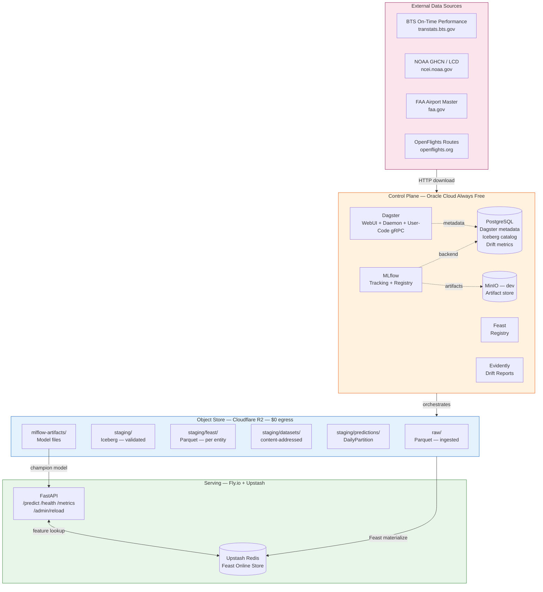
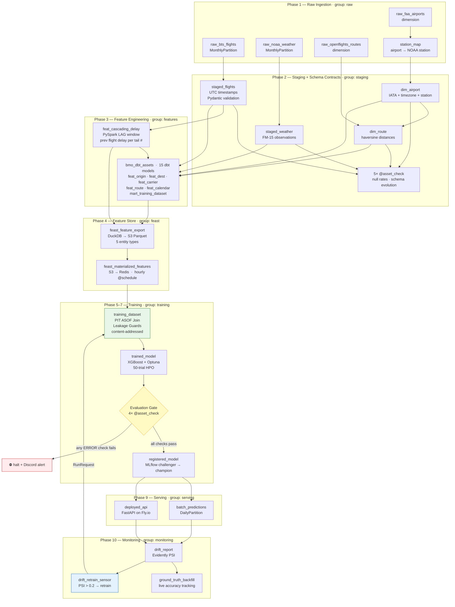
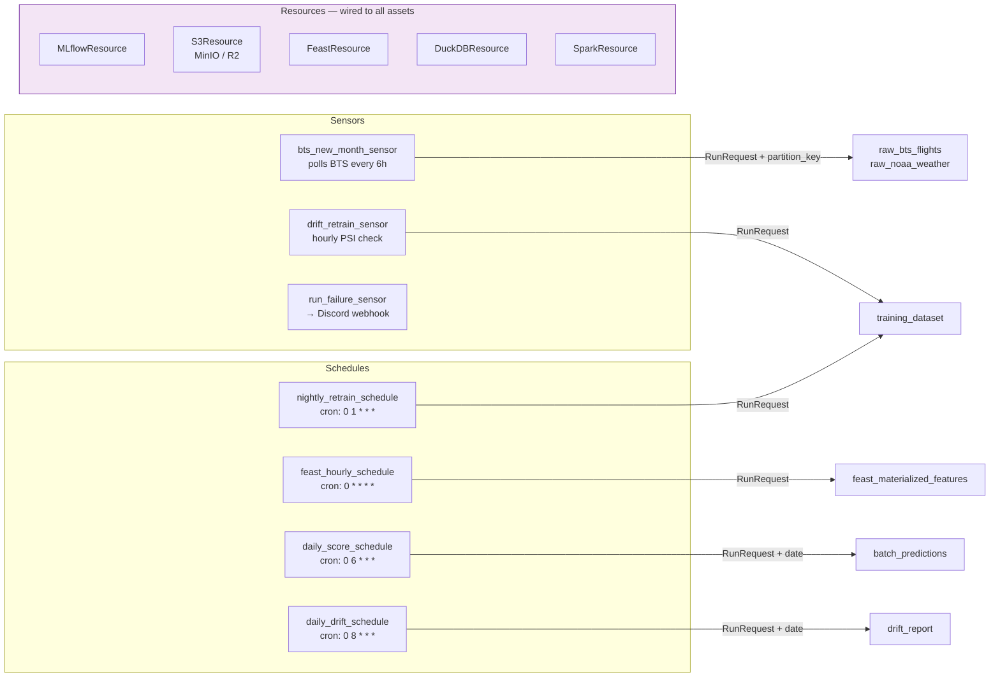

# System Architecture

## Infrastructure Tiers



## End-to-End Data Flow



## Dagster Orchestration Layer



## Storage Layout

```
Cloudflare R2 / MinIO
├── raw/
│   ├── bts/year=YYYY/month=MM/data.parquet      ← BTS flights (monthly)
│   ├── noaa/year=YYYY/month=MM/data.parquet     ← NOAA weather (monthly)
│   ├── faa/airports.parquet                     ← FAA airport master
│   └── openflights/routes.parquet               ← OpenFlights routes
├── staging/                                     ← Iceberg tables (ACID, partitioned)
│   ├── iceberg/staged_flights/                  ← month-partitioned
│   ├── iceberg/staged_weather/
│   ├── iceberg/dim_airport/
│   ├── iceberg/dim_route/
│   ├── iceberg/feat_cascading_delay/
│   ├── feat_*/                                  ← dbt feature tables (DuckDB writes)
│   ├── feast/                                   ← Feast offline store
│   │   ├── origin_airport/data.parquet
│   │   ├── dest_airport/data.parquet
│   │   ├── carrier/data.parquet
│   │   ├── route/data.parquet
│   │   └── aircraft/data.parquet
│   ├── datasets/{version_hash}/
│   │   ├── data.parquet                         ← content-addressed training dataset
│   │   └── card.json                            ← DatasetHandle metadata
│   └── predictions/date=YYYY-MM-DD/data.parquet ← batch scoring output
├── rejected/
│   ├── bts/...                                  ← rows failing Pydantic validation
│   └── noaa/...
└── mlflow-artifacts/                            ← model binaries, Evidently reports
```
