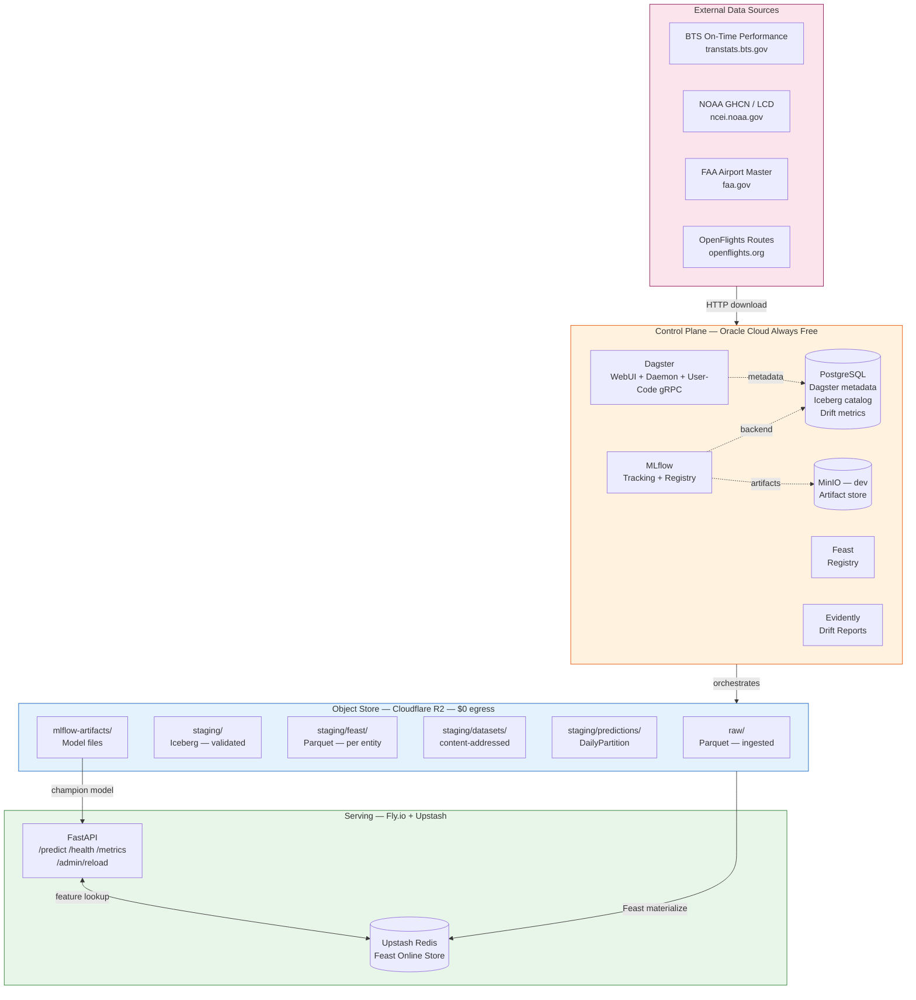
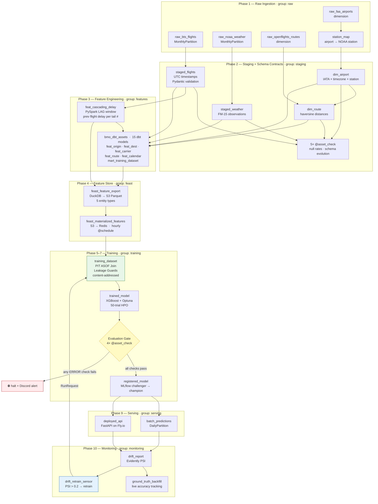
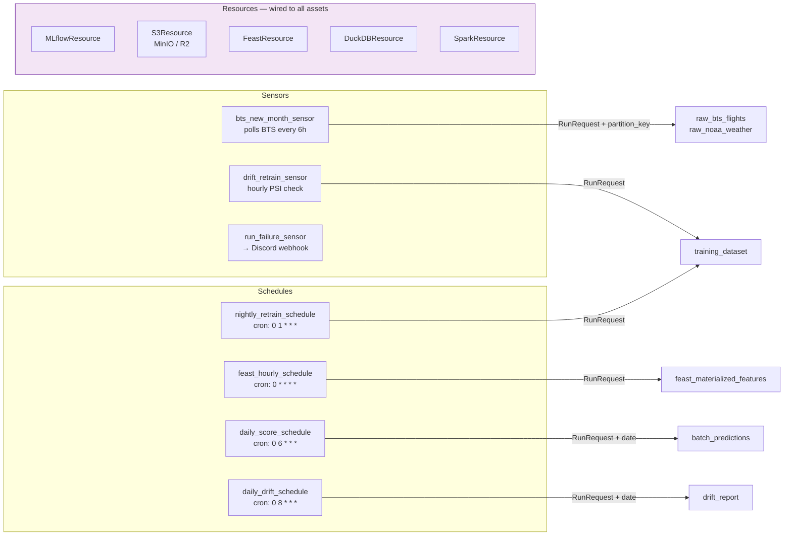
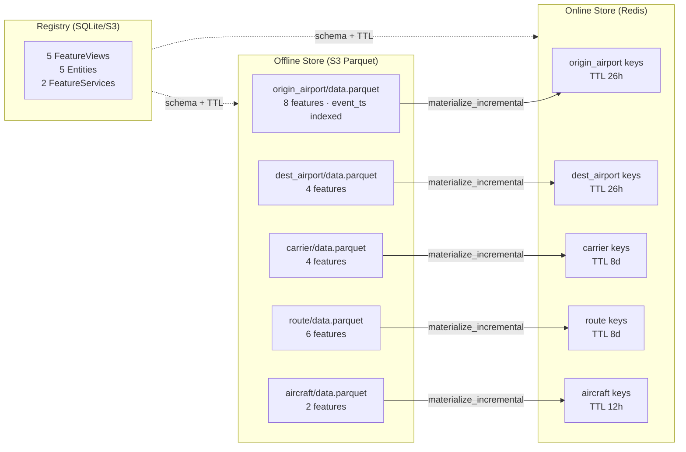
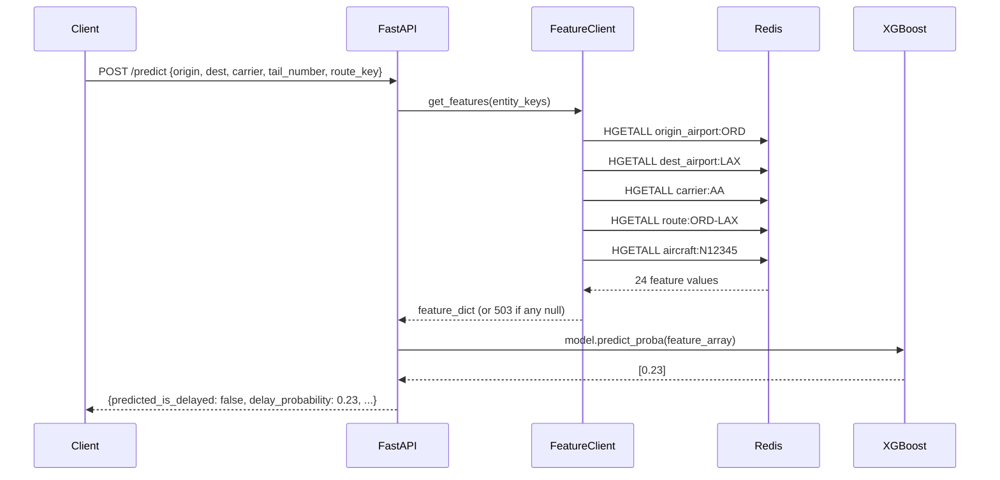
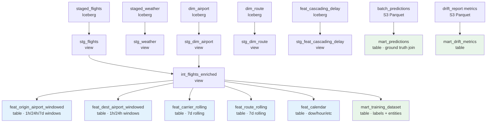
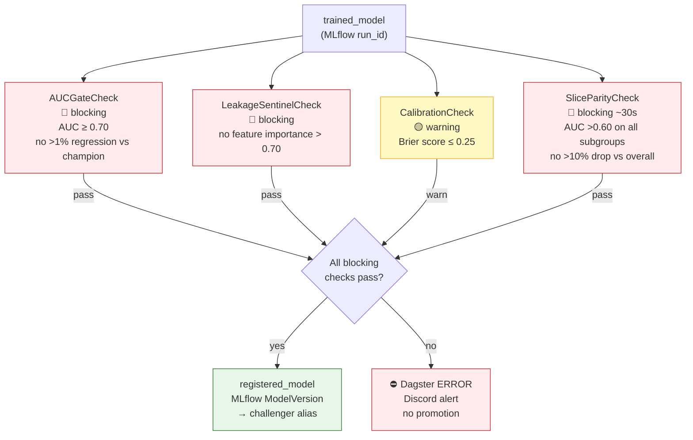
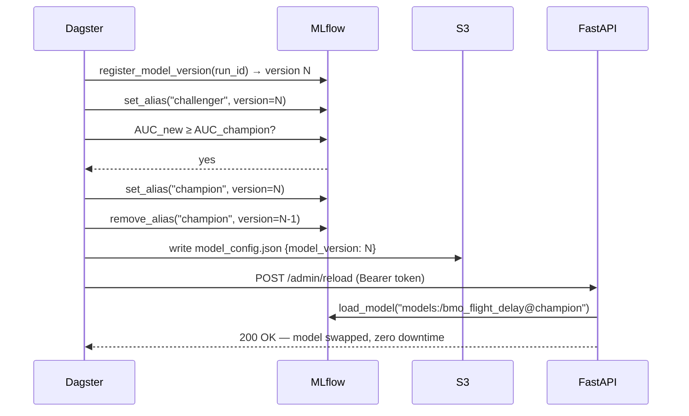
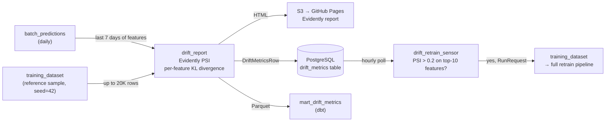

# System Architecture

BMO (Batch ML Orchestrator) is a production ML platform for predicting US domestic flight departure delays. It ingests BTS on-time performance data and NOAA weather observations, engineers point-in-time correct features, trains XGBoost classifiers with automated evaluation gates, and serves real-time predictions via a FastAPI + Redis online store.

---

## Infrastructure Tiers



---

## End-to-End Data Flow



---

## Dagster Orchestration Layer



---

## Storage Layout

```text
Cloudflare R2 / MinIO
├── raw/
│   ├── bts/year=YYYY/month=MM/data.parquet      ← BTS flights (monthly)
│   ├── noaa/year=YYYY/month=MM/data.parquet     ← NOAA weather (monthly)
│   ├── faa/airports.parquet                     ← FAA airport master
│   └── openflights/routes.parquet               ← OpenFlights routes
├── staging/                                     ← Iceberg tables (ACID, partitioned)
│   ├── iceberg/staged_flights/                  ← month-partitioned
│   ├── iceberg/staged_weather/
│   ├── iceberg/dim_airport/
│   ├── iceberg/dim_route/
│   ├── iceberg/feat_cascading_delay/
│   ├── feat_*/                                  ← dbt feature tables (DuckDB writes)
│   ├── feast/                                   ← Feast offline store
│   │   ├── origin_airport/data.parquet
│   │   ├── dest_airport/data.parquet
│   │   ├── carrier/data.parquet
│   │   ├── route/data.parquet
│   │   └── aircraft/data.parquet
│   ├── datasets/{version_hash}/
│   │   ├── data.parquet                         ← content-addressed training dataset
│   │   └── card.json                            ← DatasetHandle metadata
│   └── predictions/date=YYYY-MM-DD/data.parquet ← batch scoring output
├── rejected/
│   ├── bts/...                                  ← rows failing Pydantic validation
│   └── noaa/...
└── mlflow-artifacts/                            ← model binaries, Evidently reports
```

---

## Software Stack

Each component has a specific role. This section explains what each technology does and how it connects to its neighbors.

### Dagster — Orchestration

Dagster is the central nervous system. Every pipeline stage is a Dagster **asset** (a named, versioned unit of work that produces a persistent artifact). Assets declare upstream dependencies and Dagster resolves the execution order automatically.

Key Dagster primitives used:

| Primitive | Purpose |
| --- | --- |
| `@asset` | Defines a pipeline step with its outputs (metadata, S3 path, etc.) |
| `@asset_check` | Validates an asset after materialization; blocking checks halt the graph |
| `@sensor` | Polls an external system and yields `RunRequest`s when new work is detected |
| `@schedule` | Cron-triggered `RunRequest` for time-driven pipelines |
| `ConfigurableResource` | Typed, injectable clients (DuckDB, MLflow, S3, Feast) |
| `MonthlyPartitionsDefinition` | Partitions assets by calendar month; enables selective backfill |
| `DailyPartitionsDefinition` | Partitions batch scoring and drift reports by date |
| `FreshnessPolicy` | Declares a maximum acceptable lag per asset; UI shows SLA violations |

Dagster stores all run metadata (run IDs, step logs, asset materializations) in PostgreSQL. The daemon process handles schedule/sensor evaluation; the gRPC user-code server loads the `Definitions` object and executes asset steps.

```text
dagster_project/
├── definitions.py         ← top-level Definitions(assets, checks, schedules, sensors, resources)
├── assets/                ← one file per pipeline group
├── asset_checks/          ← schema_checks.py, evaluation_gate.py
├── schedules/             ← cron schedules
├── sensors/               ← BTS polling, drift trigger, failure alert
└── resources/             ← DuckDB, MLflow, S3, Feast wrappers
```

### PostgreSQL — Metadata Store

PostgreSQL holds three distinct schemas from different services:

| Database / Schema | Owner | Contents |
| --- | --- | --- |
| `dagster` | Dagster daemon | Run history, asset materializations, schedule ticks, logs |
| `mlflow` | MLflow server | Experiments, runs, params, metrics, tags, model versions |
| `iceberg` | PyIceberg | Iceberg table catalog (namespace/table metadata, snapshot history) |
| `bmo` (public) | Application | `drift_metrics`, `live_accuracy` application tables |

In local dev, all four databases can share one PostgreSQL instance. In production on Oracle Cloud, they share a single Always Free PostgreSQL instance.

### MinIO / Cloudflare R2 — Object Store

Both MinIO (dev) and Cloudflare R2 (prod) expose an S3-compatible API. All code uses `boto3` with a configurable `S3_ENDPOINT_URL`, so the same code runs against either backend.

R2 is chosen for production because it has **zero egress fees** — the pipeline reads its own data back frequently (training, batch scoring, drift reports), which would be expensive on AWS S3.

Three buckets:

| Bucket | Contents |
| --- | --- |
| `raw` | Downloaded source files — BTS Parquet, NOAA Parquet, FAA/OpenFlights |
| `staging` | All processed data — Iceberg tables, dbt outputs, Feast Parquet, datasets, predictions |
| `rejected` | Rows that failed Pydantic schema validation, with a `rejection_reason` column |
| `mlflow-artifacts` | MLflow run artifacts — model binaries, Evidently HTML reports, feature importance JSON |

### Apache Iceberg — Versioned Table Storage

PyIceberg manages the `staged_flights`, `staged_weather`, `dim_airport`, `dim_route`, and `feat_cascading_delay` tables. Iceberg provides:

- **ACID writes**: monthly partition overwrites are atomic
- **Schema evolution**: BTS upstream schema changes are detected by asset checks without data loss
- **Time travel**: snapshot history lets you query data as of any past materialization
- **Catalog abstraction**: the catalog lives in PostgreSQL; data files live in MinIO/R2

The catalog URI is `postgresql+psycopg2://.../<iceberg_db>`. DuckDB queries Iceberg tables natively via `httpfs` + `iceberg` extensions — no separate compute engine needed for reads.

### DuckDB — Feature Engineering SQL Engine

DuckDB is an in-process analytical SQL engine. It runs directly in the Dagster worker process (no separate server needed) and reads Parquet files from S3 via the `httpfs` extension.

DuckDB is used for:
1. **dbt feature models** — window aggregations (1h/24h/7d) over Iceberg-staged data
2. **feast_feature_export** — reads dbt feature tables and writes per-entity Parquet for Feast
3. **training_dataset builder** — reads `mart_training_dataset` labels
4. **batch_predictions** — reads scheduled flights for a given date partition

`DuckDBResource` in Dagster wraps a DuckDB connection with S3 credentials injected at construction time. The `duckdb_path` setting points to a local `.duckdb` file used as the default catalog; S3 tables are accessed via `read_parquet('s3://...')`.

### dbt — Feature Model Definitions

dbt (data build tool) manages the 15 SQL models that transform staged Iceberg data into feature tables. dbt runs inside Dagster via the `@dbt_assets` decorator, which generates one Dagster asset per dbt model and wires cross-model dependencies automatically.

Materialization strategy:

| dbt model layer | Strategy | Reason |
| --- | --- | --- |
| `stg_*` | `view` | Always-fresh reference to Iceberg tables; no storage |
| `int_*` | `view` | Lightweight join enrichment |
| `feat_*` | `table` | Expensive window aggregations; computed once |
| `mart_*` | `table` | Training labels and ground-truth joins; final outputs |

The `BmoDbtTranslator` class overrides dbt's default Dagster asset key resolution to map dbt `source()` references (e.g., `iceberg_staging.staged_flights`) to the Python asset keys produced by the staging layer (`staged_flights`). This makes cross-language asset dependencies visible in the Dagster UI.

### PySpark — Cascading Delay Computation

PySpark computes `feat_cascading_delay` — the LAG window of arrival delay across flights operated by the same tail number. This is the only asset that uses Spark because:

- It requires a partitioned LAG over an ordered, non-date key (`tail_number`)
- DuckDB window functions work but PySpark handles the Iceberg read/write more efficiently at full dataset scale

The Spark job reads `staged_flights` from Iceberg via the `iceberg-spark-runtime` JAR, computes `LAG(arr_delay_min) OVER (PARTITION BY tail_number ORDER BY scheduled_departure_utc)`, and overwrites the `feat_cascading_delay` Iceberg table.

### Feast — Feature Store

Feast provides train–serve consistency: the same feature computation logic and the same entity keys produce consistent feature values whether used in training (offline, historical) or serving (online, real-time).



**Offline store** (training + batch scoring): `get_historical_features(entity_df, feature_refs)` performs a point-in-time ASOF join — for each row in `entity_df` it finds the latest feature row where `event_ts ≤ scheduled_departure_utc`. This is the critical leakage prevention mechanism.

**Online store** (real-time serving): `get_online_features(entity_rows, feature_refs)` looks up Redis keys by entity value. If the stored value is older than the TTL, Feast returns null (handled as a 503 by the API — fail-closed).

**Registry**: holds the schema, TTL, entity definitions, and source paths for each FeatureView. In dev it is a local SQLite file; in prod it lives on R2 (`s3://bmo-staging/feast/registry.db`).

### MLflow — Experiment Tracking and Model Registry

MLflow records every training run as an **experiment run** with params, metrics, and artifacts. After training, the model is registered in the **Model Registry** under the name `bmo_flight_delay`.

Model lifecycle:

```text
training run → register version → set alias "challenger"
                                          ↓
                               AUC ≥ current champion?
                                    ↙         ↘
                               yes              no
                     promote to "champion"   keep as challenger
                     archive old champion
```

The FastAPI serving layer loads the champion model at startup with `mlflow.xgboost.load_model('models:/bmo_flight_delay@champion')`. The `/admin/reload` endpoint re-executes this lookup without restarting the container, enabling zero-downtime model swaps.

MLflow uses PostgreSQL as its tracking backend and MinIO/R2 as its artifact store. Run artifacts include: `model/` directory (XGBoost pickle), `feature_importance.json`, `evaluation_report.html` (Evidently), and `card.json` (DatasetHandle sidecar).

### Optuna — Hyperparameter Optimization

Optuna runs 50 TPE-sampler trials to tune XGBoost hyperparameters. Each trial creates a nested MLflow child run. `XGBoostPruningCallback` with `MedianPruner` terminates underperforming trials early using `eval_auc` on the validation set. After HPO, the best parameters are used for a final full training run that logs all artifacts.

Search space includes: `max_depth`, `learning_rate`, `n_estimators`, `subsample`, `colsample_bytree`, `min_child_weight`, `reg_alpha`, `reg_lambda`.

### Evidently — Drift Detection

Evidently generates per-feature drift reports comparing the training distribution (reference) against the last 7 days of production feature values (current). PSI (Population Stability Index) is the primary metric:

| PSI range | Interpretation |
| --- | --- |
| < 0.1 | Stable — no action needed |
| 0.1 – 0.2 | Moderate shift — monitor |
| > 0.2 | Significant drift — retrain trigger |

Evidently outputs a self-contained HTML report (written to S3, served via GitHub Pages) and per-feature `DriftMetricsRow` objects (upserted to PostgreSQL `drift_metrics` table). The Dagster `drift_retrain_sensor` polls this table hourly and fires a `RunRequest` if any top-10 feature by importance has PSI > 0.2.

### FastAPI — Online Serving

The FastAPI application is deployed on Fly.io and performs single-flight, real-time predictions.

Request lifecycle:



If `SHADOW_MODEL_VERSION` is set, a shadow inference runs in a `BackgroundTask` (no added latency) and the disagreement is logged as structured JSON for offline analysis.

### React Frontend — Dashboard

The frontend is built with TanStack Start (full-stack React) and Material UI. It connects to the FastAPI backend via `fetch`-based query functions wrapped in TanStack Query for caching and refetching.

Routes and what they display:

| Route | Page | API Endpoints |
| --- | --- | --- |
| `/` | Index / navigation | — |
| `/predictions` | Daily prediction volume, positive rate, actuals coverage | `GET /predictions` |
| `/accuracy` | Live ROC AUC, F1, Brier score per model version | `GET /accuracy` |
| `/drift` | PSI heatmap per feature per day, per-feature PSI trend | `GET /drift`, `GET /drift/heatmap`, `GET /drift/feature/{name}/psi` |
| `/models` | Model registry stats — avg AUC, last scored date, flight count | `GET /models` |

---

## Data Structures

### `staged_flights` — PyArrow Schema

The core event table. All timestamps are converted to UTC during staging to eliminate timezone ambiguity in all downstream computations.

```python
STAGED_FLIGHTS_SCHEMA = pa.schema([
    ('year',                     pa.int16()),
    ('month',                    pa.int8()),
    ('day_of_month',             pa.int8()),
    ('day_of_week',              pa.int8()),        # 1=Monday … 7=Sunday
    ('flight_date',              pa.date32()),
    ('reporting_airline',        pa.string()),      # 2-letter BTS carrier code
    ('tail_number',              pa.string()),      # FAA N-number
    ('flight_number',            pa.int32()),
    ('origin',                   pa.string()),      # 3-letter IATA
    ('dest',                     pa.string()),
    ('origin_tz',                pa.string()),      # tz_database_timezone from dim_airport
    ('dest_tz',                  pa.string()),
    # UTC timestamps — the whole point of staging
    ('scheduled_departure_utc',  pa.timestamp('us', tz='UTC')),
    ('actual_departure_utc',     pa.timestamp('us', tz='UTC')),   # null if cancelled
    ('scheduled_arrival_utc',    pa.timestamp('us', tz='UTC')),
    ('actual_arrival_utc',       pa.timestamp('us', tz='UTC')),   # null if cancelled/diverted
    # Delay fields
    ('dep_delay_min',            pa.float32()),
    ('arr_delay_min',            pa.float32()),
    ('dep_del15',                pa.bool_()),       # BTS binary: delayed ≥15 min
    ('arr_del15',                pa.bool_()),
    ('cancelled',                pa.bool_()),
    ('cancellation_code',        pa.string()),      # A/B/C/D
    ('diverted',                 pa.bool_()),
    ('crs_elapsed_min',          pa.float32()),
    ('actual_elapsed_min',       pa.float32()),
    ('distance_mi',              pa.float32()),
    ('carrier_delay_min',        pa.float32()),
    ('weather_delay_min',        pa.float32()),
    ('nas_delay_min',            pa.float32()),
    ('late_aircraft_delay_min',  pa.float32()),
])
```

**Validation rules** (rejections written to `s3://rejected/bts/`):

| Rule | Rejection reason |
| --- | --- |
| `origin` or `dest` not exactly 3 characters | `invalid_iata_code` |
| `distance_mi` ≤ 0 or > 6000 | `implausible_distance` |
| `scheduled_departure_utc` is null (timezone lookup failed) | `missing_scheduled_departure_utc` |
| Non-cancelled flight with null `actual_departure_utc` | `missing_actual_departure_for_operated_flight` |

### Feature Views — All Features

| Feature view | Entity join key | TTL | Features |
| --- | --- | --- | --- |
| `origin_airport_features` | `origin` (IATA) | 26h | `origin_flight_count_1h`, `origin_avg_dep_delay_1h`, `origin_pct_delayed_1h`, `origin_avg_dep_delay_24h`, `origin_pct_cancelled_24h`, `origin_avg_dep_delay_7d`, `origin_pct_delayed_7d`, `origin_congestion_score_1h` |
| `dest_airport_features` | `dest` (IATA) | 26h | `dest_avg_arr_delay_1h`, `dest_pct_delayed_1h`, `dest_avg_arr_delay_24h`, `dest_pct_diverted_24h` |
| `carrier_features` | `carrier` (2-letter) | 8d | `carrier_on_time_pct_7d`, `carrier_cancellation_rate_7d`, `carrier_avg_delay_7d`, `carrier_flight_count_7d` |
| `route_features` | `route_key` (`ORD-LAX`) | 8d | `route_avg_dep_delay_7d`, `route_avg_arr_delay_7d`, `route_pct_delayed_7d`, `route_cancellation_rate_7d`, `route_avg_elapsed_7d`, `route_distance_mi` |
| `aircraft_features` | `tail_number` | 12h | `cascading_delay_min`, `turnaround_min` |

Total: **24 features** across 5 entity types.

### `DatasetHandle` — Training Dataset Metadata

Written as `card.json` alongside every `data.parquet` and logged as an MLflow artifact. The `version_hash` is content-addressed: identical inputs always produce the same hash, enabling dataset-level caching.

```python
class DatasetHandle(BaseModel):
    version_hash: str          # SHA-256 of (feature_refs + as_of + label content + feature_set_version + code_version)
    feature_refs: list[str]    # sorted "view:feature" strings, e.g. "origin_airport_features:origin_avg_dep_delay_1h"
    feature_set_version: str   # Feast registry hash or feature_repo/ git tree SHA
    feature_ttls: dict[str, int]  # feature_view_name → TTL in seconds
    as_of: datetime | None     # upper bound on feature/label timestamps; None = unbound
    row_count: int
    label_distribution: dict[str, LabelDistribution]  # per-target stats
    schema_fingerprint: str    # SHA-256 of column names + dtypes
    created_at: datetime
    storage_path: str          # s3://staging/datasets/{version_hash}/data.parquet
```

Hash inputs: sorted feature refs, `as_of` ISO string, SHA-256 of label Parquet bytes (sorted for stability), `feature_set_version`, git HEAD SHA. The hash is computed before the expensive PIT join so the result path is known in advance — if `s3://staging/datasets/{hash}/data.parquet` already exists, the join is skipped.

### Serving API Schemas

**Request** (`POST /predict`):
```python
class PredictRequest(BaseModel):
    flight_id: str          # e.g. "AA123_20240406_0900"
    origin: str             # IATA departure airport, e.g. "ORD"
    dest: str               # IATA arrival airport, e.g. "LAX"
    carrier: str            # BTS carrier code, e.g. "AA"
    tail_number: str        # FAA tail number, e.g. "N12345"
    route_key: str          # "{origin}-{dest}", e.g. "ORD-LAX"
```

**Response**:
```python
class PredictResponse(BaseModel):
    flight_id: str
    predicted_is_delayed: bool
    delay_probability: float    # [0.0, 1.0]
    model_name: str
    model_version: str
    features_complete: bool     # false when any feature was null (503 returned instead)
```

**Shadow prediction** (logged async, never returned to caller):
```python
class ShadowPrediction(BaseModel):
    flight_id: str
    primary_version: str
    shadow_version: str
    primary_proba: float
    shadow_proba: float
    primary_is_delayed: bool
    shadow_is_delayed: bool
    agreed: bool
```

### `DriftMetricsRow` — PostgreSQL Row

One row per feature per day, upserted by the `drift_report` asset.

```python
class DriftMetricsRow(BaseModel):
    report_date: date
    feature_name: str
    psi_score: float
    kl_divergence: float | None
    rank: int           # 1 = most important feature by training-time importance
    is_breached: bool   # psi_score > 0.2
    model_version: str | None
    computed_at: datetime
```

### `AccuracyRow` — PostgreSQL Row

One row per (score_date, model_version), written by `ground_truth_backfill` when BTS actuals arrive (~60-day lag).

```python
class AccuracyRow(BaseModel):
    score_date: str
    model_version: str
    roc_auc: float
    f1: float
    precision_score: float
    recall_score: float
    brier_score: float
    positive_rate: float          # model's predicted positive rate
    actual_positive_rate: float   # ground truth positive rate
    n_with_actuals: int           # flights with confirmed outcomes
```

---

## Feature Engineering Detail

### Cascading Delay (PySpark)

The `feat_cascading_delay` feature captures **aircraft propagation delay** — if an inbound flight was late, the outbound flight on the same tail number is likely late regardless of other factors. Spark is used because it handles the ordered LAG window over a non-date partition key efficiently at full-history scale.

```text
staged_flights (Iceberg)
        │
        ▼
  PARTITION BY tail_number
  ORDER BY scheduled_departure_utc
        │
  LAG(arr_delay_min, 1) → cascading_delay_min
  scheduled_departure - prev actual_arrival → turnaround_min
        │
        ▼
feat_cascading_delay (Iceberg)
```

### dbt Model DAG



---

## Training Pipeline Detail

### Point-in-Time Join

The PIT join is the most critical correctness mechanism. It prevents **temporal leakage** — using feature values computed from data that wouldn't have been available at flight departure time.

```text
mart_training_dataset row:
  flight_id=AA123, origin=ORD, scheduled_departure_utc=2024-01-15T14:00Z
                                         │
                                         │ event_timestamp
                                         ▼
  Feast get_historical_features() ────→ ASOF JOIN:
                                         find latest origin_airport_features row
                                         where event_ts ≤ 2024-01-15T14:00Z
                                         and row age ≤ TTL (26h)
                                         │
                                         ▼
  origin_avg_dep_delay_1h = 4.2   (computed at 2024-01-15T13:47Z ✓)
  NOT                              (computed at 2024-01-15T14:12Z ✗ — future)
```

Event timestamp is `scheduled_departure_utc` (not actual), because at prediction time you only know when the flight is *scheduled* to depart.

### Evaluation Gate

The evaluation gate runs as 4 Dagster `@asset_check` functions on the `trained_model` asset. The `registered_model` asset only executes if all blocking checks pass.



**SliceParityCheck subgroups** (`~30s`, loads test split from S3):

| Dimension | Slices |
| --- | --- |
| Carrier | One bucket per carrier code |
| Origin hub size | large hub / medium hub / small hub (FAA NPIAS classification) |
| Time of day | morning (6–12), afternoon (12–18), evening (18–24), red-eye (0–6) |
| Weather | high weather delay ratio / normal |

Failure condition: any slice AUC < 0.60, or any slice AUC more than 10% below overall AUC.

---

## Serving Architecture

### Model Promotion and Hot-Swap



### Prometheus Metrics

The FastAPI `/metrics` endpoint exports:

| Metric | Type | Description |
| --- | --- | --- |
| `bmo_predictions_total` | Counter | Total predictions, labeled by `predicted_class` |
| `bmo_prediction_latency_seconds` | Histogram | End-to-end request latency |
| `bmo_feature_null_total` | Counter | Requests with incomplete features |
| `bmo_model_info` | Info | Current model version and loaded_at timestamp |

---

## Monitoring and Feedback Loop

### Drift Detection → Retrain



### Ground Truth Feedback Loop

BTS publishes on-time data with approximately a 60-day lag. The `ground_truth_backfill` asset joins `batch_predictions` against `staged_flights` once actuals are available and computes realized model accuracy per `(score_date, model_version)`.

This closes the feedback loop: PSI-triggered retrains can be evaluated against actual outcomes, not just distribution shift. A model that passes the evaluation gate but degrades on live accuracy is visible in the `live_accuracy` Postgres table and the `/accuracy` dashboard.

```text
batch_predictions (predicted_proba, model_version)
        │
        │ LEFT JOIN on (flight_id, flight_date)
        ▼
staged_flights (actual arr_del15 — available ~60 days later)
        │
        ▼
live_accuracy (roc_auc, f1, brier_score per score_date × model_version)
```

---

## Database Schemas

### PostgreSQL — Application Tables

**`drift_metrics`** (upserted daily by `drift_report` asset):
```sql
CREATE TABLE drift_metrics (
    report_date     DATE        NOT NULL,
    feature_name    TEXT        NOT NULL,
    psi_score       FLOAT       NOT NULL,
    kl_divergence   FLOAT,
    rank            INTEGER     NOT NULL,  -- 1 = highest training importance
    is_breached     BOOLEAN     NOT NULL,
    model_version   TEXT,
    computed_at     TIMESTAMPTZ NOT NULL,
    PRIMARY KEY (report_date, feature_name)
);
```

**`live_accuracy`** (upserted by `ground_truth_backfill` asset):
```sql
CREATE TABLE live_accuracy (
    score_date           DATE    NOT NULL,
    model_version        TEXT    NOT NULL,
    roc_auc              FLOAT,
    f1                   FLOAT,
    precision_score      FLOAT,
    recall_score         FLOAT,
    brier_score          FLOAT,
    positive_rate        FLOAT,
    actual_positive_rate FLOAT,
    n_with_actuals       INTEGER,
    PRIMARY KEY (score_date, model_version)
);
```

Both tables use `ON CONFLICT DO UPDATE` (upsert) so re-running an asset for the same partition is idempotent.

---

## CI/CD and Deployment

### GitHub Actions Workflows

| Workflow | Trigger | Steps |
| --- | --- | --- |
| `ci.yml` | PR / push to main | ruff lint, mypy, pytest, dbt parse |
| `build-images.yml` | Push to main | Build + push Dagster user-code and FastAPI Docker images to registry |
| `deploy.yml` | Push to main | SSH to Oracle VM, pull new images, restart services |
| `evidently-reports.yml` | Schedule | Sync Evidently HTML reports from S3 to GitHub Pages |

### Local Development

```text
compose.dev.yml
├── postgres:17        ← Dagster metadata + MLflow + Iceberg catalog
├── minio              ← S3-compatible object store (localhost:9000)
├── redis              ← Feast online store (localhost:6379)
└── mlflow             ← Tracking server (localhost:5000)
```

Start everything: `docker compose -f compose.dev.yml up -d`

Run the Dagster UI: `dagster dev` (reads `DAGSTER_HOME` for workspace config)

### Terraform

| Module | Resources |
| --- | --- |
| `infra/terraform/oracle/` | OCI VCN, subnet, internet gateway, route table, Ubuntu 22.04 ARM VM (Ampere A1 — free tier), SSH key, security rules |
| `infra/terraform/cloudflare_r2/` | R2 buckets: `bmo-raw`, `bmo-staging`, `bmo-rejected`, `bmo-mlflow-artifacts` |

---

## Configuration Reference

All configuration is loaded by `bmo.common.config.Settings` (pydantic-settings) from environment variables or `.env`. A single `settings` singleton is imported throughout the codebase.

| Variable | Required | Description |
| --- | --- | --- |
| `DAGSTER_HOME` | yes | Dagster workspace root |
| `S3_ENDPOINT_URL` | yes | MinIO (`http://localhost:9000`) or R2 (`https://<account>.r2.cloudflarestorage.com`) |
| `S3_ACCESS_KEY_ID` / `AWS_ACCESS_KEY_ID` | yes | Object store credentials |
| `S3_SECRET_ACCESS_KEY` / `AWS_SECRET_ACCESS_KEY` | yes | |
| `S3_REGION` | no | Default `us-east-1` |
| `DUCKDB_PATH` | no | Default `/tmp/bmo_features.duckdb` |
| `DUCKDB_S3_ENDPOINT` | no | DuckDB httpfs endpoint (host:port, no scheme) |
| `MLFLOW_TRACKING_URI` | yes | e.g. `http://localhost:5000` |
| `POSTGRES_HOST/PORT/DB/USER/PASSWORD` | yes | Shared PostgreSQL instance |
| `REDIS_URL` | yes | `redis://localhost:6379` (dev) or Upstash URI (prod) |
| `ICEBERG_CATALOG_URI` | no | SQLite URI for dev; defaults to PostgreSQL `iceberg` database |
| `FEAST_REGISTRY_PATH` | yes | `data/registry.db` (dev) or `s3://bmo-staging/feast/registry.db` |
| `AWS_ENDPOINT_URL` | yes | boto3 endpoint for Feast S3 reads (same as `S3_ENDPOINT_URL`) |
| `ADMIN_TOKEN` | no | Bearer token for `POST /admin/reload` |
| `SHADOW_MODEL_VERSION` | no | Registry version for shadow inference logging |
| `DISCORD_WEBHOOK_URL` | no | Alert destination for `run_failure_sensor` |
