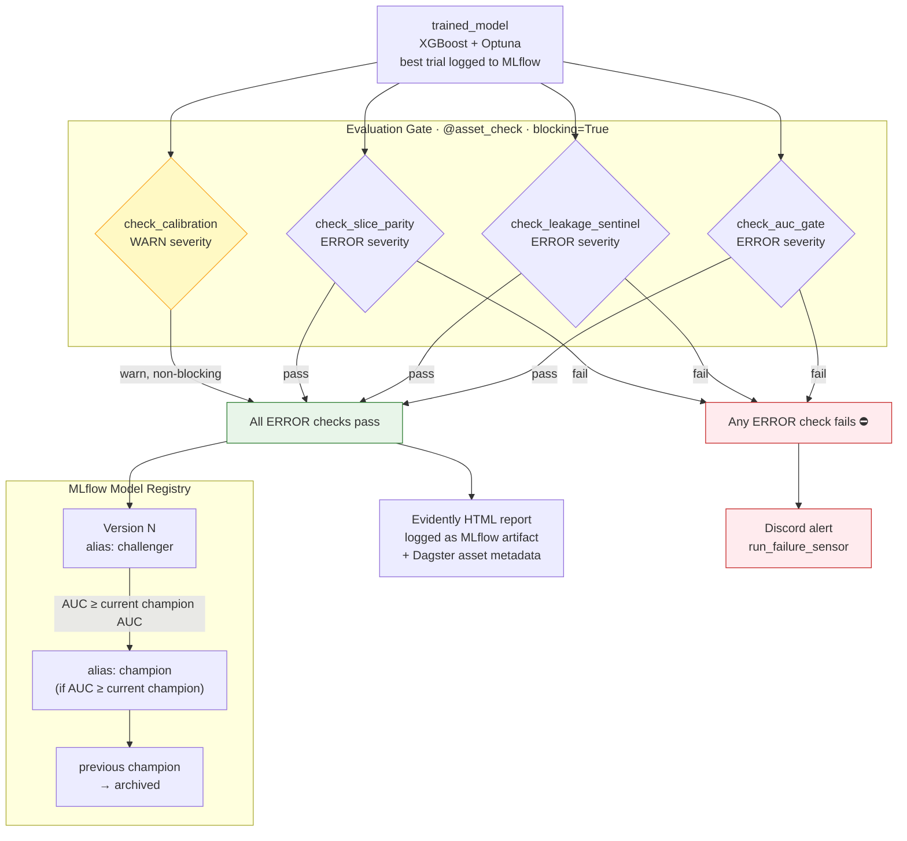
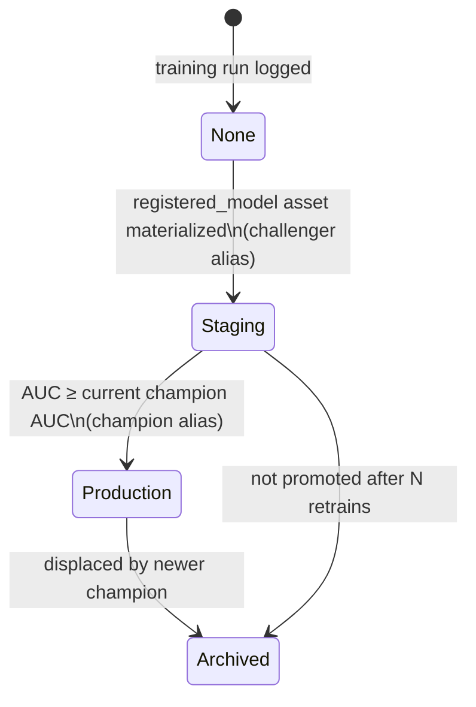

# Evaluation Gate & Model Registry

Every model candidate passes through an automated evaluation gate before it can be promoted to production. The gate is implemented as four Dagster `@asset_check` functions attached to the `trained_model` asset. Any `ERROR`-severity failure blocks materialization of `registered_model` and sends a Discord alert.

## Promotion Pipeline

## Check Definitions

### 1. `check_auc_gate` — ERROR

The primary quality floor. A model that drops below either threshold is not deployable.

| Condition | Threshold |
|-----------|-----------|
| Test-set AUC | ≥ 0.70 |
| Regression vs. current champion | ≥ champion AUC − 0.01 |

The regression guard prevents a model that technically clears the floor from silently degrading production quality. Champion AUC is read from the MLflow Registry at check time.

### 2. `check_leakage_sentinel` — ERROR

A trained model should not rely on any single feature for more than 70% of its prediction signal. A feature importance > 0.70 is a strong signal that a label or a near-label proxy leaked into training.

| Condition | Threshold |
|-----------|-----------|
| Max feature importance (gain) | ≤ 0.70 |

If this check fires in production, the failure is caught before serving — not discovered weeks later from degraded real-world accuracy.

### 3. `check_slice_parity` — ERROR

Aggregate AUC can look healthy while the model fails systematically on important subgroups. This check computes AUC on four slices and enforces two constraints:

**Slice dimensions:**
- Time-of-day bucket (early morning, rush hour, evening, overnight)
- Carrier (legacy vs. low-cost, and top-5 individual carriers)
- Origin hub size (major hub, secondary hub, regional)
- Weather condition (clear, precipitation, severe)

**Constraints:**

| Constraint | Threshold |
|-----------|-----------|
| Per-slice AUC floor | ≥ 0.60 |
| Max drop from overall AUC | ≤ 0.10 |

A model that achieves 0.78 overall but 0.54 on overnight regional flights is not acceptable for serving.

### 4. `check_calibration` — WARN (non-blocking)

A well-calibrated model outputs probabilities that match observed frequencies. A model predicting 80% delay probability should be wrong ~20% of the time on those flights.

| Condition | Threshold |
|-----------|-----------|
| Brier score | ≤ 0.25 |

This is WARN (not ERROR) because calibration can be adjusted post-hoc (Platt scaling, isotonic regression) without retraining. A WARN surfaces the issue in Dagster's UI and Evidently report without blocking deployment.

## MLflow Registry States

The `deployed_api` Dagster asset reads the model with alias `champion` from the registry and writes a `model_config.json` to S3. The FastAPI service's `/admin/reload` endpoint hot-swaps the in-memory model without restarting the container.

## Evidently Report

Each gate evaluation produces an Evidently HTML report covering:

- Feature distribution comparison (training vs. baseline)
- Prediction score distribution
- Class-level metrics (precision, recall, F1 at multiple thresholds)
- Calibration curve
- Per-slice AUC table

The report is logged as an MLflow artifact and stored as Dagster asset metadata, making it inspectable from both the MLflow UI and the Dagster asset page.

## Failure Scenario: Gate Blocks a Retrain

When the drift-triggered retrain fires and the new model fails the AUC gate, the `registered_model` asset materializes with an `AssetCheckResult(passed=False)`. Dagster marks the asset as failed, halts any downstream materializations (`batch_predictions`, `deployed_api`), and the run failure sensor posts a Discord embed with the failing check name, the actual vs. threshold values, and a link to the MLflow run.

The previous champion model remains in production. No rollback is required.
