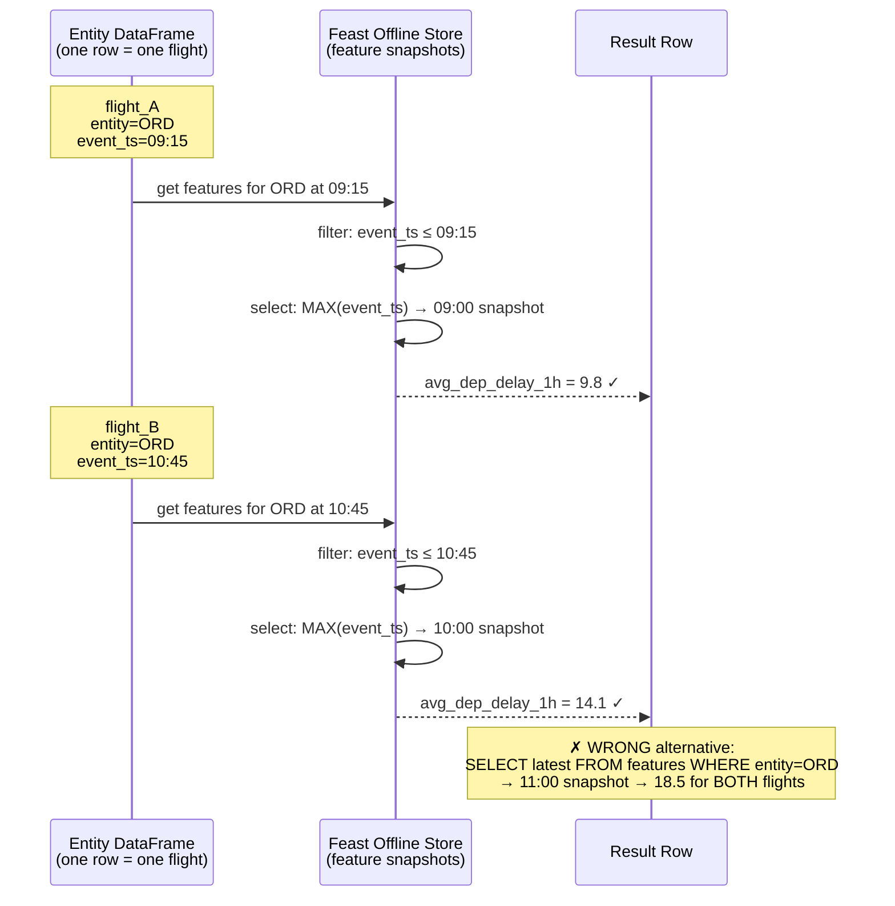
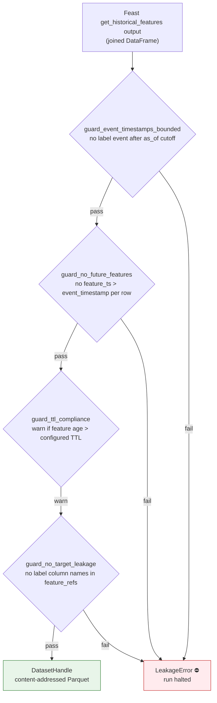

# Point-in-Time Correctness

The core data engineering problem in any ML pipeline that trains on historical events: **a training example must only see feature values that were knowable at the time of that event**. Using any information from after the event contaminates the training set with future data ("leakage") and produces a model that cannot generalize to production.

## The Problem: What Leakage Looks Like

For a flight departing ORD at 09:15, the correct feature is the average departure delay as it was *known at 09:15* — not what it became later in the day.

```
Time →

Feature snapshots (origin_airport=ORD, avg_dep_delay_1h):
  08:00 →  6.2 min
  09:00 →  9.8 min   ←── this is the latest value knowable at 09:15
  10:00 → 14.1 min
  11:00 → 18.5 min

Label events (scheduled departures):
  flight_A  scheduled_dep=09:15
  flight_B  scheduled_dep=10:45

Correct PIT join:
  flight_A → use 09:00 snapshot → avg_dep_delay=9.8  ✓
  flight_B → use 10:00 snapshot → avg_dep_delay=14.1 ✓

WRONG (naive "latest value" join):
  flight_A → use 11:00 snapshot → avg_dep_delay=18.5 ✗  (future leak)
  flight_B → use 11:00 snapshot → avg_dep_delay=18.5 ✗  (same leak, different reason)
```

The naive join gives every training example the same "latest" value regardless of when the event occurred. A model trained this way learns a relationship that cannot exist at inference time — at serving time, you only have the feature values that exist *right now*, not future values.

## BTS-Specific Subtlety: Scheduled vs Actual Departure

BTS records both `scheduled_departure_utc` and `actual_departure_utc`. The feature key must be `scheduled_departure_utc`, not actual.

**Why:** At prediction time (before the flight departs), you know the scheduled departure. You do not yet know the actual departure — it's literally what you're predicting. If you key training examples to actual departure time, you leak the answer into the feature lookup window.

This distinction is easy to miss and hard to catch without an explicit test.

## How This Pipeline Enforces PIT Correctness

### Layer 1 — dbt ASOF join in `int_flights_enriched`

The intermediate model joins weather observations to flights using DuckDB's `ASOF JOIN`, which finds the latest weather row with `observation_time ≤ scheduled_departure_utc`:

```sql
-- int_flights_enriched.sql (simplified)
SELECT
    f.*,
    w.temperature_f,
    w.wind_speed_kts,
    w.precip_in
FROM stg_flights f
ASOF JOIN stg_weather w
    ON f.origin_station_id = w.station_id
    AND w.observation_time <= f.scheduled_departure_utc
```

The `ASOF JOIN` guarantee: for each flight row, it selects the *most recent* weather snapshot that predates the scheduled departure. No future data can enter.

### Layer 2 — Feast `get_historical_features`

Feast's offline retrieval implements the same semantics for the feature store:

```
For each row in entity_df (one row per training example):
  1. entity_key = (origin_airport, carrier, tail_number, ...)
  2. event_timestamp = scheduled_departure_utc
  3. Find all feature rows matching entity_key
  4. Filter to rows where feature.event_ts ≤ entity.event_timestamp
  5. Return the row with the maximum event_ts in that filtered set
```

This is distinct from a plain `SELECT`: it returns a *different* feature value for each training example based on *when* that example occurred, not a single latest value for each entity.



### Layer 3 — Training Dataset Builder leakage guards

The `TrainingDatasetBuilder` applies four explicit guards after the ASOF join:



**Guard 1 — event timestamp bounded:** No training label can have `scheduled_departure_utc > as_of`. Prevents accidentally including future flights in the training set during a backfill.

**Guard 2 — no future features:** For every row, assert `feature_ts ≤ event_timestamp`. This catches bugs in the upstream feature computation (e.g., a misconfigured window that reaches forward in time).

**Guard 3 — TTL compliance:** Each feature view has a configured TTL (e.g., origin airport features expire after 26 hours). The guard warns if a retrieved feature is older than its TTL. Feast's TTL is enforced for online serving but silently ignored for offline retrieval — this guard makes the gap explicit.

**Guard 4 — target leakage:** Checks that none of the requested `feature_refs` match known label column names (`dep_delay_min`, `is_dep_delayed`, `arr_delay_min`, etc.). Guards against accidentally including the prediction target as a training feature.

### Layer 4 — dbt singular test `assert_pit_correct.sql`

A dbt singular test plants a known future value in the feature data and asserts the PIT join *excludes* it. This test runs in CI on every push.

### Layer 5 — Integration test `test_leakage_planted_value.py`

Plants a feature value at time T+1h for an event at time T, calls `build_dataset()`, and asserts a `LeakageError` is raised. This is the definitive correctness guarantee.

## Feature TTLs by Entity Type

| Entity | Feature View | TTL | Rationale |
|--------|-------------|-----|-----------|
| Origin airport | `origin_airport_features` | 26 hours | Rolling windows ≤ 24h; buffer for late data |
| Destination airport | `dest_airport_features` | 26 hours | Same |
| Carrier | `carrier_features` | 8 days | 7-day rolling window |
| Route (OD pair) | `route_features` | 8 days | 7-day rolling window |
| Aircraft tail | `aircraft_features` | 12 hours | Previous flight delay; staleness matters most here |

TTLs serve two purposes: they bound how stale a feature can be at serving time (Redis), and they define the warning threshold for offline retrieval via Guard 3.

## Content-Addressed Dataset Versioning

Every `build_dataset()` call produces a `DatasetHandle` with a `version_hash` — a SHA-256 of:

- Sorted list of feature references
- `as_of` timestamp
- SHA-256 of the label DataFrame (flight IDs + targets)
- Feature registry git tree hash
- Code version (git SHA)

Two calls with identical inputs produce the same hash. The hash is stored as an MLflow run parameter, creating a traceable link from any model artifact back to the exact dataset that trained it.

```
MLflow run xyz
  └── params.dataset_version_hash = "a3f8c2..."
        └── s3://staging/datasets/a3f8c2.../data.parquet
              └── card.json  ← feature_refs, as_of, row_count, label_distribution, schema_fingerprint
```
