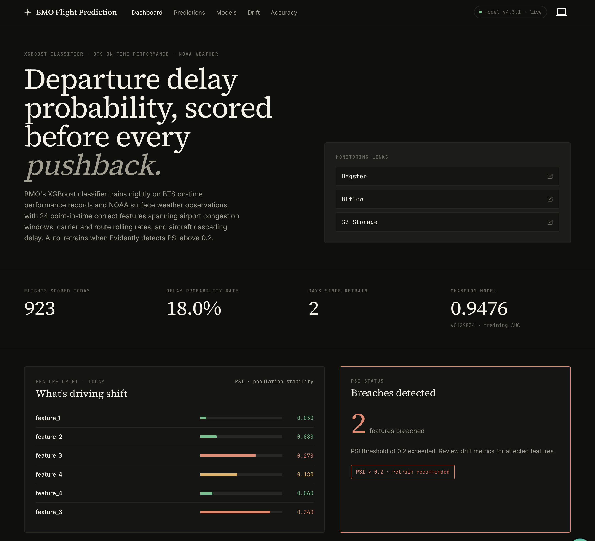
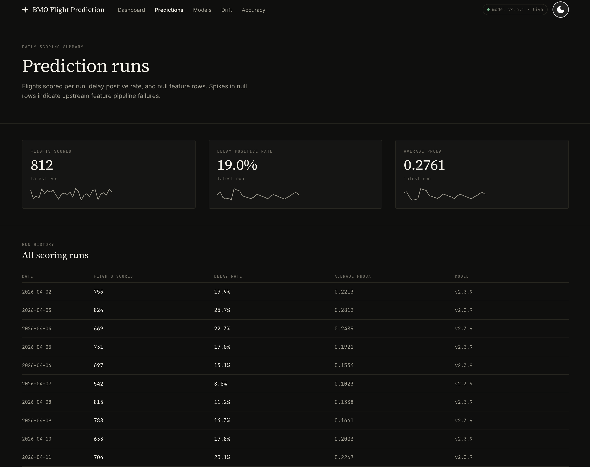
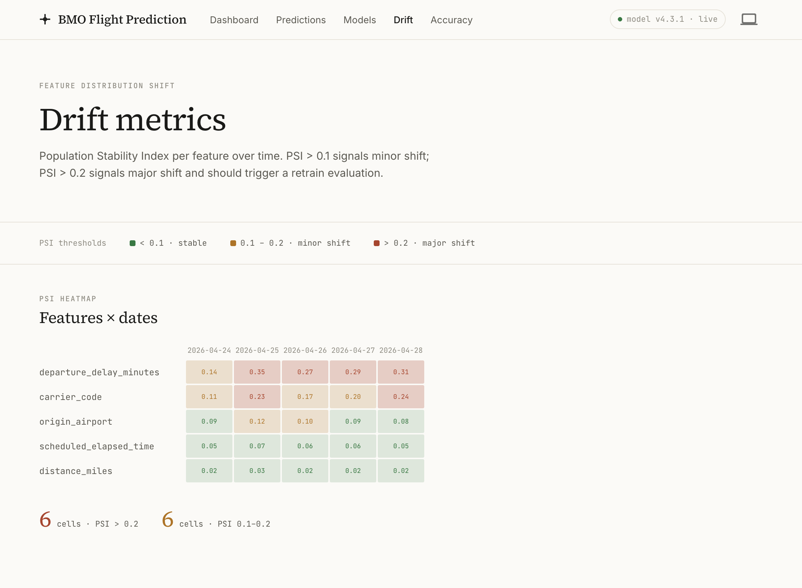
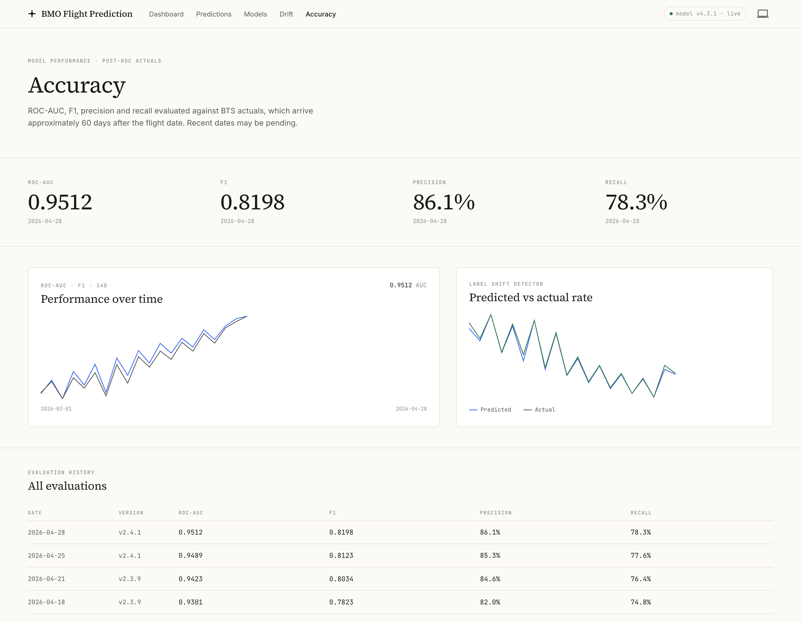

# BMO Flight Delay Prediction React App

## Deploy

[Tanstack Start on Vercel](https://vercel.com/docs/frameworks/full-stack/tanstack-start)

```bash
pnpm i nitro
```

```typescript
// {...}
import { nitro } from 'nitro/vite';

export default defineConfig({
  plugins: [tanstackStart(), nitro(), viteReact()],
});
```

Create project from Vercel dashboard

- connect repo
- set directory to `react`
- update build directory, start command, etc.

After deploy ensure FastAPI Cors policy is configure to accept requests from the Vercel domain.

## Screenshots






